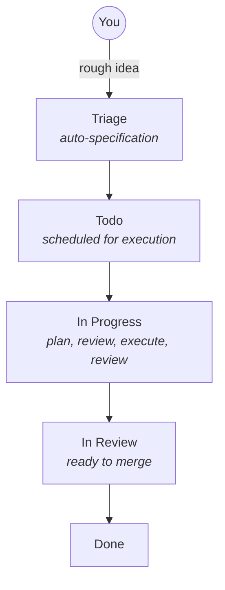

# Architecture

[← Docs index](./README.md)

This document explains how Fusion is structured, how data is stored, and how the AI execution pipeline moves work from idea to merged code.

## End-to-End Workflow



At a high level:

- **Triage** writes a full `PROMPT.md` spec
- **Scheduler** selects ready tasks (respecting dependencies and limits)
- **Executor** runs agents in isolated worktrees
- **Merger** finalizes tasks to `done` (direct squash merge or PR flow)

## Workspace Packages

| Package | Responsibility |
|---|---|
| `@fusion/core` | Domain model, TaskStore/MissionStore, SQLite persistence, shared types/defaults. |
| `@fusion/dashboard` | Express API + React dashboard UI (kanban board, live updates, tooling surfaces). |
| `@fusion/engine` | Triage, scheduling, execution, workflow steps, merge orchestration, automation runtime. |
| `@fusion/tui` | Ink-based terminal UI package (lightweight terminal components). |
| `@gsxdsm/fusion` | Published CLI (`fn`) + pi extension tools. |

## Storage Architecture

Fusion uses a **hybrid model**:

- **SQLite metadata:** `.fusion/fusion.db`
- **Blob/filesystem artifacts:** `.fusion/tasks/{id}/PROMPT.md`, `agent.log`, attachments
- **Global user settings:** `~/.pi/fusion/settings.json`

### Why hybrid?

- SQLite gives transactional metadata updates and indexed queries.
- Filesystem storage keeps large task artifacts simple and portable.

### Key SQLite behavior

- WAL mode enabled for concurrent readers/writers
- Foreign keys enforced
- Monotonic metadata timestamp used for change detection

## Typical `.fusion/` Layout

```text
.fusion/
  fusion.db
  tasks/
    FN-001/
      task.json
      PROMPT.md
      agent.log
      attachments/
  backups/
```

## AI Engine Components

### 1) TriageProcessor

- Reads rough task descriptions
- Generates structured `PROMPT.md` with mission, file scope, steps, and acceptance criteria
- Can be gated by `requirePlanApproval`

### 2) Scheduler

- Moves tasks from `todo` to `in-progress`
- Enforces dependencies, concurrency limits, and overlap rules
- Coordinates mission/slice progression hooks

### 3) TaskExecutor

- Creates/attaches task worktrees (`fusion/{task-id}` branches)
- Runs agent sessions with tooling (task update/logging/review/spawn)
- Supports step session mode (`runStepsInNewSessions`) and parallel step execution (`maxParallelSteps`)
- Executes configured pre-merge workflow steps

## Error Recovery and Resilience

Fusion has multiple safety/recovery paths:

- **Transient error retry:** bounded retry flow for temporary failures
- **Stuck task detection:** inactivity timeout can terminate/requeue hung runs
- **Context-limit recovery:** compact-and-resume flow when model context overflows
- **Workflow step failure handling:** marks task failed/in-review for inspection rather than silently passing
- **Pause semantics:** global hard-stop (`globalPause`) and soft scheduler pause (`enginePaused`)

## Project Memory System

When enabled (`memoryEnabled: true`), agents can use project memory files:

- `.fusion/memory.md` — durable project learnings
- Optional derived memory insights (via scheduled extraction)

This helps agents retain patterns and pitfalls across tasks.

## Git Worktree Isolation Model

Every active task runs in its own git worktree:

- Avoids cross-task file collisions
- Makes cleanup/retry deterministic
- Enables parallel execution safely
- Supports pooled reuse when `recycleWorktrees` is enabled

Branch naming remains `fusion/{task-id}` regardless of worktree folder naming mode.

## Related Guides

- [Task Management](./task-management.md)
- [Workflow Steps](./workflow-steps.md)
- [Multi-Project](./multi-project.md)
- [Settings Reference](./settings-reference.md)
