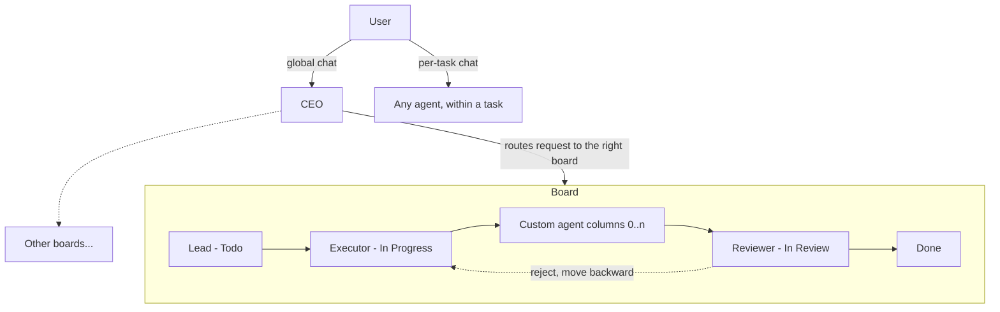

# Simple Mode: Boards, Teams, and the Company Model

## Summary

Productize Fusion's existing workflow engine into a "company" model: every project gets a CEO (the single global-chat entry point that routes work), and every board gets a mandatory Lead → Executor → Reviewer team with optional custom agent-columns in between — one persistent agent per column, no ephemeral agents. Boards are the first-class containers: a task lands on a board and inherits that board's columns; workflow/column config is a property of the board, never a per-task selection. Multi-lane converts to multi-board, and the graph/workflow editor plus Missions and other non-core surfaces move behind an "advanced mode."

---

## Problem Frame

Fusion's engine already supports custom columns, column-bound agents, and graph workflows (behind `experimentalFeatures.workflowColumns` and `workflowGraphExecutor`), but the product surface exposes that power as raw complexity: per-task workflow selection, derived lanes, ephemeral per-task agents, and a board crowded with concepts (missions, traits, graph nodes) that a new user must navigate before getting value.

Two concrete pains anchor this work:

1. **Non-coding tasks don't fit.** The legacy pipeline hard-codes coding semantics — worktree, branch, in-review-as-merge-blocker, done-as-merged. A documentation task or a content task has no branch to merge, so it has no honest path through the board.
2. **Tasks can't complete without human oversight.** There is no trusted reviewing actor whose verdict the user is willing to let gate auto-merge, so every task ends with the human babysitting the finish line.

The fix is not more engine capability — it's an opinionated, legible default experience: a company you can explain in one sentence (someone structures the request, someone executes it, someone reviews it), with the existing general machinery preserved as an escape hatch.

---

## Key Decisions

- **Opinionated layer over the existing engine, not a replacement.** Simple mode is a constrained preset over the workflow-columns + column-agent + trait machinery already built. The graph executor's generality (split/join, hold nodes, custom traits) is retained, gated behind advanced mode.
- **The board is the container; workflow is board config.** Tasks never select a workflow. A task lands on a board and inherits that board's columns and team. This inverts today's model (task selects workflow → lane derived).
- **Multi-board replaces multi-lane unconditionally.** Boards become first-class navigable entities, each with its own team and column config — the universal task container in every mode, advanced included. The lane concept and per-task workflow selection are removed outright, with no lane rendering path retained.
- **Persistent named agents only — ephemeral agents are eliminated entirely under the company model.** Every piece of work, in simple and advanced mode alike, is performed by a named persistent agent; the roster is the mental model. Per-task agent selection disappears from simple mode; advanced mode retains it, choosing from the persistent roster. The legacy flag-off path keeps ephemeral workers untouched; the ephemeral machinery is deleted at flag graduation.
- **CEO exists from day one, even with one board.** Project creation always creates the CEO. Global chat always talks to the CEO, who delegates to boards. This costs a fourth mandatory agent with little to do in single-board v1, in exchange for a mental model that doesn't shift when boards multiply.
- **Hard movement constraints chosen for auditability.** Sequential column movement, no skipping, one agent per column, locked endpoint roles. These constraints are what make autonomous agent work legible and trustworthy; flexibility lives in advanced mode.
- **The Reviewer absorbs the Validator.** The existing Validator Run machinery (Contract Assertions, verdicts, fix feedback) becomes the Reviewer's engine: when a task reaches In Review, the board's Reviewer agent runs the validation. One judge, one mental model — "the Reviewer" is the productized face of the validator, not a second parallel judge.
- **Simple-mode curation is decided here, not in planning.** Simple mode keeps boards (tasks, columns, drag), global chat (CEO), per-task chat, the agent roster, basic project settings, and notifications. Simple mode HIDES (and advanced mode shows) Missions (milestones/slices/autopilot), the graph/workflow editor, traits configuration, per-task agent and model selection, custom task fields, branch-group / merge-queue management UI, and plugin development surfaces.
- **"Executor" is the role name** (replacing "Engineer") — the role is not inherently a coder; any action-performing agent can hold the slot's column shape.

---

## Actors

- A1. **User (owner)** — talks to the CEO in global chat, can talk to any agent inside a task, and oversees all boards. Owner drags are limited to Idea ↔ Todo, Done → Archive, and Done/Archive → Todo (revert, R24); everything else flows through the agents and explicit affordances (refine, approve plan, merge request).
- A2. **CEO** — project-level agent created at project creation. The single task-entry point in global chat: interprets a request, selects the responsible board, and creates the task in that board's Todo queue.
- A3. **Lead** — mandatory, bound to the Todo column. Sorts, structures, and formalizes incoming tasks; prepares the execution prompt for the board's Executor. Role is locked: only its instructions are customizable.
- A4. **Executor** — mandatory, bound to the In Progress column. Performs the requested action (coding or otherwise).
- A5. **Reviewer** — mandatory, bound to the In Review column. Analyzes and validates completed work; its verdict gates Done (and merge, on coding boards). May move tasks backward.
- A6. **Custom column agent** — optional persistent agent staffed on a user-created column between Todo and In Review (e.g., a Documentation Specialist). One agent per column; an agent holds at most one column per board.

---

## Requirements

**Board & column model**

- R1. Every board is created with three mandatory, locked role-columns: Lead → Todo, Executor → In Progress, Reviewer → In Review. These cannot be deleted or replaced; their instructions are customizable.
- R2. Users can insert any number of custom columns between Todo and In Review, and after In Review for post-approval steps (e.g., Deploy, Publish) — never agent columns before Todo, so nothing bypasses Lead intake. One built-in exception sits before Todo: the unstaffed Idea column, a human-managed intake backlog (user-created tasks land there; Idea ↔ Todo is a human move per R5; CEO-routed tasks land directly in Todo). The Reviewer's verdict remains the sole gate out of In Review; Done follows the last column.
- R3. Each column is staffed by exactly one agent. In simple mode an agent can hold at most one column per board; advanced mode may staff one agent on multiple columns of a board. Agents are strictly board-scoped: an agent belongs to exactly one board (the CEO is project-level), there is no cross-board staffing or agent transfer, and the agents menu and agent creation are board-scoped — a board shows only its own team. (A company-wide roster/overview is a possible later addition.)
- R4. The board owns its workflow/column config. A task lands on a board and inherits that board's columns; there is no per-task workflow selection.
- R5. Agent-driven task movement is strictly sequential — column to adjacent column, no skipping. Only the Lead and the Reviewer may move a task backward. The CEO has no movement powers (it only creates tasks). The human owner is NOT broadly exempt: human drags are limited to Idea ↔ Todo, Done → Archive, and Done/Archive → Todo (the revert flow, R24). A task that doesn't meet expectations is refined — sent back through the cycle with updated instructions — never hand-dragged across stages (no Todo → In Review shortcuts, no In Review → Done bypass of the Reviewer).
- R24. Revert flow: the user can send a Done or Archived task back to Todo; doing so reverts the changes that task merged (a revert of its merge commit on the integration branch) and re-enters the cycle so a new outcome can be produced. Feasibility caveat: post-merge reverts can conflict with later work — surface conflicts to the user rather than forcing.
- R6. Boards must support non-coding work — via the reliable path: every board keeps the worktree/merge machinery intact, and non-coding tasks simply produce a `report.md` (or similar artifact) that is committed and merged through the same pipeline. No merge-less column variant: removing the machinery per-board risked coding tasks executing without a worktree/merge on mis-classified boards, especially under low-end models.

**Agents & roster**

- R7. The company model has no ephemeral agents: every unit of work, in simple and advanced mode alike, executes as a named, persistent agent. Per-task agent selection is removed from simple mode; advanced mode retains it, choosing from the persistent roster.
- R8. Project creation auto-creates the CEO and Board 1 with its Lead, Executor, and Reviewer pre-staffed — a new user gets a working team with zero configuration.
- R9. The CEO is the only entry point in global chat. Given a user request, it selects the responsible board and creates the task in that board's Todo queue.
- R10. Users can talk to any agent within a specific task; the agent incorporates the message on its next reasoning cycle.

**Review & autonomous completion**

- R11. The Reviewer's verdict gates the transition out of In Review. On coding boards, a passing verdict feeds the project's merge mode — auto-merge, or opening a pull request via the existing PR flow — so a task can complete with no human oversight (or land as a ready-to-review PR); a failing verdict moves the task backward with feedback.
- R16. The Reviewer subsumes the existing Validator: Validator Runs execute as the board Reviewer's evaluation, and no separate validator concept is exposed in simple mode. There is exactly one "AI judge of done" per board.

**Multi-board**

- R12. A project supports multiple boards, each with its own team, columns, and config. Boards can run simultaneously.
- R13. Multi-lane converts to multi-board and the lane concept is removed entirely — in every mode, advanced included; there is no lane rendering path left. Each existing workflow-in-use becomes a board, boards are the universal task container, and existing tasks migrate to the board derived from their previous workflow; no task data is lost.

**Simple / advanced mode**

- R14. Simple mode is the default UI and keeps: boards (tasks, columns, drag), global chat (CEO), per-task chat, the agent roster, basic project settings, and notifications. Simple mode HIDES (and advanced mode shows): Missions (milestones/slices/autopilot), the graph/workflow editor, traits configuration, per-task agent and model selection, custom task fields, branch-group / merge-queue management UI, and plugin development surfaces. Plugin-contributed user-facing views and surfaces can declare simple-mode compatibility and appear in simple mode — only plugin development surfaces are categorically gated.
- R15. Advanced-mode capabilities remain fully functional — gating is a UI-visibility concern, not a feature removal. Existing projects relying on those surfaces keep working after opting into advanced mode.
- R17. An existing legacy/advanced project can be converted to simple mode on demand — the same conform mapping the upgrade migration uses (columns onto the company template, team seeded), triggered explicitly from settings rather than only at upgrade.

**Integrations**

- R18. When the compound-engineering plugin is installed, "Compound Engineering" is a selectable board type (never the default): Lead structures via ce-plan, Executor executes via ce-work, Reviewer evaluates via ce-code-review, a post-approval Compound column captures learnings via ce-compound before the PR, and PR review feedback is handled by ce-resolve-pr-feedback. Stage artifacts attach to the task and flow column to column.
- R19. On coding boards with PR merge mode, a passing Reviewer verdict drives the unified PR entity lifecycle (the first-class pr-create / pr-respond / pr-merge workflow nodes), not legacy procedural PR code.
- R20. Plan review and approval: a per-board "require plan approval" setting (default-on for Compound Engineering boards) parks a task once the Lead finishes structuring it; the user reviews the attached plan from the task on any surface and explicitly approves before the Executor starts — or sends feedback that returns it to the Lead. Bypassed in LFG mode.
- R21. Structured Q&A: when a column engine needs user input (Lead brainstorming/planning foremost), the task card shows an awaiting-input state and sends a notification; opening the card presents a structured Q&A view — multiple choice, radio buttons, free text, like planning mode — whose answers resume the agent's session.
- R22. LFG mode (Compound Engineering boards only): the board (or an individual task) runs the full pipeline end-to-end with zero user interaction — stages run headless with autonomous defaults, and the plan-approval gate and Q&A are bypassed.
- R23. Simple mode always uses worktree isolation: per-task worktrees cannot be disabled from simple mode, and the board shows only tasks and columns — worktree/branch details stay out of the cards (task detail and advanced mode carry them).

---

## Key Flows

- F1. Chat request to done, hands-free
  - **Trigger:** User sends a request in global chat ("create a new blog article").
  - **Steps:** CEO identifies the responsible board and creates a task in its Todo queue → Lead structures the request and prepares the execution prompt → task advances to In Progress, Executor performs the work → task passes through any custom columns (each agent does its specialty) → Reviewer evaluates → pass: task moves through any post-approval columns to Done (and, on a coding board, auto-merges or opens a pull request per the project's merge mode).
  - **Covers:** R1, R5, R9, R11.
- F2. Reviewer rejection
  - **Trigger:** Reviewer's evaluation fails.
  - **Steps:** Reviewer moves the task backward with feedback → the receiving column's agent reworks → task advances sequentially again to In Review.
  - **Covers:** R5, R11.
- F3. New project onboarding
  - **Trigger:** User creates a project.
  - **Steps:** CEO is created; Board 1 is created with Lead, Executor, Reviewer staffed; user lands on Board 1 and can immediately send their first request in global chat.
  - **Covers:** R8, R9.
- F4. Existing project migration
  - **Trigger:** A project with lanes / per-task workflows upgrades.
  - **Steps:** Each workflow in use becomes a board; tasks land on the board derived from their workflow; mandatory teams are auto-created per board; missions and graph surfaces move behind advanced mode.
  - **Covers:** R13, R14, R15.

---

## Acceptance Examples

- AE1. **Covers R11.** Given a coding board with auto-merge enabled, when the Reviewer passes a task in In Review, then the task's branch enters the merge queue and the task reaches Done with no human action.
- AE2. **Covers R6, R11.** Given a board for documentation work, when the Executor completes the task by producing a `report.md` in its worktree and the Reviewer passes it in In Review, then the task merges and reaches Done through the standard pipeline — same machinery as a coding task, different artifact.
- AE3. **Covers R3.** Given an agent already staffed on a column of a board, when the user tries to assign that agent to a second column on the same board, then the assignment is rejected with a clear explanation.
- AE4. **Covers R5.** Given a task in Todo, when the Executor (or any non-Lead/Reviewer agent) attempts to move it directly to In Review, then the move is rejected; when the human owner attempts the same Todo → In Review drag, it is also rejected — human drags are limited to Idea ↔ Todo, Done → Archive, and Done/Archive → Todo (revert).
- AE5. **Covers R9.** Given a single-board project, when the user sends any request in global chat, then the CEO creates the task on Board 1's Todo queue (routing degenerates gracefully when there is only one board).

---

## Scope Boundaries

**Deferred for later**

- Non-developer verticals (the "bakery" scenario, WhatsApp intake, marketing teams) — north-star positioning; the v1 persona stays the solo developer running coding-plus-adjacent boards.
- CEO "automatic mode" (acting continuously without an explicit user message).
- Multi-user / collaboration on boards.

**Outside this product's identity**

- Building tool-specific integrations (Remotion, Instagram, Canva, calendars) into core. Specialized boards get their capabilities from the plugin ecosystem; core ships the company model, not the tools.

---

## Dependencies / Assumptions

- Builds on the existing `experimentalFeatures.workflowColumns` and `workflowGraphExecutor` machinery — Column, Trait, Column agent (`defer`/`override`), Default workflow. Simple mode is a preset over these, which assumes they graduate from experimental to the default path.
- The Reviewer gate reuses the existing validator machinery (Contract Assertions, Validator Run) as its engine per R16; how its verdict plugs into the auto-merge blocker seam is a planning question.
- Assumption: advanced mode retains per-task agent selection and all current graph capabilities — nothing is deleted, only re-surfaced.
- Assumption: movement constraints (R5) bind agents only; the human owner always has override.

---

## Outstanding Questions

**Deferred to planning**

- Migration mechanics for lanes → boards and existing per-task agent settings.
- How the CEO identifies the responsible board (board descriptions, Lead self-reporting, routing instructions) and what happens on ambiguous routing.
- Whether mandatory-role agents are shared across boards or per-board instances (each board has its own Lead/Reviewer per the model; naming/identity scheme is a planning detail).
