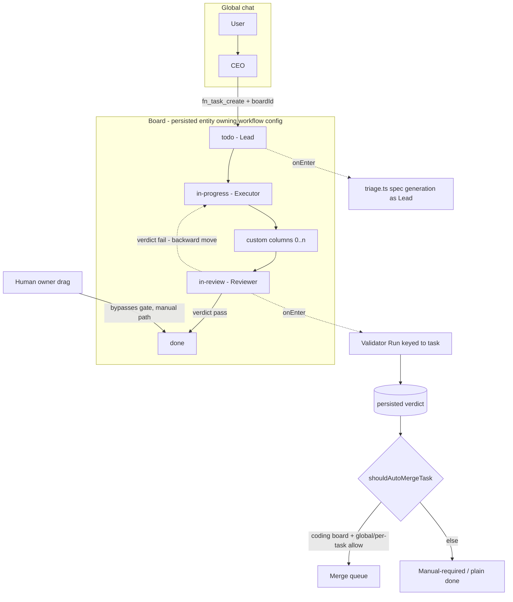
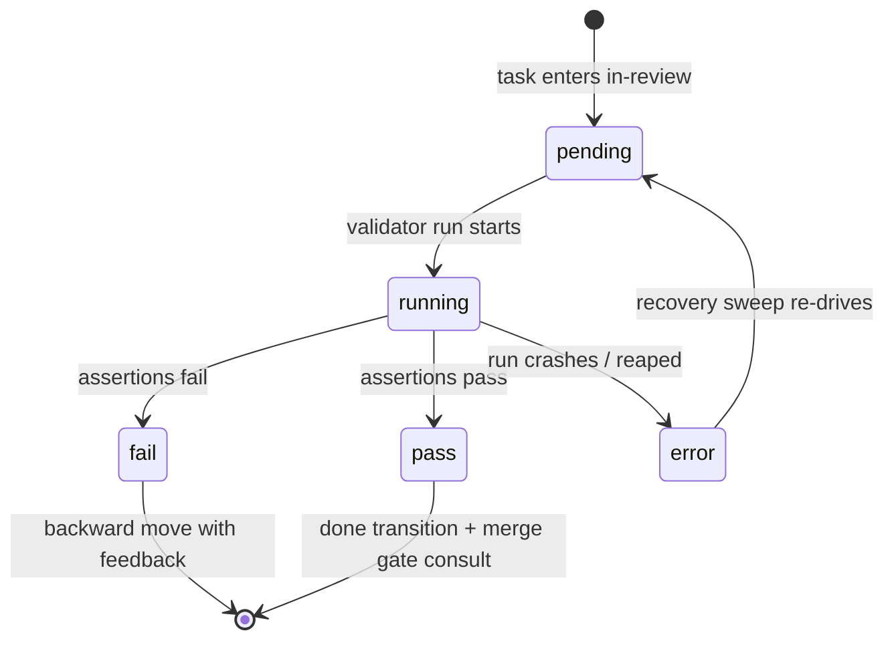
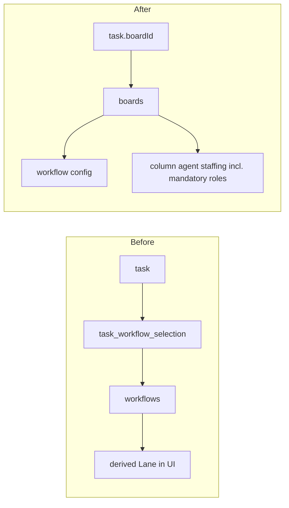

# feat: Company model — boards, role agents, and simple mode

## Summary

Productize Fusion's experimental workflow engine into the company model: Boards become first-class task containers (replacing Lanes and per-task workflow selection), every board carries a mandatory Lead → Executor → Reviewer team of persistent column-bound agents, a project-level CEO routes global-chat requests to boards, the Reviewer absorbs the Validator to gate done/auto-merge, and the dashboard defaults to a simple mode that gates power surfaces behind advanced mode. Ships behind a single feature flag, graduating to default-on in a follow-up.

---

## Problem Frame

Fusion's engine already supports custom columns, column-bound agents, traits, and graph workflows (behind `experimentalFeatures.workflowColumns` / `workflowGraphExecutor`), but the product exposes that power as raw complexity. Two concrete pains anchor the work (see origin): non-coding tasks have no honest path through a pipeline that hard-codes merge semantics, and tasks cannot complete without human oversight because no trusted reviewing actor gates the finish line. The remedy is an opinionated default experience over the existing machinery — not new engine capability.

---

## Requirements

Carried from origin (`docs/brainstorms/2026-06-05-simple-mode-boards-agents-requirements.md`, R1–R16). Grouped by concern; plan units trace to these IDs.

**Board & column model**
- R1. Mandatory locked role-columns per board: Lead→Todo, Executor→In Progress, Reviewer→In Review; non-deletable/non-replaceable, instructions customizable.
- R2. Custom columns insertable between Todo and In Review, and after In Review for post-approval steps (Deploy, Publish) — never before Todo. The Reviewer's verdict remains the sole gate out of In Review; Done follows the last column.
- R3. One agent per column. Simple mode: an agent holds at most one column per board; advanced mode may staff one agent on multiple columns. Cross-board sharing always allowed.
- R4. Board owns workflow/column config; tasks land on a board, never select a workflow.
- R5. Agent-driven movement is sequential, no skipping; only Lead/Reviewer move backward; the human owner is exempt.
- R6. Non-coding boards flow to Done without branch/worktree/merge machinery.

**Agents & roster**
- R7. No ephemeral agents anywhere under the company model (simple and advanced mode); per-task agent selection removed from simple mode, kept in advanced choosing from the persistent roster. Legacy flag-off path unchanged; ephemeral machinery deleted at flag graduation.
- R8. Project creation auto-creates CEO + Board 1 with Lead/Executor/Reviewer staffed.
- R9. CEO is the only global-chat entry point; routes requests into a board's Todo queue.
- R10. Users can message any agent within a task; incorporated on its next reasoning cycle.

**Review & autonomous completion**
- R11. Reviewer verdict gates the exit from In Review; on coding boards a pass feeds the project's merge mode — auto-merge, or PR creation via the existing PR flow; a fail moves the task backward with feedback.
- R16. Reviewer subsumes the Validator — one AI judge of done per board; no separate validator concept in simple mode.

**Multi-board**
- R12. Multiple boards per project, each with its own team/columns, running simultaneously.
- R13. Multi-lane converts to multi-board and the lane concept is removed entirely — every mode, advanced included; boards are the universal task container. Existing tasks migrate losslessly.

**Simple / advanced mode**
- R14. Simple mode (default) keeps boards, global chat, per-task chat, agent roster, basic settings, notifications. Advanced mode gates Missions, graph/workflow editor, traits config, per-task agent/model selection, custom task fields, branch-group/merge-queue UI, plugin dev surfaces. Plugin-contributed user-facing views can declare simple-mode compatibility and appear in simple mode; only plugin development surfaces are categorically gated.
- R15. Gating is UI visibility only — no capability removed.
- R17. An existing legacy/advanced project converts to simple mode on demand from settings, reusing the migration's conform mapping (columns onto the company template, team seeded).

**Integrations**
- R18. When the compound-engineering plugin is installed, "Compound Engineering" is a selectable board type (never the default): its columns run CE stages as their work engines — Lead/Todo → ce-plan, Executor/In Progress → ce-work, Reviewer/In Review → ce-code-review, a post-approval Compound column → ce-compound (knowledge capture after review, before the PR), and the PR respond loop → ce-resolve-pr-feedback. Driven through the existing CE Session machinery and the bundled plugin; stage artifacts attach to the task and flow column to column.
- R19. On coding boards with PR merge mode, a passing Reviewer verdict drives the unified PR entity lifecycle (`pr-create` → await-review → `pr-respond` loop → `pr-merge` workflow nodes from the PR-lifecycle plan), not the legacy procedural PR code.
- R20. Plan review and approval gate: a per-board "require plan approval" setting (on by default for CE boards, available to any board) parks a task after the Lead finishes structuring it — the plan artifact is viewable from the task on every surface, and the task advances to the Executor only on explicit user approval; feedback instead of approval routes back to the Lead for revision. Bypassed in LFG mode (R22).
- R21. Structured Q&A: when a column engine needs user input (Lead brainstorming/planning stages foremost), the task card shows an awaiting-input state and notifications fire; opening the card presents a structured Q&A view — multiple choice, radio, and free-text answers, like planning mode's interview UI — whose answers flow back into the running CE Session. Questions never silently stall a task: the awaiting-input state is visible on the board and clears when answered.
- R22. CE LFG mode: a Compound Engineering board (or an individual task on it) can run in LFG mode — the full pipeline executes end-to-end with zero user interaction. The plan-approval hold (R20) and structured Q&A (R21) are bypassed: stages run in their headless/pipeline form, making scope decisions autonomously, and the task flows Todo → done/PR without waiting on a human.

---

## Key Technical Decisions

- **One feature flag for the company-model semantics: `experimentalFeatures.companyModel`.** Composed additively with the existing `workflowColumns`/`workflowGraphExecutor` flags (which it implies for board internals). Flag off → execution semantics byte-identical to today (ephemeral workers, triage processor, entry-driven merge, no role teams, no CEO); the flag does NOT gate board containment — boards replace lanes unconditionally (see below). Kill-switch parity: every execution entry point must read the flag — bindings, seeds, and routing are inert when off (mirrors the column-agent kill-switch rule in `docs/solutions/architecture-patterns/per-entity-execution-principal-override-blast-radius.md`).
- **Board is a persisted entity wrapping a workflow config, not a renamed workflow.** New `boards` table; each board references its own workflow definition (column config + agent staffing). `task_workflow_selection` is superseded by a `tasks`-side board reference; the resolver chain (`resolveWorkflowIrForTask`) resolves board → workflow IR so all existing IR consumers (transitions, traits, executor) work unchanged. For boards converted from the Default workflow, byte-identical column ids are preserved so no task row's `column` value is rewritten except triage (below). Boards converted from non-default workflows **conform-on-migrate**: their columns map onto the company template (entry column → todo, wip → in-progress, review → in-review, remaining columns become custom columns between), teams are seeded, and any column-value rewrites are recorded in the migration audit — every migrated board is a working simple-mode board, not a degraded one.
- **The Lead absorbs triage, the same move as Reviewer-absorbs-Validator.** The triage subsystem (`packages/engine/src/triage.ts` — spec generation, PROMPT.md authoring, stuck detection) becomes the Lead agent's work, fired on Todo entry. The `triage` column disappears from company-model boards; migration remaps `triage` tasks to `todo` with status reconciliation (a task mid-spec-generation keeps its session, now attributed to the Lead). This is the only column-value rewrite in the migration.
- **Reviewer verdict is a task-keyed validator run triggered by In Review entry, persisted in a new task-scoped run table.** The existing Validator Run engine is shared, but task verdicts persist in a new `task_reviewer_runs` table keyed to taskId — `mission_validator_runs` keeps its NOT NULL feature/milestone/slice FKs intact, so mission-path integrity is untouched. The in-review column's `onEnter` hook starts the run; the Done transition and merge gates consult the persisted verdict. Validator runs stay read-only; recovery sweeps re-drive orphaned runs (per `docs/solutions/logic-errors/mission-autopilot-stalled-by-stranded-done-feature.md`).
- **One auto-merge chokepoint, consulted additively.** Introduce a single `shouldAutoMergeTask` predicate in `@fusion/core` that combines global setting, per-task override, and Reviewer verdict; every trigger gate (merger enqueue, self-healing sweeps, store hydration paths) calls it. Additive gating preserves the Manual-required parking path (per `docs/solutions/logic-errors/per-task-auto-merge-override-ignored-by-trigger-gates.md`).
- **Auto-merge enqueue is verdict-driven, not entry-driven, on company-model boards.** Today `applyInReviewEnterEffects` stamps `autoMerge` and the merger enqueues at in-review entry; the Reviewer's run is asynchronous, so entry-time enqueue would merge unreviewed work. On flag-on boards the enqueue trigger moves to verdict completion (fires only when the persisted verdict reaches pass), and autoMerge stamping defers until verdict. A passing verdict routes by the project's merge mode: auto-merge enqueues the merge queue; PR mode enters the unified PR entity sub-graph (`pr-create`, see the PR-integration KTD below) — both count as autonomous completion.
- **Human drag is manual approval, never auto-merge.** Owner dragging In Review → Done bypasses the Reviewer gate (R5 exemption) and routes any merge through the existing manual/Manual-required path. Auto-merge fires only on a passing Reviewer verdict.
- **CEO routing asks when ambiguous.** The CEO resolves the target board from board names/descriptions; one board auto-routes; zero or multiple plausible matches → the CEO asks a clarifying question in chat. Task creation goes through `fn_task_create` wired into the global-chat tool set, stamping the stored board id (never a derived string — per `docs/solutions/integration-issues/branch-group-single-pr-synthetic-id-dead-wiring.md`).
- **One-agent-per-column is an identity constraint, not a concurrency limit — and simple-mode-scoped.** Existing capacity/concurrency semantics are unchanged; a column's agent may run multiple task sessions. The per-board uniqueness rule is enforced on simple-mode editing surfaces via the shared `validateColumnAgentBindings` validator; advanced mode permits one agent staffing multiple columns of a board. Cross-board sharing is always allowed.
- **Mode gating is a user-level setting (`uiMode: simple | advanced`), not a capability switch.** Read through the existing settings system; every gated surface (dashboard views, modals, server routes that exist only for gated UI, TUI equivalents) consults one shared predicate, with an invariant test pinning the surface set (per `docs/solutions/integration-issues/bundled-plugin-registration-drift.md`).
- **CE stages are pluggable column work engines, exposed as a selectable board type.** Fusion already runs compound-engineering stages as CE Sessions (CE Stage registry → bundled skill → conventional artifact location). The company model exposes that as a column-engine configuration, packaged as a "Compound Engineering" board type offered at board creation when the plugin is installed — never the default. Mapping: Lead/Todo → ce-plan (the plan doc becomes the structuring artifact the Executor consumes), Executor → ce-work, Reviewer → ce-code-review (outcome feeds the U6 verdict interface), post-approval Compound column → ce-compound, PR respond loop → ce-resolve-pr-feedback. Standard boards keep the current engines (triage pipeline, executor session, validator).
- **Structured Q&A rides the CE Session awaiting-input machinery, surfaced board-first.** CE Sessions already model an agent question/answer flow with an `awaiting-input` lifecycle state and Steering. The company model surfaces that on the board: a card whose engine is awaiting input renders a distinct state + notification, and the task detail opens the structured Q&A view (reusing planning mode's interview component patterns — single/multi choice, radio, free text). Answers feed the session; LFG mode (below) suppresses the question path entirely.
- **LFG is a Compound-Engineering-only execution posture, not a different pipeline.** LFG mode exists exclusively on Compound Engineering boards (a per-board default with per-task override; standard boards have no LFG concept): it runs each CE stage in its headless/pipeline form (the same mode the CE plugin's lfg pipeline uses — no blocking questions, autonomous defaults), skips the plan-approval hold, and never enters awaiting-input. Interactive and LFG tasks coexist on one CE board; the toggle changes how engines run, not which columns exist.
- **Plan approval is a manual-release hold, not new machinery.** With "require plan approval" on, Lead completion parks the task in a plan-approval hold (the existing hold/manual-release primitives); the user reviews the attached plan artifact from the task detail (dashboard, TUI, CLI) and approves — releasing the task to the Executor — or sends feedback (per-task chat, R10), which returns it to the Lead for revision. Off by default for standard boards, on by default for CE boards.
- **PR mode rides the unified PR entity from `gsxdsm/fixprflow`, not legacy PR code.** That branch (plan: `docs/plans/2026-06-05-001-feat-unified-pr-entity-review-loop-plan.md`, U1–U6 committed) ships `pr-create`/`pr-respond`/`pr-merge` workflow nodes, await holds with external-event/manual release, GitHub-corroborated state, and a bounded review-response loop. It merges into this branch before U7. The company board's PR merge mode maps the post-approval region onto the PR sub-graph: Reviewer verdict pass → `pr-create`; review feedback → the respond loop (ce-resolve-pr-feedback on CE boards); `pr-merge` completes per the project's merge settings. `shouldAutoMergeTask` governs only legacy auto-merge boards; PR-mode boards merge exclusively through the `pr-merge` node (the PR plan's R14).
- **Boards that violate simple-mode invariants render degraded, not broken.** A board edited in advanced mode into a non-simple shape (split/join, agentless columns) renders in simple mode with live task progress visible but all mutating controls disabled (grayed out, not hidden), under a persistent non-dismissible banner explaining why, with an "Open in advanced editor" button that switches mode and navigates. Migration never produces such boards (conform-on-migrate above) — this path exists only for advanced-mode edits. Simple-mode invariants are validated only on simple-mode editing surfaces.

---

## High-Level Technical Design

Company-model topology and where each role plugs into existing machinery:

Reviewer verdict lifecycle (state machine for the new task-keyed run):

Data-model change (before → after):

---

## Implementation Units

### Phase A — Core data model & migration

### U1. Board entity, schema migration, and lanes→boards conversion

- **Goal:** Introduce the persisted `Board` entity and migrate existing data: each workflow-in-use becomes a board; tasks gain a board reference; `triage` tasks remap to `todo` with status reconciliation.
- **Requirements:** R4, R12, R13 (origin F4).
- **Dependencies:** none.
- **Files:** `packages/core/src/db.ts`, `packages/core/src/types.ts`, `packages/core/src/store.ts`, new `packages/core/src/board-store.ts`, `packages/core/src/workflow-ir-resolver.ts`, `packages/core/src/__tests__/board-store.test.ts`, `packages/core/src/__tests__/migration-company-model.test.ts`.
- **Approach:** New migration block (next version after current `SCHEMA_VERSION = 111`): create `boards` table (id, projectId, name, description, workflow config reference, ordering), add task board reference, convert each distinct workflow-in-use into a board, rehome selections, remap `triage`→`todo` only on converted boards. The canonical "workflow-in-use" key is the *resolved* workflow id (null/dangling selections resolve to `builtin:coding`), so duplicate selections of one workflow collapse to one board and selections whose `workflowId` no longer exists fall back to the default board rather than orphaning tasks. Note: `packages/core/src/board.ts` already exists as a legacy transition/dependency utility — `board-store.ts` is a new, distinct module alongside it, not a replacement. Board containment is universal and unflagged: the migration assigns every task a board, and the resolver chain gains board→IR resolution (keeping `resolveWorkflowIrForTask` signatures stable for existing consumers) as the primary path — `task_workflow_selection` is superseded, retained read-only only as migration input. Company-model *semantics* (teams, movement rules, etc.) stay behind the flag in later units. In-flight tasks keep their sessions; tasks mid-spec-generation carry planning status into Todo (consumed by U5). Mirror migration 102/109 conversion patterns; update `MIGRATION_ONLY_TABLE_SCHEMAS` and the compat fingerprint in the same change.
- **Patterns to follow:** `packages/core/src/db.ts` migrations 108/109; `docs/solutions/database-issues/schema-version-constant-must-equal-highest-migration.md`.
- **Test scenarios:**
  - Covers AE-origin behavior: fresh DB creates `boards` table and resolves a task's IR through its board.
  - Seed-at-previous-version migration test: DB at v111 with two workflows in use + tasks in each lane migrates to two boards with tasks correctly homed; no task ids or non-triage columns rewritten.
  - Invariant test: `SCHEMA_VERSION` equals the highest `applyMigration` target.
  - Triage remap: task in `triage` with `status === "planning"` lands in `todo` retaining its status and session linkage.
  - Null workflow selection: tasks with no selection land on the default board (converted from `builtin:coding`).
  - Dangling selection: a task whose `task_workflow_selection.workflowId` no longer resolves lands on the default board with no data loss.
  - Collapse: two tasks selecting the same workflow id produce one board, not two.
  - Conform-on-migrate: a board converted from a custom three-column workflow maps entry/wip/review onto todo/in-progress/in-review, carries extra columns as custom columns, and satisfies all simple-mode invariants post-migration; rewritten column values appear in the migration audit.
  - Idempotency: re-running migration logic on an already-converted DB makes no changes.
- **Verification:** Migration runs on a copy of a real multi-lane DB without data loss; all existing core store tests pass with flag off.

### U2. Role model, team seeding, and staffing constraints

- **Goal:** Add `lead`/`ceo` roles, auto-create CEO + Board 1 team at project creation, and enforce one-agent-per-column-per-board with deletion guards.
- **Requirements:** R1, R3, R7 (roster shape), R8.
- **Dependencies:** U1.
- **Files:** `packages/core/src/types.ts` (`AgentCapability`), `packages/core/src/agent-store.ts`, `packages/core/src/agent-role-policy.ts`, `packages/core/src/central-core.ts` (`registerProject`/`ensureProjectForPath`), `packages/core/src/column-agent-binding-validation.ts`, new `packages/core/src/board-team-seed.ts`, `packages/core/src/__tests__/board-team-seed.test.ts`, `packages/core/src/__tests__/column-agent-binding-validation.test.ts`.
- **Approach:** Extend `AgentCapability` with `lead` and `ceo` as new values; mark `triage` deprecated (the Lead absorbs its function) and `engineer` deprecated in favor of `executor`, with role-policy helpers (`agent-role-policy.ts`) treating the deprecated values as aliases so existing agents keep working unchanged. A board-team seed step (flag-gated) runs at project registration and board creation: durable named agents staffed via `WorkflowColumnAgent` bindings on the role columns. Seeded role agents are created with explicit permission policies — never the `unrestricted` default: the CEO gets a task-routing-only policy, and Lead/Reviewer get policies without command execution (spec and validation work needs no shell access); only the Executor carries the project's normal execution policy. Seeding is idempotent across every uniqueness dimension (name + role + board) per `docs/solutions/logic-errors/branch-group-name-collision-strands-mission-triage.md`. Extend the shared `validateColumnAgentBindings` to reject one-agent-two-columns within a board and unstaffing/deleting a mandatory-role agent without replacement; the validator gains board context (a signature change), so every existing call site — HTTP routes, the workflow editor save path, and agent-tool store writes — updates in this unit; it remains the single authority used by all write surfaces. The per-board uniqueness rejection applies on simple-mode surfaces only — advanced mode may staff one agent on multiple columns of a board (cross-board sharing is always allowed in both modes).
- **Test scenarios:**
  - New project (flag on) yields CEO + Board 1 with Lead/Executor/Reviewer staffed; flag off yields current behavior (nothing seeded).
  - Covers AE3: staffing an agent on a second column of the same board is rejected with a typed error; staffing the same agent on a different board succeeds.
  - Deleting an agent staffed on any column is rejected; deleting after replacement succeeds; mandatory role columns can never be left unstaffed.
  - Seed idempotency: re-registering an existing project does not duplicate agents or bindings.
  - Edge: project created while flag off, then flag turned on → seed backfills on next startup without duplicating user-created agents.
- **Verification:** Project creation E2E produces a working staffed board; binding validation rejections surface typed `fieldId`/`code` errors on every write surface.

### U3. Company-model board template and movement rules

- **Goal:** Define the simple-mode board column template (todo / in-progress / in-review / done / archived — no triage) with locked role columns, custom-column placement rules, and sequential/backward movement enforcement that exempts the human owner.
- **Requirements:** R1, R2, R5, R6.
- **Dependencies:** U1.
- **Files:** new `packages/core/src/company-board-template.ts`, `packages/core/src/workflow-transitions.ts`, `packages/core/src/workflow-reconciliation.ts`, `packages/core/src/builtin-traits.ts` (if a new trait is needed for role-locking), `packages/core/src/__tests__/company-board-template.test.ts`, `packages/core/src/__tests__/workflow-transitions.test.ts`.
- **Approach:** The template is a workflow IR preset whose role columns carry locked markers; reconciliation rejects deleting/replacing role columns and inserting columns before todo — custom columns are legal between todo and in-review and after in-review (post-approval steps that run between the Reviewer's pass and done; the verdict remains the sole gate out of in-review). Transition validation distinguishes actor class: agent moves must be adjacent-forward (or backward only when the acting effective agent is the board's Lead/Reviewer); human/owner moves are unrestricted. Non-coding boards are templates whose in-review column omits the merge trait — traits already make merge machinery per-column, so R6 falls out of column config rather than new code.
- **Test scenarios:**
  - Covers AE4: executor-agent move todo→in-review (skip) rejected; same move by owner succeeds.
  - Backward move by Reviewer succeeds; backward move by Executor rejected; backward move target may be any earlier column.
  - Inserting a custom column between todo and in-review succeeds; after in-review (post-approval) succeeds and the task passes through it between verdict pass and done; before todo rejected at save (server-side, not just editor).
  - Deleting/renaming a role column rejected; editing role-column agent instructions succeeds.
  - Covers AE2: a board without the merge trait moves a task in-review→done with no merge-queue interaction.
- **Verification:** Transition parity tests still pass for the legacy flag-off path (`transition-parity.test.ts`).

### Phase B — Execution semantics

### U4. Persistent column agents replace ephemeral workers

- **Goal:** Under the flag, all task execution — simple and advanced mode alike — resolves to a persistent agent (the column's agent by default; an advanced per-task selection from the persistent roster when set); ephemeral worker creation is bypassed entirely; every identity-keyed subsystem consults the effective agent. Ephemeral machinery is deleted at flag graduation, not in this unit.
- **Requirements:** R7.
- **Dependencies:** U2, U3.
- **Files:** `packages/engine/src/ephemeral-worker-manager.ts`, `packages/engine/src/agent-assignment.ts`, `packages/engine/src/task-agent-sync.ts`, `packages/engine/src/executor.ts`, `packages/core/src/column-agent-resolver.ts`, `packages/engine/src/__tests__/executor-column-agent-principal.test.ts` (extend), new `packages/engine/src/__tests__/persistent-agent-execution.test.ts`.
- **Approach:** With the flag on, the column-agent binding becomes the default execution principal (`defer`-style precedence: explicit advanced-mode per-task settings still win where they exist). Apply the full blast-radius checklist from `docs/solutions/architecture-patterns/per-entity-execution-principal-override-blast-radius.md`: session identity/model resolution, permission gating receives the running agent, heartbeat serialization both directions, resume/wake-up selection filters, mid-flight change detection including the release path, kill-switch parity. Grep every reader of `assignedAgentId` and re-key or justify each.
- **Execution note:** Add a two-turns-through-the-same-agent test early — persistent agents fail via latched per-session state that single-turn tests structurally miss.
- **Test scenarios:**
  - Task entering in-progress on a flag-on board executes as the board's Executor agent identity (permissions, heartbeats, session attribution all keyed to it).
  - Two tasks concurrently in in-progress both run under the single Executor identity (identity constraint ≠ concurrency limit).
  - Kill-switch: flag off → ephemeral worker path byte-identical to today (no column-agent resolution).
  - Advanced-mode per-task agent override on a task still wins over the column agent and resolves to a persistent roster agent — never an ephemeral worker.
  - Agent replaced mid-flight on a column: running session completes under the old identity; next dispatch uses the new agent (mirror existing mid-flight change-detection tests).
- **Verification:** `executor-column-agent-principal` suite green; a flag-on board completes a coding task end-to-end with zero ephemeral agents created.

### U5. Lead absorbs triage

- **Goal:** Triage's spec-generation/PROMPT.md work runs as the board's Lead agent on Todo entry; the triage column ceases to exist on company-model boards.
- **Requirements:** R1 (Lead role behavior), origin F1 step "Lead structures the request".
- **Dependencies:** U3, U4.
- **Files:** `packages/engine/src/triage.ts`, `packages/engine/src/scheduler.ts`, `packages/core/src/default-workflow-hooks.ts` (or the company-template hooks), new `packages/engine/src/__tests__/lead-triage.test.ts`.
- **Approach:** Triage today is not a hook — it is the long-lived `TriageProcessor` polling `listTasks({ column: "triage" })` plus scheduler special-casing; U5 rewires that contract. On flag-on boards the processor's scan picks up the company-board todo column (poll loop retained; no new dispatch mechanism), attributed to the Lead as effective agent; PROMPT.md output format unchanged so the Executor consumes it as today. Inventory every literal `"triage"` in `packages/engine/src/scheduler.ts` (dispatch eligibility ~701, filesystem-validation move ~1494, stale/needs-replan move ~1507) and re-target each to `todo` on company-model boards — otherwise recovery sweeps move tasks to a column that doesn't exist on their board. Lead completion advances the task to in-progress through the normal sequential transition (Lead is allowed to move its own column's tasks forward) — unless the board's "require plan approval" setting is on (R20), in which case Lead completion parks the task in a plan-approval hold (existing hold/manual-release primitives) and only explicit user approval releases it to the Executor; user feedback instead returns it to the Lead for revision. Stuck-task detection keeps working keyed to the new column. Migrated mid-triage tasks (from U1) resume their planning session under Lead attribution.
- **Test scenarios:**
  - Task created in todo on a flag-on board gets a spec/PROMPT.md authored under the Lead identity, then advances to in-progress.
  - Migrated task with in-flight planning session resumes without restarting spec generation.
  - Flag off: triage column and subsystem behave exactly as today.
  - Recovery re-target: a flag-on board task failing filesystem validation lands in `todo` under Lead attribution, never an invalid `triage` column.
  - Lead rework: Reviewer moves a task back to todo → Lead re-structures with the Reviewer feedback in context.
  - Covers R20: with "require plan approval" on, Lead completion parks the task in the plan-approval hold; approval releases it to in-progress; feedback returns it to the Lead; with the setting off, the task advances directly.
- **Verification:** Existing triage tests pass flag-off; a flag-on board takes a raw task to a structured prompt with no triage column present.

### U6. Reviewer absorbs the Validator (task-keyed verdict gating Done)

- **Goal:** Entering in-review triggers a task-keyed Validator Run executed as the Reviewer; the persisted verdict gates the done transition; failure moves the task backward with feedback.
- **Requirements:** R11, R16, origin F2, AE1/AE2 (verdict side).
- **Dependencies:** U3, U4.
- **Files:** `packages/core/src/db.ts` (`task_reviewer_runs` migration), `packages/core/src/mission-types.ts`, `packages/core/src/mission-store.ts` (shared run engine), new `packages/core/src/task-reviewer-store.ts`, `packages/engine/src/mission-execution-loop.ts`, new `packages/engine/src/reviewer-gate.ts`, `packages/engine/src/self-healing.ts`, `packages/engine/src/__tests__/reviewer-gate.test.ts`.
- **Approach:** Share the Validator Run engine across subjects but persist task verdicts in a new `task_reviewer_runs` table (own migration block in this unit; taskId-keyed, same status lifecycle) — the mission tables and their FK constraints are untouched, and mission flows keep working, now reading as "the Reviewer evaluating mission features". The in-review column's `onEnter` hook starts the run with the Reviewer as effective agent; Contract Assertions are lazily linked when absent, as today — on non-coding boards the assertion derives from the task description, giving the Reviewer something concrete to judge. Verdict persists on the run; the done-transition guard consults the latest verdict. Fail → automatic backward move (default: in-progress; Reviewer may target an earlier column) with the failure record attached as feedback. Add a recovery path: runs orphaned by crash/restart are reaped and re-driven by the self-healing sweep, and the sweep explicitly handles verdict-pending tasks parked in in-review (avoid the strict-gate/incomplete-sweep deadlock documented in `docs/solutions/logic-errors/mission-autopilot-stalled-by-stranded-done-feature.md`). Use the `transitionPending` crash-safe marker for the verdict→transition hooks. The verdict is write-once from the Reviewer's effective-agent identity — any other writer is rejected with a typed error — and the agent-tool paths (`fn_task_done`, `fn_task_update`) must not advance a task past in-review while a verdict is pending; the only bypass is the human-drag manual-approval path. Cap automatic rework cycles with a per-task budget (reuse the mission loop's budget concept); exhaustion parks the task in in-review with a needs-attention diagnostic, surfaced on the board as a distinct "stuck"-style badge on the card (reusing the existing stuck-task indicator pattern) with the diagnostic message in the task detail modal — the card must not read as normally in-review.
- **Test scenarios:**
  - Covers AE1 (verdict half): task enters in-review → run starts under Reviewer identity → pass persists → done transition allowed.
  - Covers AE2: non-coding board, lazily-linked assertion, pass → done with no merge interaction.
  - Fail verdict → task moves backward with failure feedback attached; rework → re-entering in-review starts a fresh run.
  - Rework budget exhausted → task parks in in-review with a persisted diagnostic (no infinite ping-pong).
  - Crash mid-run → reaped to error; sweep re-drives; verdict-pending task is never silently stranded.
  - Mission flows unaffected: Feature-keyed runs still gate Slice completion.
  - Human drag in-review→done with verdict pending/failed succeeds (owner exemption) and is recorded as manual approval.
- **Verification:** A flag-on coding board completes the loop autonomously; mission execution suite stays green.

### U7. Auto-merge chokepoint consults the Reviewer verdict

- **Goal:** A single `shouldAutoMergeTask` predicate in core combines global setting + per-task override + Reviewer verdict + manual-approval marker, and every auto-merge trigger layer consults it.
- **Requirements:** R11 (merge half), AE1.
- **Dependencies:** U6.
- **Files:** new `packages/core/src/auto-merge-gate.ts`, `packages/core/src/task-merge.ts`, `packages/engine/src/merger.ts`, `packages/engine/src/merge-trait.ts`, `packages/engine/src/self-healing.ts`, `packages/engine/src/gating-classifications.ts`, `packages/core/src/store.ts` (slim projections), `packages/core/src/__tests__/auto-merge-gate.test.ts`, `packages/engine/src/__tests__/merger.test.ts` (extend).
- **Approach:** Step 1 (named, before any code): audit the full gate set — grep every `autoMerge` read across all packages (`merger.ts`, `executor.ts`, `self-healing.ts`, `project-engine.ts`, `group-merge-coordinator.ts`, store hydration paths) and list the sites; the "~19 gates" estimate must be verified, not trusted, and the predicate must cover every listed site before `auto-merge-gate.ts` is written. Then replace each site's ad-hoc check with the shared predicate, gating additively: global-on admits for downstream routing; verdict-fail or verdict-pending blocks enqueue but never strands — Manual-required parking is preserved, and human-approved tasks route manual, never auto. Re-sequence the enqueue trigger per the KTD: on company-model boards the merge-queue handoff fires on verdict completion (pass), not on in-review entry, and `applyInReviewEnterEffects` defers autoMerge stamping until verdict. The pass route follows the project's merge mode — auto-merge enqueues the merge queue; PR mode hands the task to the unified PR entity sub-graph (`pr-create` node from the merged `gsxdsm/fixprflow` work; the PR plan's R14 keeps PR-mode tasks out of the legacy merge queue entirely) — so simple-mode users get autonomous completion either way. Prerequisite: merge `gsxdsm/fixprflow` into this branch before starting this unit. Ensure the verdict column/field is included in slim task projections so per-row predicates don't read `undefined`.
- **Test scenarios:**
  - Covers AE1 (merge half): pass verdict + auto-merge on → task enqueues and merges with no human action.
  - Test matrix crossing global auto-merge {on, off} × per-task override {unset, true, false} × verdict {pass, fail, pending, manual-approved} — assert enqueue/Manual-required/blocked outcomes for all twenty-four cells.
  - Entry-vs-verdict ordering: a task freshly entered into in-review with a pending verdict is NOT enqueued by the entry-time handoff; the enqueue fires on verdict pass.
  - PR mode: on a PR-mode project, a passing verdict routes the task into the PR sub-graph (`pr-create` fires) instead of the merge queue; the legacy merger never picks it up.
  - Two-task test differing only in verdict: pass enqueues, fail does not (gate actually consulted at trigger layer).
  - Self-healing sweep does not enqueue a verdict-pending in-review task; does re-process it after pass.
  - Slim projection: gate evaluated through a list-query code path reads the verdict correctly.
  - Flag off: predicate degrades to today's behavior exactly.
- **Verification:** Merge queue E2E with Reviewer gating; no regression in `merge-trait`/merger suites.

### Phase C — CEO & chat

### U8. CEO agent and global-chat routing

- **Goal:** The CEO is the global-chat principal; given a user request it selects the target board (asking a clarifying question when ambiguous) and creates the task in that board's Todo via `fn_task_create`.
- **Requirements:** R9, origin F1/F3, AE5.
- **Dependencies:** U1, U2.
- **Files:** `packages/dashboard/src/chat.ts`, `packages/dashboard/src/planning-board-tools.ts` (or a new chat toolset module), `packages/engine/src/agent-tools.ts` (`fn_task_create` board parameter), `packages/dashboard/src/chat-project-services.ts`, engine-construction sites `packages/cli/src/commands/daemon.ts`, `packages/cli/src/commands/serve.ts`, `packages/cli/src/commands/dashboard.ts`, new `packages/dashboard/src/__tests__/ceo-routing.test.ts`.
- **Approach:** Flag-on project chat sessions run under the CEO agent identity with a routing tool set: list boards (names + descriptions + column summary), create task on a board. `fn_task_create` gains an optional board reference, stamping the stored board id returned by the store (never a derived string). The tool currently hard-codes `column: "triage"` at both `createAgentTask` call sites — when a board reference is present, the creation column resolves from the target board's template (its Todo column) instead; the boardId-absent path keeps `triage` for flag-off behavior. The boardId parameter is authorization-checked: `fn_task_create` is in `COORDINATION_EXEMPT_TOOLS` (bypasses the action gate), so only the project's CEO identity may pass boardId — any other agent supplying it receives a typed error, preventing lateral task injection across boards. Routing policy lives in the CEO's system instructions: exactly one board → route directly; ambiguous/no match → ask conversationally in chat, continuing the dialogue until the target board is resolved (no structured pick-list fallback, no expiry — pending routing context lives in the chat session like any other conversation state). Routing/dispatch decisions re-fetch session state from an enriching endpoint before side effects (per `docs/solutions/logic-errors/queued-chat-message-flush-trusts-stale-isgenerating.md`); a routing failure emits a persisted audit event, never a stdout-only log. Wire at every engine-construction site (daemon, serve, dashboard).
- **Test scenarios:**
  - Covers AE5: single-board project, any request → task created on Board 1's todo; no clarifying question.
  - Two boards with distinct descriptions: matching request routes to the right board; ambiguous request produces a clarifying chat turn and creates nothing until answered.
  - Created task carries the stored board id; board renamed afterward still resolves.
  - Tool failure (store rejects) surfaces an error message in chat plus a persisted audit event.
  - Flag off: chat tool set and session identity unchanged.
- **Verification:** Manual chat session: "create a blog article" lands a structured task in the content board's todo.

### U9. Per-task agent messaging with parked-agent queueing

- **Goal:** A user message addressed to an agent within a task is delivered on the agent's next reasoning cycle; if the agent is idle/parked, the message queues and is injected when the task next activates in that agent's column.
- **Requirements:** R10.
- **Dependencies:** U4.
- **Files:** `packages/dashboard/src/cli-chat.ts` / task-chat seam, `packages/engine/src/executor.ts` (turn-context injection), task store (queued message persistence), new `packages/engine/src/__tests__/task-agent-messaging.test.ts`.
- **Approach:** Reuse the existing per-task chat surface; add a per-task, per-agent queued-message store mirroring the chat Queued-message pattern (persisted, flushed against authoritative server state). Active session → injected next turn; no session → injected into the dispatch context when the agent next picks up the task. Pending state is a first-class UI element: an inline "queued — delivers when <agent> next runs" marker on the message in the task chat thread (not a separate banner), with a cancel affordance while undelivered; a message still queued when its task is archived is discarded with a visible note on the thread.
- **Test scenarios:**
  - Message to an agent mid-session appears in its next turn context.
  - Message to a parked agent persists and is injected on next column activation; navigation/refresh does not lose it.
  - Message to an agent whose column the task already passed: queued and delivered only if the task returns to that column; surfaced as pending in the task UI meanwhile.
- **Verification:** Manual: steer the Executor mid-task from the task modal and observe incorporation.

### U13. Compound Engineering board type (CE-stage column engines)

- **Goal:** When the compound-engineering plugin is installed, board creation offers a "Compound Engineering" board type whose columns run CE stages as their work engines, with plan approval on by default and an LFG mode (per-board default, per-task override) that runs the whole pipeline headless with zero user interaction.
- **Requirements:** R18, R20 (CE-board default-on approval), R22 (LFG mode).
- **Dependencies:** U2, U3, U5, U6; U7 for the PR respond-loop engine (ce-resolve-pr-feedback).
- **Files:** new `packages/core/src/ce-board-template.ts` (or extend `company-board-template.ts`), CE Session integration seam (`packages/dashboard/src/` CE session modules — discover exact paths from the CE plugin runtime), `packages/engine/src/` column-engine dispatch seam from U5/U6, new `packages/engine/src/__tests__/ce-board-engines.test.ts`.
- **Approach:** A column work engine is a per-column configuration resolved at dispatch: standard engines (triage pipeline, executor session, validator) or a CE Stage (registry id → bundled skill → artifact location). The CE board template staffs: Lead/Todo → ce-plan (plan doc artifact attached to the task; PROMPT.md points at it), Executor → ce-work (consumes the plan artifact), Reviewer → ce-code-review (its findings outcome feeds the U6 verdict interface), a Compound custom column between In Review and the PR/Done region → ce-compound (captures learnings to docs/solutions before shipping), and the PR respond loop → ce-resolve-pr-feedback (when the board is PR-mode). Engines run as CE Sessions through the existing detached-turn machinery; stage completion advances the column. Offered only when the plugin is installed (probe the bundled-plugin registry); never the default board type. LFG mode (CE boards only): when set on the board (overridable per task), every stage runs in its headless/pipeline form — no blocking questions, autonomous defaults — the plan-approval hold is skipped, and a session that would ask a question instead proceeds with its pipeline-mode behavior; the task flows Todo → done/PR untouched.
- **Test scenarios:**
  - CE board creation (plugin installed) seeds the team with CE engines bound per column; without the plugin the board type is absent from the picker.
  - Task flows Todo→done on a CE board: ce-plan artifact attaches in Todo; plan-approval hold fires (default-on); ce-work session consumes the plan; ce-code-review outcome produces the verdict; Compound column runs ce-compound before the PR region.
  - Engine fallback: a CE column whose plugin/stage is missing at dispatch degrades to the standard engine with a persisted audit event, never a silent stall.
  - Verdict integration: ce-code-review failure outcome moves the task backward exactly like a validator fail.
  - Covers R22: an LFG-mode task flows Todo → done/PR with zero awaiting-input states and no plan-approval hold; an interactive task on the same board still parks for approval and questions.
- **Verification:** End-to-end CE board run produces plan + review + compounded learning artifacts and lands through the PR sub-graph; the same run in LFG mode completes with no human touchpoints.

### U14. Structured Q&A surface for awaiting-input engines

- **Goal:** When a column engine needs user input (Lead brainstorm/plan stages foremost), the board makes it impossible to miss and easy to answer: awaiting-input card state, notifications, and a structured Q&A view (multiple choice / radio / free text) like planning mode's interview UI.
- **Requirements:** R21 (and R10 — answers are a structured form of per-task messaging).
- **Dependencies:** U10, U13.
- **Files:** `packages/dashboard/app/components/TaskDetailModal.tsx` (Q&A panel), new `packages/dashboard/app/components/TaskQuestionView.tsx` (mirror the planning/mission interview component patterns — discover from `MissionInterviewModal.tsx` and the CE session UI), card awaiting-input badge in `packages/dashboard/app/components/Column.tsx`/card component, notification wiring (existing notification system), new `packages/dashboard/app/components/__tests__/TaskQuestionView.test.tsx`.
- **Approach:** CE Sessions already expose an `awaiting-input` lifecycle state with structured pending questions. Surface it board-first: the card renders a distinct awaiting-input state (visually stronger than idle — the task is blocked on the human); a notification fires on question arrival (existing notification channels, respecting user settings). Opening the card presents the pending question(s) as a structured form: single-select with options, multi-select, radio, or free text — matching the question schema the CE machinery already carries; an answer (plus optional steering text) resumes the session and clears the state. Works on dashboard first; TUI gets the awaiting-input visibility with answer-in-chat fallback. LFG-mode tasks never enter this path (U13).
- **Test scenarios:**
  - Covers R21: Lead's ce-plan session asks a question → card flips to awaiting-input, notification fires, Q&A view renders the options, submitted answer resumes the session and clears the badge.
  - Free-text and multi-select question shapes render and submit correctly; an answer with steering text reaches the session as steering.
  - Question arrives while the task detail is open → the view updates live (no refresh).
  - Session interrupted/completed while a question is pending → the Q&A view clears gracefully rather than submitting into a dead session.
  - LFG-mode task: no awaiting-input state ever renders.
- **Verification:** Interactive CE board run: every Lead question surfaces on the card with a notification and is answerable through the structured view end-to-end.

### Phase D — Dashboard simple mode

### U10. Multi-board UI replaces multi-lane

- **Goal:** The dashboard renders one board at a time with a board switcher in every mode — the lane concept, `Lane.tsx`, and the per-task workflow selector are deleted outright (no flag-gated lane fallback).
- **Requirements:** R4 (UI half), R12, R13.
- **Dependencies:** U1.
- **Files:** `packages/dashboard/src/routes/board-workflows.ts` (board-scoped payload), `packages/dashboard/app/components/Board.tsx`, `packages/dashboard/app/components/Lane.tsx` (DELETE, with its tests), `packages/dashboard/app/components/WorkflowSelector.tsx` (DELETE — per-task workflow selection is gone), new `packages/dashboard/app/components/BoardSwitcher.tsx`, `packages/dashboard/app/components/__tests__/Board.test.tsx`, new `packages/dashboard/app/components/__tests__/BoardSwitcher.test.tsx`.
- **Approach:** Server payload becomes board-scoped (columns + team + tasks for one board) with a boards index for the switcher, in every mode — there is no lane assembly left; legacy (flag-off) projects render their migrated boards through the same multi-board UI. BoardSwitcher carries explicit states: skeleton while the boards index loads, the active board highlighted, an overflow strategy for many boards (horizontal scroll with fade, switching to a dropdown past ~8), a disabled-with-tooltip state on index fetch failure, and a graceful zero-boards state with a create-board CTA (unreachable after U2 seeding, but the component handles it). Drag-and-drop continues to use the same transition API (owner moves are exempt from sequential rules server-side, U3). Moving a task between boards is an explicit action: an inline board picker in the card menu. For non-fresh tasks (active session or branch), a warning states the move interrupts execution and restarts the task in the target board's Todo (the Lead re-structures; the task's branch is kept on the task, not orphaned); move failures surface as an inline error at the card.
- **Test scenarios:**
  - Two boards render via switcher; each shows its own columns (and team when the flag is on); zero lane elements anywhere, in either flag state.
  - Flag off (legacy semantics): a migrated single-workflow project renders one board whose columns and task behavior match today's pipeline.
  - Cross-board move: task re-enters target board's todo; its column history records the move.
  - Migrated project: a flag-on project converted from two workflows renders two boards with their migrated names via the switcher; tasks appear in the correct board and column; no lane UI elements present.
  - Mobile breakpoint: board switcher and columns usable at the `(max-width: 768px), (max-height: 480px)` breakpoint.
- **Verification:** Visual pass on both modes; `Board.test.tsx` green in both flag states.

### U11. Simple/advanced mode gating

- **Goal:** A `uiMode` setting (default simple) gates the advanced surfaces; one shared predicate, surface-set invariant test, degraded rendering for non-simple boards.
- **Requirements:** R14, R15.
- **Dependencies:** U10.
- **Files:** `packages/core/src/types.ts` + `packages/core/src/settings-schema.ts` (setting), `packages/dashboard/app/hooks/useAppSettings.ts`, `packages/dashboard/app/hooks/useViewState.ts`, `packages/dashboard/app/App.tsx` + `AppModals.tsx`, `packages/dashboard/app/components/SettingsModal.tsx` (mode toggle), `packages/dashboard/app/components/TaskDetailModal.tsx` (hide per-task agent/model in simple), TUI equivalents in `packages/cli`, new `packages/dashboard/app/__tests__/ui-mode-gating.test.tsx`.
- **Approach:** `uiMode` is a user-level Global Setting (three-tier persistence pattern) so it carries across surfaces. A single `isAdvancedSurface(view|modal)` predicate maps the gated set: missions view, graph editor, traits panel, custom fields panel, per-task agent/model controls, branch-group card management, plugin development views. Plugin-contributed user-facing views are NOT categorically gated: the plugin view manifest gains a simple-mode-compatibility declaration, and declaring views appear in simple mode (undeclared plugin views default to advanced). Gating hides UI only — routes and data stay live (R15). Boards violating simple invariants render read-only with an "open advanced editor" affordance. The deep-link redirect notice is a non-dismissible inline banner at the redirect destination (not a modal or toast) that names the gated view the user tried to reach and offers a single "Switch to advanced mode" button — modal dismissal must not discard the user's intent. An invariant test pins the gated-surface list so additions can't silently drift (multi-surface registration risk).
- **Test scenarios:**
  - Simple mode: gated views absent from navigation; deep-link to a gated view redirects with an "enable advanced mode" notice.
  - Advanced mode: everything visible; toggling back to simple with custom columns intact keeps the board fully functional.
  - Board with a split/join graph renders read-only in simple mode with the advanced-editor affordance.
  - Setting persists across dashboard reloads and carries to the TUI (three-tier setting hydration).
  - Invariant: the gated-surface list in the predicate matches the enumerated set in the test (drift pins red).
- **Verification:** Manual sweep of every gated surface in both modes on dashboard and TUI.

### U12. Onboarding and team-management UI

- **Goal:** New-project flow lands on Board 1 with its staffed team visible; users can view/edit agent instructions, staff custom columns, create additional boards, and convert an existing legacy/advanced project to simple mode on demand.
- **Requirements:** R1 (instructions editing), R2/R3 (column staffing UX), R8, R17 (on-demand conversion), origin F3.
- **Dependencies:** U2, U10, U11.
- **Files:** `packages/dashboard/app/components/AgentOnboardingModal.tsx` (or successor), new `packages/dashboard/app/components/BoardTeamPanel.tsx`, `packages/dashboard/app/components/WorkflowColumnPanel.tsx` (simple-mode column add flow), new `packages/dashboard/app/components/__tests__/BoardTeamPanel.test.tsx`.
- **Approach:** Project creation (flag on) routes to Board 1 and opens a short guided modal tour (meet your team → how tasks flow → send your first request in chat), mirroring the existing `AgentOnboardingModal` view-state machine (initial/loading/question/summary/creating/error); skippable at any step, never re-shown after completion or skip. The team panel shows the roster column-by-column with role badges and handles loading / seed-failed (retry CTA) / loaded states; role agents expose instructions editing only (no delete/replace per R1 — replace staffing for custom columns only). Adding a custom column is a single flow: name the column, pick or create its agent (validation from U2 enforces uniqueness). Tasks parked in the plan-approval hold (R20) surface the attached plan artifact in the task detail with Approve / Send feedback actions (dashboard, TUI, CLI); board creation offers the board-type picker (standard, and Compound Engineering when the plugin is installed per U13). Board creation reuses the team seed (U2) so every new board is born staffed. A "Convert to simple mode" action in project settings runs the U1 conform mapping on demand for legacy/advanced projects (columns onto the company template, extra columns carried as custom columns, team seeded), with a preview of the column mapping before applying.
- **Test scenarios:**
  - New project lands on Board 1 showing CEO + three staffed role columns.
  - Editing the Lead's instructions persists; delete/replace controls absent on role columns.
  - Custom column add flow: between-placement enforced in UI and rejected server-side if bypassed; staffing an already-staffed agent surfaces the AE3 rejection inline.
  - Creating a second board seeds its own Lead/Executor/Reviewer with distinct identities from Board 1's.
  - Covers R17: "Convert to simple mode" on a legacy project shows the column-mapping preview, applies the conform mapping, and lands the user on a working simple-mode board with a seeded team.
- **Verification:** F3 E2E: create project → land on Board 1 → send first chat request → watch the task flow.

---

## Scope Boundaries

**Deferred for later** (carried from origin)
- Non-developer verticals (the "bakery" scenario, WhatsApp intake, marketing teams) — north-star positioning; the v1 persona stays the solo developer.
- CEO "automatic mode" (acting continuously without an explicit user message).
- Multi-user / collaboration on boards.

**Outside this product's identity** (carried from origin)
- Tool-specific integrations (Remotion, Instagram, Canva, calendars) in core — specialized boards get capabilities from the plugin ecosystem.

**Deferred to Follow-Up Work**
- Flag graduation: flipping `companyModel` (and the underlying `workflowColumns`/`workflowGraphExecutor`) to default-on, plus deleting the ephemeral-agent machinery — separate release after the model has soaked. (The lane UI is already deleted in this work, not at graduation.)
- Cross-board scheduling fairness / per-project agent caps (origin R12 capacity trace) — current global capacity semantics apply unchanged in v1.
- Retiring the `triage` column from the legacy `builtin:coding` workflow for flag-off users.
- TUI feature-parity beyond mode-gating (board switcher in the TUI can ship minimal: current board only).

---

## System-Wide Impact

- **Execution identity:** the effective agent becomes the column agent on every flag-on path — permission gating, heartbeats, resume, and audit attribution all shift keys. U4 carries the blast-radius checklist; reviewers should treat any `assignedAgentId` read in the diff as a checklist item.
- **Merge lifecycle:** a new gate (Reviewer verdict) joins the auto-merge decision. The additive-gating rule and Manual-required parking path must survive (U7's 24-cell matrix is the proof).
- **Mission machinery:** Validator Run keying generalizes; Missions themselves move behind advanced mode but keep operating — their validator usage now reads as Reviewer activity.
- **Data migration:** one-shot lanes→boards conversion touches every project DB on upgrade; triage→todo is the only column rewrite.
- **Both surfaces** (dashboard + TUI) must honor `uiMode`; the invariant test pins the gated-surface set.

---

## Risks & Dependencies

- **Upstream branch dependency: `gsxdsm/fixprflow`** (local branch; plan `docs/plans/2026-06-05-001-feat-unified-pr-entity-review-loop-plan.md`, its U1–U6 committed). Carries the unified PR entity (`pull_requests` table, `pr-create`/`pr-respond`/`pr-merge` nodes, reconcile substrate). Must be merged into this branch before U7; U13's respond-loop engine and R19 depend on it. If its schema version collides with U1/U6 migrations, renumber ours on top during the merge.

- **Migration on corrupted/old DBs.** fusion.db corruption recurs in the field; the migration must tolerate auto-recovered DBs. Mitigation: idempotent migration + seed-at-previous-version tests + dry-run against a copied production DB before release.
- **Double-judge race during transition.** Until U7 lands, a Feature-keyed validator pass could trigger auto-merge while the task-keyed Reviewer verdict is pending. Mitigation: U6 and U7 land in the same release; the flag keeps both inert until then.
- **Persistent-agent state latching.** Long-lived role agents accumulate per-session state that ephemeral agents structurally discarded. Mitigation: per-turn reset + two-turn tests (U4 execution note).
- **Scope breadth.** Twelve units across four packages; phases are independently landable (A alone is invisible to users; B requires A; C/D require A–B) and each unit is flag-inert, so partial landing is safe.
- **Dependency:** assumes the workflow-columns + graph-executor machinery is sound under the flag; any latent bugs there become company-model bugs. The transition-parity and column-agent test suites are the regression net.

---

## Acceptance Examples

Carried from origin and extended with flow-analysis cases:

- AE1. Given a coding board with auto-merge enabled, when the Reviewer passes a task in in-review, then the branch enters the merge queue and the task reaches done with no human action. (U6 + U7)
- AE2. Given a documentation board, when the Reviewer passes a task, then the task reaches done with no branch or merge step. (U3 + U6)
- AE3. Given an agent staffed on a column, when the user assigns it to a second column on the same board, then the assignment is rejected with a clear explanation. (U2)
- AE4. Given a task in todo, when a non-Lead agent moves it to in-review, the move is rejected; when the owner drags it, the move succeeds. (U3)
- AE5. Given a single-board project, when the user sends any global-chat request, then the CEO creates the task on Board 1's todo. (U8)
- AE6. Given the owner drags a task in-review→done while the Reviewer verdict is pending, then the task completes as manually approved and any merge follows the manual path, never auto-merge. (U6 + U7)
- AE7. Given a board edited in advanced mode into a non-simple shape, when viewed in simple mode, then it renders read-only with an open-in-advanced affordance and its tasks keep executing. (U11)
- AE8. Given a task that has failed Reviewer rework N times (budget), then it parks in in-review with a needs-attention diagnostic instead of looping. (U6)
- AE9. Given a v111 database with two lanes in use and a task mid-triage, when the migration runs, then two boards exist, the mid-triage task sits in todo with its planning session intact, and no other column values changed. (U1)

---

## Open Questions

**Deferred to implementation**
- Whether the CEO needs a distinct chat-session kind or just an agent identity + tool set on existing project sessions (U8).
- The minimal TUI rendering for boards in v1 (U11/U10 follow-up).
- Naming display convention for per-board role agents (e.g., "Lead (Content)") — pure presentation, decide in U12.

---

## Sources & Research

- Origin: `docs/brainstorms/2026-06-05-simple-mode-boards-agents-requirements.md` (R1–R16, F1–F4, AE1–AE5).
- Vocabulary: `CONCEPTS.md` — "Workflow columns & traits", "Merge lifecycle", "Company model (simple mode)".
- Engine surface: `packages/core/src/workflow-ir-types.ts`, `workflow-transitions.ts`, `column-agent-resolver.ts`, `builtin-coding-workflow-ir.ts`, `packages/engine/src/triage.ts`, `mission-execution-loop.ts`, `merger.ts`.
- Prior plan building the column-agent machinery: `docs/plans/2026-06-04-002-feat-column-agent-assignment-plan.md`.
- Institutional learnings applied: `docs/solutions/architecture-patterns/per-entity-execution-principal-override-blast-radius.md`, `docs/solutions/logic-errors/per-task-auto-merge-override-ignored-by-trigger-gates.md`, `docs/solutions/database-issues/schema-version-constant-must-equal-highest-migration.md`, `docs/solutions/logic-errors/mission-autopilot-stalled-by-stranded-done-feature.md`, `docs/solutions/logic-errors/branch-group-name-collision-strands-mission-triage.md`, `docs/solutions/integration-issues/branch-group-single-pr-synthetic-id-dead-wiring.md`, `docs/solutions/logic-errors/queued-chat-message-flush-trusts-stale-isgenerating.md`, `docs/solutions/architecture-patterns/acp-persistent-jsonrpc-agent-runtime-integration.md`, `docs/solutions/integration-issues/bundled-plugin-registration-drift.md`.
