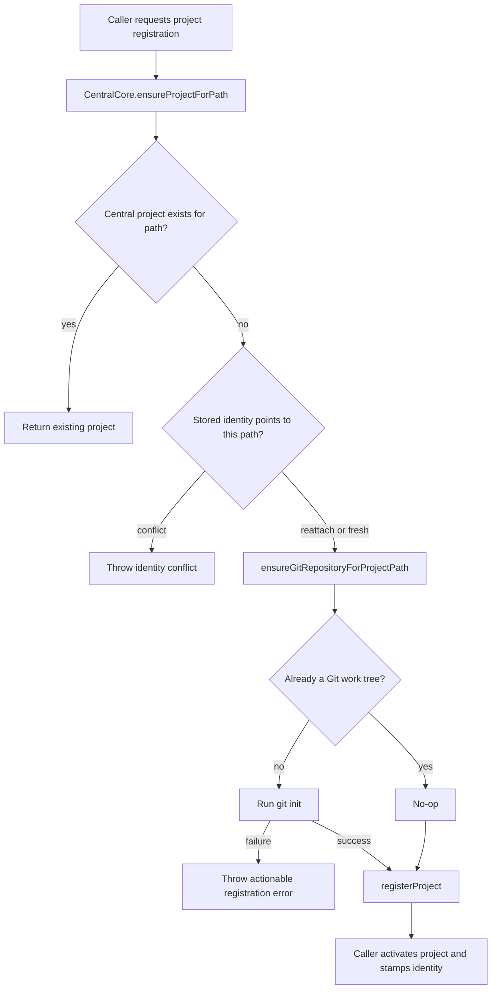

# fix: Initialize Git repositories during project registration

## Summary

Initialize Git metadata automatically when Fusion registers a project path that is not already a Git repository. The fix should live at the shared registration boundary so dashboard, setup, CLI, and auto-registration paths all avoid the first-task failure where the executor reports that the project is not a Git repository.

---

## Problem Frame

Issue #1455 reports that adding a new project without `.git` succeeds, but first task execution fails because Fusion requires a Git repository for worktree creation. The current failure appears later in `packages/engine/src/executor.ts`, while project creation paths converge earlier through `CentralCore.ensureProjectForPath(...)` in `packages/core/src/central-core.ts`. A dashboard-only fix would leave CLI and first-run/setup registration paths exposed.

---

## Requirements

- R1. Registering a new project path with no existing Git repository initializes Git before the project can become usable for task execution.
- R2. Registering an existing Git repository is idempotent and does not alter commits, remotes, branches, Git config, or working tree content.
- R3. Reattaching an existing Fusion project identity at a path with no Git repository also initializes Git before activation.
- R4. Registration fails with an actionable error if `git init` fails; it must not persist a project that will immediately fail on first task creation.
- R5. Dashboard project add, setup wizard completion, CLI `fn project add`, `fn init`, and cwd auto-registration all receive the shared behavior without each carrying separate Git initialization logic.
- R6. The implementation does not create an initial commit, `.gitkeep`, remotes, or local Git author config as part of automatic project registration.
- R7. The published CLI package records a patch changeset because the behavior affects `@runfusion/fusion`.

---

## Key Technical Decisions

- **Initialize at `CentralCore.ensureProjectForPath(...)`, not in dashboard UI code.** The shared method is already used by route registration, CLI project registration, CLI cwd auto-registration, and first-run/migration setup paths, so it is the smallest boundary that covers the issue consistently.
- **Use a minimal Git initializer for registration.** Existing `fn init --git` logic creates a branch, configures author identity, writes `.gitkeep`, and creates an initial commit. That is appropriate for an explicit CLI flag but too invasive for automatic project registration; the shared helper should only run `git init` when the target is not already a repository.
- **Block registration on initialization failure.** Registering a central project row after `git init` fails only moves the failure from registration to first task execution. The registration caller should surface the failure immediately and leave central state unchanged.
- **Detect repositories with Git, not only `.git` directory existence.** `.git` can be a file in worktrees, and repository detection should match the executor's real worktree needs. A helper based on `git rev-parse --is-inside-work-tree` with a fallback for absent Git is safer than a raw `.git` existence check.
- **Keep clone-mode behavior naturally idempotent.** Dashboard clone mode already runs `git clone`; the shared initializer should detect the cloned repository and no-op rather than adding clone-specific branches.

---

## High-Level Technical Design

Registration flow after this change:

The ordering is intentional: the Git side effect happens before central row insertion for fresh and reattach outcomes, while the existing-project outcome remains a no-op to avoid surprising already-registered projects.

---

## Implementation Units

### U1. Shared minimal Git initialization helper

- **Goal:** Provide a core helper that detects whether a path is already a Git work tree and runs only `git init` when needed.
- **Requirements:** R1, R2, R4, R6.
- **Dependencies:** none.
- **Files:** `packages/core/src/git-repository.ts` (new), `packages/core/src/__tests__/git-repository.test.ts` (new), `packages/core/src/index.ts`.
- **Approach:** Add a small async helper such as `ensureGitRepositoryForProjectPath(path)` in core. Use `execFile`/promisified `execFile` with argument arrays and timeouts for `git -C <path> rev-parse --is-inside-work-tree` and `git -C <path> init`. Return a structured outcome (`existing` or `initialized`) or throw a typed/actionable error that includes the path and the underlying Git stderr/message. Do not set branch names, Git config, remotes, commits, or files.
- **Patterns to follow:** `packages/core/src/gh-cli.ts` for `execFile`-style Git command wrapping; `packages/cli/src/commands/git.ts` for Git repository detection intent; `packages/cli/src/commands/init.ts` as a contrast for the richer explicit `--git` path that this helper must not duplicate.
- **Test scenarios:**
  - Happy path: empty temp directory with no Git repository -> helper returns `initialized` and `.git` metadata exists.
  - Happy path: existing repository with a commit, configured user, and remote -> helper returns `existing` and leaves commit count, config, and remotes unchanged.
  - Edge case: Git worktree where `.git` is a file -> helper treats it as existing.
  - Error path: missing `git` binary or failing `git init` -> helper throws an actionable error and does not mask the failure.
- **Verification:** Core helper tests prove minimal side effects and failure behavior without relying on dashboard or CLI mocks.

### U2. Integrate Git initialization into central project registration

- **Goal:** Ensure fresh and reattached central project registrations initialize Git before any project row is persisted.
- **Requirements:** R1, R2, R3, R4, R5.
- **Dependencies:** U1.
- **Files:** `packages/core/src/central-core.ts`, `packages/core/src/__tests__/central-core-ensure-project.test.ts`, `packages/core/src/__tests__/central-core.test.ts`.
- **Approach:** Call the shared helper inside `ensureProjectForPath(...)` only on paths that will produce `registered` or `reattached` outcomes. Keep the `existing` outcome untouched. For identity reattach, initialize before `registerProject({ id: ... })`; for fresh registration, initialize before the final `registerProject(...)`. Let helper errors propagate so callers receive a failed registration rather than a partially usable central row.
- **Patterns to follow:** Existing `ensureProjectForPath(...)` outcome structure in `packages/core/src/central-core.ts`; existing coverage in `packages/core/src/__tests__/central-core-ensure-project.test.ts` and the broader central-core project registration tests.
- **Test scenarios:**
  - Fresh ensure: directory without Git -> returns `registered`, central row exists, and the path is a Git repository.
  - Existing ensure: already-registered path without Git from old state -> returns `existing` and does not mutate Git metadata in this compatibility path.
  - Reattach ensure: identity recovered at a directory without Git -> returns `reattached` and initializes Git before the row is reinserted.
  - Error path: helper failure before fresh registration -> promise rejects and `getProjectByPath(path)` remains undefined.
  - Error path: helper failure before reattach -> promise rejects and `getProject(identity.id)` remains undefined.
- **Verification:** Central-core tests prove the shared invariant at the registry boundary rather than only through one caller.

### U3. Preserve and simplify CLI registration behavior

- **Goal:** Ensure CLI registration paths inherit the shared initialization behavior without keeping duplicate automatic Git logic.
- **Requirements:** R1, R2, R5, R6.
- **Dependencies:** U2.
- **Files:** `packages/cli/src/commands/init.ts`, `packages/cli/src/commands/ensure-project-registered.ts`, `packages/cli/src/commands/project.ts`, `packages/cli/src/commands/__tests__/init.test.ts`, `packages/cli/src/commands/__tests__/ensure-project-registered.test.ts`, `packages/cli/src/commands/__tests__/project.test.ts`.
- **Approach:** Keep explicit `fn init --git` semantics intact for users who ask for an initial commit. Remove or update messaging that says a non-Git project is acceptable unless `--git` is passed, because shared registration will now initialize a minimal repository. In mocked CLI command tests, assert that `runInit(...)`, `runProjectAdd(...)`, and `ensureCwdProjectRegistered(...)` delegate through `ensureProjectForPath(...)` and handle propagated errors. Prove the Git side effect in real core integration tests from U2/U4 rather than duplicating it in mock-only CLI tests.
- **Patterns to follow:** Existing mocked `CentralCore.ensureProjectForPath` assertions in CLI command tests; existing `fn init --git` tests that should remain specific to initial-commit behavior.
- **Test scenarios:**
  - `runInit({ path })` without `--git` delegates to `ensureProjectForPath(...)` and no longer logs a warning that Git must be initialized manually.
  - `runInit({ path, git: true })` still creates the explicit initial commit path.
  - `runProjectAdd(..., { force: true })` still delegates registration to `ensureProjectForPath(...)`; it does not run a second Git initializer.
  - `ensureCwdProjectRegistered(...)` propagates a failed shared registration as its existing auto-registration failure path and does not stamp identity on failure.
- **Verification:** CLI tests distinguish automatic minimal registration from the explicit `--git` initial-commit command.

### U4. Lock dashboard and setup surfaces to the shared behavior

- **Goal:** Prove dashboard project add, clone add, setup wizard, and migration setup all rely on the shared central invariant.
- **Requirements:** R1, R2, R4, R5.
- **Dependencies:** U2.
- **Files:** `packages/dashboard/src/routes/register-project-routes.ts`, `packages/dashboard/src/__tests__/project-routes.test.ts`, `packages/core/src/migration.ts`, `packages/core/src/first-run.ts`, `packages/core/src/__tests__/migration.test.ts`, `packages/core/src/__tests__/first-run.test.ts`.
- **Approach:** Route code likely needs little or no production change because it already calls `ensureProjectForPath(...)`. Update route tests to reflect that missing-Git existing-directory mode succeeds through the central call, while a central helper failure returns an API error and does not activate the project. For setup/migration tests that use real `CentralCore`, add assertions that registered project paths are Git repositories afterward.
- **Patterns to follow:** `packages/dashboard/src/__tests__/project-routes.test.ts` route-handler tests for `POST /api/projects`; `MigrationCoordinator.completeSetup(...)` and `FirstRunExperience.completeSetup(...)` tests for multi-project setup flows.
- **Test scenarios:**
  - Dashboard existing-directory add with no `.git` -> HTTP 201 and central ensure receives the normalized path.
  - Dashboard clone add -> `git clone` creates the repository and shared initializer no-ops.
  - Dashboard registration when central ensure throws Git initialization failure -> non-2xx API response with actionable message and no `updateProject(...)` activation.
  - `MigrationCoordinator.completeSetup(...)` registers multiple Fusion projects without Git and each becomes a Git repository.
  - `FirstRunExperience.completeSetup(...)` registers a directory without Git and returns an active project backed by a Git repository.
- **Verification:** Surface tests cover the invariant through both mocked route calls and real core setup paths.

### U5. Documentation and release marker

- **Goal:** Document the changed registration expectation and add the required patch changeset.
- **Requirements:** R7.
- **Dependencies:** U1-U4.
- **Files:** `docs/cli-reference.md`, `docs/docker.md`, `.changeset/<descriptive-name>.md`.
- **Approach:** Update CLI docs where project initialization and project add are described so they no longer imply users must manually run `git init` before first task execution. Keep Docker guidance that Git must be available in project volumes, but clarify that Fusion initializes missing repositories during registration and still requires the `git` binary. Add a patch changeset for `@runfusion/fusion` because this alters published CLI/dashboard behavior.
- **Patterns to follow:** Existing changeset files under `.changeset/`; existing CLI docs sections for `fn init` and `fn project add`.
- **Test scenarios:** Test expectation: none -- documentation and changeset only.
- **Verification:** Docs match the final behavior and the changeset is present with a patch bump for `@runfusion/fusion`.

---

## Scope Boundaries

- Automatic registration does not create commits, branches, remotes, `.gitkeep`, or Git author config. Those remain exclusive to explicit `fn init --git`.
- Existing central project rows are not retroactively repaired when merely listed or selected. This plan fixes creation/reattach registration; broader repair of old registrations can be a follow-up if needed.
- This plan does not change executor worktree requirements. The executor should continue to reject non-Git paths if a legacy or manually corrupted project reaches it.
- This plan does not add UI prompts before Git initialization. The issue requested automatic behavior, and the chosen scope confirmed shared automatic registration.

### Deferred to Follow-Up Work

- A startup or health-check repair path for already-registered legacy projects that lack Git metadata.
- A dashboard-visible "Git initialized automatically" toast or activity event. The functional fix does not require a new user-facing notification.

---

## System-Wide Impact

The change moves a filesystem side effect into central project registration. That is intentional but important: every caller that creates or reattaches a project may now run `git init` before a central row is inserted. Multi-node path mappings are unaffected because the initializer runs only against the local path being registered on the handling node.

---

## Risks & Dependencies

- **Missing `git` binary:** registration will fail earlier and more clearly. This is preferable to creating an unusable project, but Docker and setup docs should make the requirement explicit.
- **Partial filesystem side effect:** `git init` can create `.git` and a later central insert can still fail. That leaves Git metadata without a Fusion project row, which is acceptable and recoverable by retrying registration.
- **Existing compatibility path:** already-registered projects that lack Git remain possible until a separate repair path exists. The executor's current failure remains the backstop for those legacy states.
- **Test cost:** real `git init` tests are integration tests. Keep them narrow and temp-dir based; do not add polling loops, network remotes, or slow worktree scenarios.

---

## Sources & Research

- GitHub issue: `https://github.com/Runfusion/Fusion/issues/1455`.
- Shared registration boundary: `packages/core/src/central-core.ts`.
- First-task Git failure backstop: `packages/engine/src/executor.ts`.
- Dashboard registration route: `packages/dashboard/src/routes/register-project-routes.ts`.
- CLI registration callers: `packages/cli/src/commands/init.ts`, `packages/cli/src/commands/project.ts`, `packages/cli/src/commands/ensure-project-registered.ts`.
- Setup registration callers: `packages/core/src/migration.ts`, `packages/core/src/first-run.ts`.
- Testing policy and gate commands: `AGENTS.md`, `docs/testing.md`.
