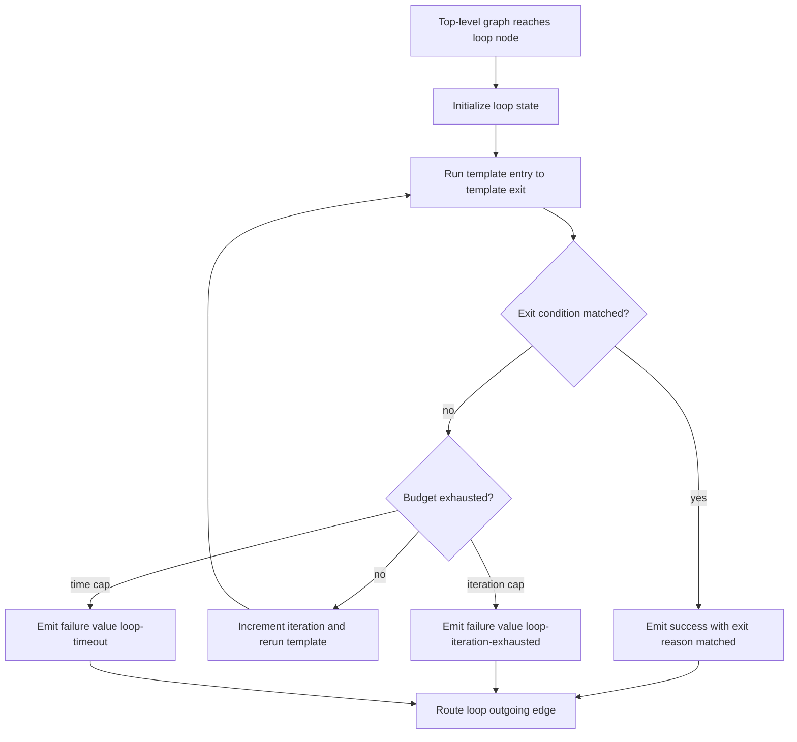

# Workflow Loop Nodes

## Summary

Add a first-class `loop` workflow node that repeats an inline node sequence until a configured exit condition is met or a configured budget expires. The loop should be available through the shared workflow IR, graph executor, editor, docs, plugin SDK exports, and published package bundle so extension workflows can use it without engine forks.

---

## Problem Frame

Workflow IR currently supports bounded corrective loops through `kind: "rework"` edges and per-step iteration through `foreach`. Those mechanisms are not a general workflow loop: authors cannot model "run these nodes until the agent says a stop token" or "retry this agentic sequence for at most N iterations or M milliseconds" without abusing rework semantics or loosening the global cycle guard. A dedicated loop node preserves the graph's acyclic safety while making bounded repeat-until behavior explicit and inspectable.

---

## Requirements

**Loop contract**

- R1. Workflow IR accepts `kind: "loop"` with an inline template graph that has exactly one entry and one exit.
- R2. A loop exits successfully when a configured agent-output string or regex matches the selected node output.
- R3. A loop exits with a routable budget outcome when `maxIterations` or `timeoutMs` is reached before the exit condition matches.
- R4. Loop execution records iteration count, exit reason, final value, and per-iteration node outcomes in workflow context for downstream routing and diagnostics.

**Safety and compatibility**

- R5. General non-rework cycles remain illegal; loop repetition is implemented inside the loop node's bounded sub-walk, not by allowing top-level cyclic edges.
- R6. Loop templates reject unsafe nesting and invalid placement in the same parse-time style as `foreach` templates.
- R7. Existing workflows, built-ins, and v1 upgrade/downgrade behavior remain unchanged unless they explicitly use `kind: "loop"`.
- R8. The public plugin SDK exports the loop node types so extension-authored workflows can declare loop nodes through the same package contract as core workflows.

**Authoring and docs**

- R9. The workflow editor can render, round-trip, copy, delete, and configure loop groups without dropping template nodes or loop settings.
- R10. Documentation explains loop semantics, exit conditions, budgets, routable outcomes, and the distinction between `loop`, `foreach`, and `rework`.
- R11. Because the published CLI package bundles the shared engine and dashboard, the release includes a changeset for `@runfusion/fusion`.

---

## High-Level Technical Design

The loop template should use the same "group node with inline subgraph" shape as `foreach`, but it is not step-source driven. Runtime expansion is one loop instance with repeated sub-walks, not one instance per planned task step.

---

## Key Technical Decisions

- KTD1. Add a distinct `loop` node kind instead of overloading `foreach`: `foreach` binds to a collection source and per-item state, while `loop` binds to a termination policy and a single repeated region.
- KTD2. Keep top-level graph cycle validation strict: the executor repeats loop templates internally, so normal edges still form an acyclic graph except existing `rework` edges.
- KTD3. Model exit conditions as explicit config: `exitWhen` should support at least `{ type: "output-contains", nodeId?, value }` and `{ type: "output-matches", nodeId?, pattern }`, with the default source being the template exit node's `value`.
- KTD4. Treat budget exhaustion as routable failure values: `loop-iteration-exhausted` and `loop-timeout` let authors park, escalate, or fail using existing `outcome:<value>` edges.
- KTD5. Reuse the editor's group-node mechanics: loop authoring should mirror `foreach` template rendering and round-trip behavior rather than creating a second bespoke canvas model.
- KTD6. Export additive types through `@fusion/core` and `@fusion/plugin-sdk`: extension packages should consume the loop contract from the shared package rather than relying on local structural copies.

---

## Implementation Units

### U1. Core IR Types and Validation

- **Goal:** Add the `loop` node contract to shared workflow IR and validate loop templates at parse time.
- **Files:** `packages/core/src/workflow-ir-types.ts`, `packages/core/src/workflow-ir.ts`, `packages/core/src/index.ts`, `packages/plugin-sdk/src/index.ts`
- **Patterns:** Follow `WorkflowForeachConfig`, `validateForeach`, `validateNoIllegalCycles`, `serializeWorkflowIr`, and extension metadata exports.
- **Test Scenarios:** Add `packages/core/src/__tests__/workflow-ir-loop.test.ts` covering valid loop parsing, duplicate template node rejection, external template edge rejection, nested loop/foreach policy, invalid exit condition config, max iteration bounds, timeout bounds, serialization round-trip, and illegal top-level cycles still rejected.
- **Verification:** `pnpm --filter @fusion/core exec vitest run src/__tests__/workflow-ir-loop.test.ts --silent=passed-only --reporter=dot`

### U2. Loop Runtime Execution

- **Goal:** Implement loop-node execution in the workflow graph executor with bounded repeat-until semantics.
- **Files:** `packages/engine/src/workflow-graph-executor.ts`, `packages/engine/src/workflow-graph-loop.ts`
- **Patterns:** Follow the extracted sub-walk style in `packages/engine/src/workflow-graph-foreach.ts` and the top-level rework budget handling in `packages/engine/src/workflow-graph-executor.ts`.
- **Test Scenarios:** Add `packages/engine/src/__tests__/workflow-graph-loop.test.ts` covering immediate match, match after multiple iterations, iteration exhaustion, timeout exhaustion with fake timers or injected clock, context patch propagation between iterations, selected `nodeId` output source, and unchanged behavior for non-loop graphs.
- **Verification:** `pnpm --filter @fusion/engine exec vitest run src/__tests__/workflow-graph-loop.test.ts --silent=passed-only --reporter=dot`

### U3. Routing and Context Semantics

- **Goal:** Define how loop outcomes and context keys participate in existing edge routing.
- **Files:** `packages/engine/src/workflow-graph-executor.ts`, `packages/engine/src/__tests__/workflow-graph-executor-parity.test.ts`
- **Patterns:** Follow `shouldTraverseEdge`, `node:<id>:outcome`, `node:<id>:value`, and foreach context recording.
- **Test Scenarios:** Cover `condition: "success"` after a matched loop, `condition: "outcome:loop-iteration-exhausted"`, `condition: "outcome:loop-timeout"`, and failure propagation when a template node fails before the exit condition can be evaluated.
- **Verification:** Include these cases in the loop runtime focused test or a small executor parity test update.

### U4. Workflow Editor Loop Authoring

- **Goal:** Add loop group rendering, palette entry, inspector controls, flow-to-IR round-trip, delete/copy behavior, and node summary text.
- **Files:** `packages/dashboard/app/components/WorkflowNodeEditor.tsx`, `packages/dashboard/app/components/workflow-flow-mapping.ts`, `packages/dashboard/app/components/nodes/WorkflowNodeTypes.tsx`, `packages/dashboard/app/components/nodes/node-summary.ts`, `packages/dashboard/app/components/WorkflowNodeEditor.css`
- **Patterns:** Follow existing `foreach` group node rendering, `foreachChildFlowId`, template remapping, `cascadeDelete`, fragment insertion, and inspector field patterns.
- **Test Scenarios:** Extend `packages/dashboard/app/components/__tests__/workflow-flow-mapping.test.ts`, `packages/dashboard/app/components/__tests__/WorkflowNodeEditor.test.tsx`, and `packages/dashboard/app/components/nodes/__tests__/node-summary.test.ts` for palette insertion, config editing, template child preservation, copy/remap, delete cascade, condition editability, and summary display.
- **Verification:** Run the focused dashboard tests named above.

### U5. Built-In Documentation and Authoring Reference

- **Goal:** Document loop node semantics and update authoring guidance so workflow authors use the right repeat primitive.
- **Files:** `docs/workflow-steps.md`, `docs/PLUGIN_AUTHORING.md`, `docs/cli-reference.md`
- **Patterns:** Follow the existing node sections for `foreach`, `step-review`, and `code`.
- **Test Scenarios:** Documentation-only assertions should rely on existing docs tests if present; otherwise no new test is needed.
- **Verification:** `pnpm lint` should catch markdown-adjacent import/doc inventory issues if any are covered by lint.

### U6. Packaging and Release Metadata

- **Goal:** Ensure the loop contract ships through the published package and remains available to extension-authored workflows.
- **Files:** `.changeset/<loop-node-name>.md`, `packages/cli/src` bundle entry points if needed, `packages/plugin-sdk/src/index.ts`
- **Patterns:** Follow `.changeset/workflow-extension-plugins.md` and the current plugin SDK export surface.
- **Test Scenarios:** Existing build coverage should prove package exports compile; add a small SDK type-export assertion only if current tests do not cover exported workflow IR types.
- **Verification:** `pnpm --filter @fusion/plugin-sdk typecheck`, `pnpm build`

### U7. Extension Workflow Consumption Pass

- **Goal:** Update extension-authored workflow templates to use `loop` where they currently need bounded repeat-until behavior.
- **Files:** Extension package workflow template files that declare repeat-until review or response regions.
- **Patterns:** Consume `WorkflowLoopConfig` and related exported types from `@fusion/plugin-sdk`; do not duplicate loop config shapes locally.
- **Test Scenarios:** Add template parse/round-trip tests in the extension package and a focused runtime dispatch test for a loop-backed extension workflow.
- **Verification:** Run that package's typecheck/build and focused tests after the shared engine change is available.

---

## Acceptance Examples

- AE1. Given a loop template whose final prompt node returns `DONE`, when `exitWhen.value` is `DONE`, then the loop runs once, records `matched`, and follows its success edge.
- AE2. Given a loop template that returns `KEEP_GOING` twice and `DONE` on the third run, when `maxIterations` is at least 3, then the loop runs three iterations and exits successfully.
- AE3. Given a loop template that never emits the configured stop string, when `maxIterations` is 2, then the loop emits `value: "loop-iteration-exhausted"` and follows an `outcome:loop-iteration-exhausted` edge if present.
- AE4. Given a loop template that runs longer than `timeoutMs`, when the timeout elapses, then the loop emits `value: "loop-timeout"` without running another iteration.
- AE5. Given a workflow with a top-level non-rework cycle, when it is parsed, then parse still rejects it even if the workflow also contains a valid loop node.

---

## Scope Boundaries

- This plan does not add unbounded graph cycles.
- This plan does not change `foreach(source:"task-steps")` semantics.
- This plan does not replace existing PR review `rework` loops; it adds a separate authoring primitive for repeat-until workflows.
- This plan does not introduce persistent loop-instance tables unless implementation discovers a restart-resume requirement that cannot be met from existing run context.

---

## Risks and Dependencies

- **Loop output source ambiguity:** Authors may expect any agent text to count as loop output. The initial contract should define one source clearly: the selected template node's `WorkflowNodeResult.value`, defaulting to the template exit node.
- **Timeout testing risk:** Real timers would slow the suite. Use fake timers or an injectable clock/deadline helper for timeout exhaustion coverage.
- **Editor complexity:** `foreach` already has careful group-node round-trip behavior. Loop should reuse that mapping machinery or small generalized helpers to avoid a second drift-prone group implementation.
- **Extension timing:** Extension workflow templates can adopt `loop` after the shared package exports land; until then they should continue to parse under the current engine contract.

---

## Sources

- `packages/core/src/workflow-ir-types.ts` defines current node kinds, `WorkflowForeachConfig`, and rework budget helpers.
- `packages/core/src/workflow-ir.ts` validates `foreach` templates and rejects non-rework cycles.
- `packages/engine/src/workflow-graph-executor.ts` owns graph traversal, top-level rework handling, and node outcome routing.
- `packages/engine/src/workflow-graph-foreach.ts` provides the closest runtime pattern for a bounded inline sub-walk.
- `packages/dashboard/app/components/workflow-flow-mapping.ts` and `packages/dashboard/app/components/WorkflowNodeEditor.tsx` provide the existing group-node authoring pattern.
- `docs/workflow-steps.md` documents current `foreach`, `rework`, and `code` node semantics.
