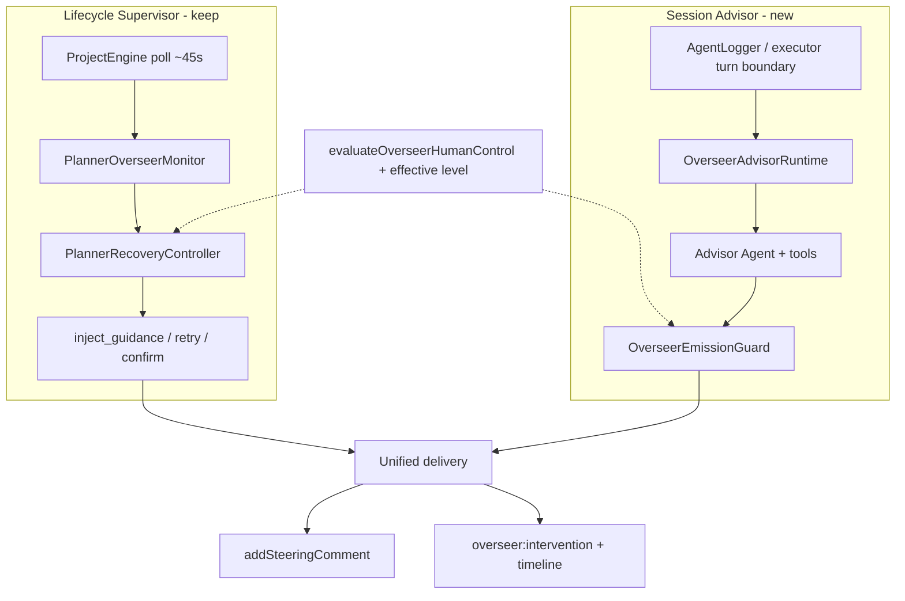

# feat: Overseer session advisor (OMP advisor parity)

## Summary

Add a live, transcript-aware **session advisor** beside Fusion’s existing lifecycle planner overseer so in-flight executors get concrete, severity-routed advice (oh-my-pi advisor shape), without discarding stage watching, bounded recovery, merge confirmation, or human-control withhold.

## Problem Frame

Fusion’s planner overseer (FN-7511–7520, FN-7551, FN-7577, FN-7743) is a strong **lifecycle supervisor**: it polls store state every ~45s, derives stage signals, and at `autonomous` may inject canned steering, retry, or request confirmation. It does **not** read agent transcripts or run a second model, so it cannot catch “working hard in the wrong direction,” thin verification, or churn until a coarse stall signal fires (often hours later).

oh-my-pi’s advisor is the complementary shape: after each primary turn it feeds transcript deltas to a separate agent with read tools and an `advise` tool, prefers silence, enforces emission hygiene in code, and routes by severity.

Operators want Fusion’s overseer to **work like that advisor** for coding sessions while keeping board-native recovery and safety gates.

## Requirements

- R1. While an executor session is active and session advising is enabled, a second model reviews **transcript deltas** (not only board column metadata) and may produce at most one concrete note per advisor update.
- R2. Advice delivery is severity-aware: `nit` (non-interrupting), `concern` / `blocker` (steering-weight); silence is the default when the agent is on track.
- R3. Content-free and duplicate advice never reaches the executor (load-bearing emission guard, not prompt-only).
- R4. Project-specific review priorities can be configured without code changes (`OVERSEER.md`, optionally honoring `WATCHDOG.md` aliases).
- R5. Effective planner oversight levels remain the master gate: `off` does nothing; `observe` may run AI but does not inject; `steer` injects advice only; `autonomous` allows advice plus existing bounded lifecycle recovery.
- R6. Human-control policy still withholds **all** inject/retry/confirm paths for user-paused and auto-merge-off/human-review tasks (`evaluateOverseerHumanControl`).
- R7. Merge/PR and destructive side effects remain confirmation-gated; the session advisor never self-approves merge.
- R8. Lifecycle supervisor behavior (stage observation, stall→guidance/retry, intervention timeline, nudge/stop/explain) continues to work when the session advisor is off, misconfigured, or failing.
- R9. Overseer/advisor model usage is attributable separately from the executor (distinct agent role / log stream).
- R10. v1 ships **executor lane only**; multi-advisor YAML, mutating advisor tools, and reviewer/merger shadowing are deferred.

## Assumptions

Product call-outs resolved as planning defaults (redirect before implementation if wrong):

- A1. **Session AI defaults off** until a dedicated overseer/advisor model role (or explicit model setting) is configured — even if oversight level is `autonomous`. Avoids surprise cost on every task after upgrade.
- A2. **v1 delivery = steering comments** via existing `addSteeringComment` + executor real-time injection. True tool-abort interrupt is deferred unless a safe runtime seam is already free.
- A3. Config discovery accepts **`OVERSEER.md` and `WATCHDOG.md`** (and `.fusion/` / user agent-dir equivalents) so OMP-familiar operators are not blocked.
- A4. First ship is **executor-only**; other stages keep lifecycle rules only.

## Scope Boundaries

### In scope

- Hybrid architecture: lifecycle supervisor + session advisor
- Emission guard, severity metadata, intervention timeline extensions
- Agent-log / turn-boundary delta runtime for executor
- LLM advisor agent (read-only tools + `advise`), system prompt adapted from OMP peer-reviewer framing
- Settings: enablement via model role + level matrix; optional sync backlog / immune turns
- Docs: architecture, settings-reference, dashboard-guide

### Deferred to Follow-Up Work

- Multi-advisor roster (`OVERSEER.yml` / `WATCHDOG.yml` specialists)
- Mutating advisor tools (`edit`/`write`/`bash`)
- Reviewer / merger / PR-lane session shadowing
- True in-flight tool abort on `blocker`
- Subagent / workspace-repo per-cwd advisors
- Full Agent Hub-style advisor dump UX (minimal status first)

### Out of scope

- Replacing self-healing or StuckTaskDetector
- Changing merge authorization / auto-merge contracts
- Publishing a separate npm package for the advisor runtime

## High-Level Technical Design

### Hybrid topology



### Level × path matrix

| Effective level | Lifecycle supervisor | Session advisor |
|---|---|---|
| `off` | idle | idle |
| `observe` | record observations | LLM may run; **no inject** (timeline/observe only) |
| `steer` | no retry/re-enqueue | LLM injects nit/concern (and blocker as strong steer) |
| `autonomous` | full bounded recovery | full advice + recovery coupling |

### Session advisor runtime loop (directional)

```
onExecutorLogFlush / turn-end marker
  → render delta since cursor (filter prior advisories)
  → optional backlog wait (default off)
  → advisor.prompt(batch)
  → advise(note, severity?) → emission guard
  → if accepted and level allows inject → addSteeringComment + intervention
  → on 3 consecutive advisor failures → drop backlog, notify once, continue executor
```

### Delivery mapping

| Severity | v1 Fusion delivery |
|---|---|
| silence | no comment |
| `nit` | steering comment, metadata `severity=nit` |
| `concern` / `blocker` | steering comment, higher severity metadata; immuneTurns suppresses repeated hard steers |

## Key Technical Decisions

- KTD1. **Composite overseer, not a rewrite:** keep FN-7511–7520 modules; add parallel session-advisor modules and a thin composition point in `ProjectEngine` / executor wiring.
- KTD2. **Steering channel reuse:** all advice lands through `TaskStore.addSteeringComment` so existing executor mid-flight injection and step-session paths apply without a new IPC channel.
- KTD3. **Emission guard in code first:** port OMP `AdvisorEmissionGuard` semantics (normalize, content-free phrase set, session dedupe FIFO, one accept per advisor update, severity-rank escalation for same note text) before enabling LLM defaults.
- KTD4. **Delta source = agent log stream:** hook after durable agent-log flushes (and/or explicit turn-end markers if present), not a second 45s poll of task rows. Cursor seeds when advising enables mid-task; resets on session switch / worktree rebind / compaction-like history rewrite.
- KTD5. **Model gate separate from oversight level:** session AI runs only when (level ≠ off) **and** an overseer/advisor model resolves; missing model is soft-disable with a single diagnostic, not a hard task failure.
- KTD6. **Read-only tool pool in v1:** grant investigative tools scoped to the task worktree; no mutating tools.
- KTD7. **Lifecycle canned guidance remains fallback:** when AI is unavailable, existing `decidePlannerRecovery` + canned `[planner-oversight] ${reason}` paths still operate; when AI is available, prefer AI-authored notes for inject_guidance-class actions.
- KTD8. **Cost defaults conservative:** `syncBacklog` default `off`; immune turns default `3`; no lockstep blocking of the executor.
- KTD9. **Postgres/storage-neutral design:** advisor state is in-memory runtime + existing store APIs (steering comments, run-audit, agent logs). No new SQLite assumptions after the PG cutover on main.

## Implementation Units

### U1. Advice contracts and emission guard

**Goal:** Shared types and pure emission policy that make silence/dedupe load-bearing.

**Requirements:** R2, R3

**Dependencies:** none

**Files:**
- create: `packages/core/src/overseer-advice.ts`
- create: `packages/core/src/overseer-emission-guard.ts`
- create: `packages/core/src/__tests__/overseer-emission-guard.test.ts`
- modify: `packages/core/src/index.ts` (exports)

**Approach:** Define `OverseerAdviceSeverity`, `OverseerAdviceNote`, severity rank (nit < concern < blocker), and `OverseerEmissionGuard` with `beginUpdate` / `accept` / `reset`. Mirror OMP normalization (NFKC, alnum fold) and the conservative content-free phrase set. No engine imports.

**Patterns to follow:** pure never-throw style of `packages/core/src/planner-recovery.ts` and `packages/core/src/planner-confirmation.ts`.

**Test scenarios:**
- Empty / whitespace-only note rejected
- `"Stop."`, `"LGTM"`, `"no issue; continue."` variants rejected after normalize
- Same note text accepted once; second identical call rejected
- Same text at higher severity accepted once (nit → concern escalation)
- After `beginUpdate`, second different note in same update rejected; next `beginUpdate` allows one again
- `reset` clears history so prior note can re-fire

**Verification:** core unit tests green; package exports resolve.

---

### U2. Steering and intervention metadata for severity / source

**Goal:** Operators and agents can distinguish lifecycle canned guidance from session advice and see severity on the timeline.

**Requirements:** R2, R9

**Dependencies:** U1

**Files:**
- modify: `packages/core/src/planner-intervention.ts` (and/or types for intervention metadata)
- modify: `packages/core/src/planner-overseer-events.ts`
- modify: `packages/core/src/__tests__/planner-overseer-events.test.ts`
- modify: `packages/engine/src/project-engine.ts` (handler comment prefixes / metadata)
- modify: `packages/dashboard/app/components/PlannerInterventionTimeline.tsx` (severity/source display)
- modify: dashboard timeline tests if present

**Approach:** Extend intervention entries with optional `severity`, `source` (`lifecycle` | `session-advisor` | `manual`), and optional `advisorSlug`. Keep backward compatibility for existing timeline rows. Emit façade helpers accept the new optional fields without breaking call sites.

**Patterns to follow:** `emitOverseerSteering` / `recordPlannerIntervention` additive metadata style (FN-7520).

**Test scenarios:**
- Existing intervention parse still works without severity/source
- New emission with severity+source round-trips through parse helpers
- Lifecycle inject path still records timeline entries
- Timeline UI renders severity badge when present; omits when absent

**Verification:** core + dashboard component tests for timeline rendering.

---

### U3. Session delta runtime (no LLM)

**Goal:** OMP-shaped cursor/backlog/reset runtime over executor log deltas, fully testable with fakes.

**Requirements:** R1, R8

**Dependencies:** U1

**Files:**
- create: `packages/engine/src/overseer-advisor-runtime.ts`
- create: `packages/engine/src/overseer-session-delta.ts` (log entries → markdown batch)
- create: `packages/engine/src/__tests__/overseer-advisor-runtime.test.ts`
- create: `packages/engine/src/__tests__/overseer-session-delta.test.ts`

**Approach:** Port the control plane of OMP `AdvisorRuntime`: pending batches, backlog count, epoch invalidation on reset/dispose, 3-failure drop, `seedTo`, filter self-advisories from deltas. Host interface: `snapshotDelta()`, `enqueueAdvice()`, `beginAdvisorUpdate()`, optional `onTurnError` / `notifyFailure`. No real model in this unit — fake agent records prompts.

**Patterns to follow:** OMP `runtime.ts` control flow; Fusion degrade-to-no-op conventions from `PlannerRecoveryController`.

**Test scenarios:**
- Happy path: two flushes produce two deltas then one drained prompt when batched
- Seed mid-session: first update does not replay entire history
- Reset after “session switch”: epoch drops in-flight batch; next prompt is re-prime/replay from new cursor
- Self-advisory lines filtered out of next delta
- Three consecutive prompt failures drop backlog and call notify once
- Dispose aborts and clears waiters

**Verification:** engine unit tests with fake timers only (no real polling sleeps).

---

### U4. Executor log-tail seam

**Goal:** Wire runtime to real executor logging without blocking the executor path.

**Requirements:** R1, R8, R10

**Dependencies:** U3

**Files:**
- modify: `packages/engine/src/agent-logger.ts` (optional non-blocking `onEntriesFlushed` / turn marker hook)
- modify: `packages/engine/src/executor.ts` and/or `packages/engine/src/project-engine.ts` (construct/dispose per-task runtime)
- create: `packages/engine/src/__tests__/overseer-advisor-wiring.test.ts` (or extend existing executor harness if lighter)

**Approach:** After durable log flush for agent role `executor`, notify the task’s advisor runtime with best-effort async (never throw into AgentLogger). Create runtime when task enters in-progress with advising eligible; dispose/clear on terminal or lane change. Prefer fail-soft if store/getAgentLogs is unavailable.

**Patterns to follow:** AgentLogger external callbacks (`onAgentText`); ProjectEngine planner-overseer poll init/teardown.

**Test scenarios:**
- Flush with advising eligible → runtime `onTurnEnd` invoked
- Flush when level `off` or no model → no runtime prompt
- Logger flush failure in subscriber does not reject AgentLogger.flush
- Task completion disposes runtime and clears maps (no leak across tasks)

**Verification:** focused engine tests; no full-suite requirement.

---

### U5. LLM advisor agent + advise tool + model gate

**Goal:** Real second model produces notes that pass the guard and inject when policy allows.

**Requirements:** R1–R3, R5–R7, R9

**Dependencies:** U2, U4

**Files:**
- create: `packages/engine/src/overseer-advise-tool.ts`
- create: `packages/engine/src/overseer-advisor-session.ts` (build agent, tools, system prompt packing)
- create: `packages/engine/src/__tests__/overseer-advise-tool.test.ts`
- create: `packages/engine/src/__tests__/overseer-advisor-session.test.ts` (mock/scripted provider)
- modify: `packages/core/src/builtin-workflow-settings.ts` and/or model-role resolution surfaces (overseer model setting)
- modify: `packages/engine/src/project-engine.ts` (compose delivery with human-control + level)
- docs settings as needed in U8

**Approach:** Isolated session identity (`-overseer` / agent=`overseer`). Tools: worktree-scoped read/grep/glob + `advise`. System prompt: OMP peer-reviewer framing adapted to Fusion (PROMPT.md, File Scope, verification, don’t restate known tool errors). `advise` executes → emission guard → if inject allowed, `addSteeringComment` + intervention. Attribute logs with agent overseer. Mock/scripted provider is the CI path.

**Patterns to follow:** existing multi-lane model resolution; mock provider `testMode` forcing; FN-7514 human-control before inject.

**Test scenarios:**
- Scripted model returns concern → steering comment text is the note (not canned lifecycle reason)
- Scripted model returns “no issue continue” phrase → guard drops; no steering comment
- User-paused task → no inject even if model advises
- Level `observe` → intervention/observe recorded, no steering comment
- Level `off` or missing model → no advisor prompt
- Merge stage not handled by session advisor (lifecycle only)

**Verification:** mock-provider engine tests; intervention timeline shows session-advisor source.

---

### U6. OVERSEER.md / WATCHDOG.md discovery

**Goal:** Project and user review priorities append to the advisor system prompt.

**Requirements:** R4

**Dependencies:** U5

**Files:**
- create: `packages/engine/src/overseer-watchdog.ts`
- create: `packages/engine/src/__tests__/overseer-watchdog.test.ts`
- modify: `packages/engine/src/overseer-advisor-session.ts` (prompt assembly)

**Approach:** Discover readable candidates from user agent dir + walk cwd → repo root for `OVERSEER.md`, `WATCHDOG.md`, and `.fusion/` / `.omp/` variants. Concatenate user-first then ancestor→leaf. Malformed/missing files never throw. Expand `@imports` only if an existing Fusion helper already does for context files; otherwise ship plain content first and note import expansion as follow-up.

**Patterns to follow:** OMP `collectConfigCandidates` search path; Fusion project context loading conventions.

**Test scenarios:**
- No files → undefined/empty blocks, session still builds
- User + project files both load; leaf project more prominent (order asserted)
- Only `WATCHDOG.md` present still loads (alias)
- Unreadable path skipped without throwing

**Verification:** unit tests with temp dirs (bounded, not system `$TMPDIR` walks).

---

### U7. Lifecycle ↔ advisor coupling (bounded)

**Goal:** AI and rules reinforce each other without double-spamming.

**Requirements:** R1, R7, R8

**Dependencies:** U5

**Files:**
- modify: `packages/engine/src/planner-recovery-controller.ts` and/or `packages/engine/src/project-engine.ts` handlers
- modify: `packages/core/src/planner-recovery.ts` only if pure decision needs an optional “hasRecentAdvisorBlocker” input (prefer engine-side)
- create/modify: `packages/engine/src/__tests__/overseer-lifecycle-coupling.test.ts`
- optional: feed StuckTaskDetector / stall path only via existing signals

**Approach:** When session advisor accepts a `blocker` about churn, allow lifecycle to treat guidance as already spent or to accelerate a single targeted-fix steering comment with log refs — without bypassing attempt budgets. When AI is healthy and already advised this stage, suppress identical canned lifecycle inject_guidance text via emission guard. Keep merge confirmation path untouched.

**Patterns to follow:** FN-7577 healthy-signal no-op; FN-7743 stall detection remains independent fail-safe.

**Test scenarios:**
- Advisor concern already injected → lifecycle same-reason canned inject deduped
- Advisor disabled → lifecycle canned inject still works on stuck
- Exhausted recovery budget still escalates once

**Verification:** controller unit tests with fake snapshot + fake handlers.

---

### U8. Operator UX and documentation

**Goal:** Status visibility and docs for the new layer without a full redesign.

**Requirements:** R5, R9

**Dependencies:** U5

**Files:**
- modify: `packages/core/src/planner-overseer-state.ts` (optional fields: lastAdviceSeverity, advisorBacklog, advisorModel?)
- modify: `packages/engine/src/planner-overseer-runtime-snapshot.ts`
- modify: `packages/dashboard/app/components/TaskDetailModal.tsx` (oversight cluster status strip)
- modify: related dashboard tests
- modify: `docs/architecture.md`, `docs/settings-reference.md`, `docs/dashboard-guide.md`, `docs/getting-started.md` pointer
- changeset for `@runfusion/fusion` if published surface/behavior changes

**Approach:** Additive snapshot fields; never fail board load. Document level matrix, model gate, OVERSEER.md locations, cost defaults. Changeset category `feature` with operator-facing summary.

**Patterns to follow:** FN-7531 snapshot enrichment; existing oversight cluster controls.

**Test scenarios:**
- Snapshot without advisor → existing fields only
- Snapshot with backlog/last severity → detail UI shows them
- Settings reference documents new keys

**Verification:** dashboard unit tests + docs updated; `pnpm check:changesets` if changeset added.

---

## Alternative Approaches Considered

| Approach | Why not (for this plan) |
|---|---|
| Replace lifecycle overseer entirely with OMP-style advisor | Loses merge confirmation, multi-stage recovery, board semantics Fusion already ships |
| Poll agent logs every 45s only (no turn-boundary hook) | Too laggy for “wrong direction” advice; worse than OMP turn-end |
| Always-on second model for every autonomous task | Cost blow-up; rejected via A1 model gate |
| Full multi-advisor YAML in v1 | High config surface; defer until single-advisor path is proven |

## Risks & Dependencies

| Risk | Mitigation |
|---|---|
| Cost explosion across many concurrent tasks | Model gate default off; backlog off; 1 note/update; cheap model role |
| Advice spam (OMP #3520 class) | U1 guard before LLM ship |
| Recursive self-review | Filter advisory-origin content from deltas |
| Executor latency | Never block executor by default |
| Secrets in transcript | Worktree-scoped tools; reuse secret-redaction if present; no secrets tools |
| Human-control regression | Re-check guard at inject; tests in U5 |
| PG migration / storage churn on main | No new local DB files; use store APIs only (KTD9) |
| Flaky tests | Mock provider + fake timers; quarantine-on-sight policy |

**Dependencies:** Existing executor steering injection; agent-log persistence; planner oversight settings; mock provider for CI.

## Phased Delivery

1. **Foundation:** U1 → U2 → U3  
2. **Wire + AI:** U4 → U5 → U6  
3. **Harden + UX:** U7 → U8  

Recommended first shippable milestone: **U1–U6** (executor session advisor with docs light), then U7–U8 polish.

## Success Metrics

- Executor going wrong-direction receives a specific note without waiting for the 2h stall threshold
- Healthy progressing tasks do not accumulate noise interventions from the session advisor
- User-paused / autoMerge-off tasks never receive advisor injects
- Advisor off or failing does not block task completion or lifecycle recovery
- Overseer token usage visible separately from executor

## Documentation Plan

- Architecture: hybrid supervisor + session advisor subsection
- Settings reference: model gate, levels, optional backlog/immune turns, OVERSEER.md paths
- Dashboard guide: timeline severity/source; detail status strip
- Getting started: one-line pointer

## Open Questions

None blocking. Redirect A1–A4 before U5 if product defaults should change.

## Deferred Implementation Notes

- Exact helper names and whether advise is a pi tool vs internal function
- Whether turn-end is an explicit session event or inferred from tool_result quiescence
- Optional `@import` expansion for OVERSEER.md
- Whether immuneTurns is workflow setting or constant in v1

## Sources & Research

- Upstream: [oh-my-pi advisor package](https://github.com/can1357/oh-my-pi/tree/main/packages/coding-agent/src/advisor), [advisor-watchdog.md](https://github.com/can1357/oh-my-pi/blob/main/docs/advisor-watchdog.md)
- Local lifecycle stack (still present on main after 2026-07-13 refresh):  
  `packages/engine/src/planner-overseer.ts`, `planner-recovery-controller.ts`, `overseer-human-control-policy.ts`, `packages/core/src/planner-recovery.ts`, `planner-overseer-events.ts`, `project-engine.ts` poll wiring
- Delivery seam: `TaskStore.addSteeringComment` + executor real-time steering injection in `packages/engine/src/executor.ts`
- Log seam: `packages/engine/src/agent-logger.ts`
- Strategy alignment: Fusion orchestration track (task completion quality / concurrent agent reliability) — session advising reduces wasted executor turns

## System-Wide Impact

- Engine concurrency: one additional model stream per advised in-progress task when enabled
- Run-audit volume: more `overseer:intervention` rows when AI advises; keep dedupe
- Dashboard: timeline + detail only; board list stays best-effort snapshot
- No merge contract change; no multi-node protocol change

---

## Prior draft

Supersedes the freeform gap analysis previously at `docs/plans/2026-07-11-001-feat-overseer-advisor-parity-plan.md` (rewritten into this ce-plan contract after `origin/main` refresh).
