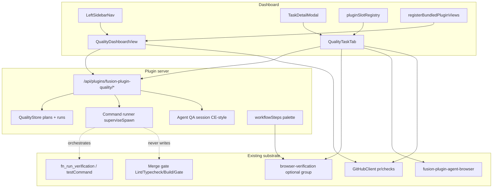
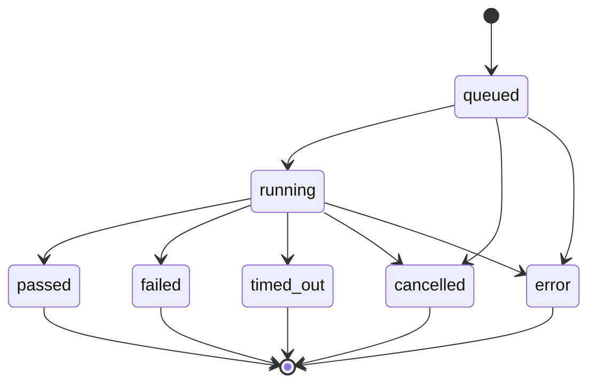
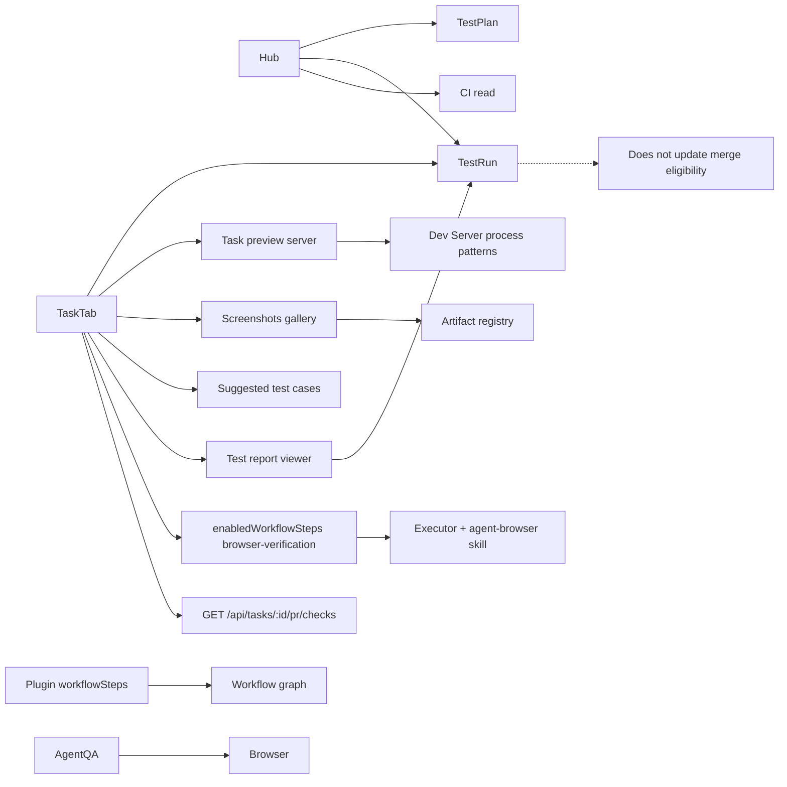

# feat: Fusion Quality (QA) plugin — hub, task tab, and agent QA flows

## Summary

Ship a bundled Fusion plugin that makes **task QA easy and visual**: a Task QA tab where operators start a **task-scoped preview/test server**, run targeted tests, see **screenshots of changes**, open **test reports**, and get **suggested test cases** — backed by a project Quality hub for history, plans, and CI. Compose existing Dev Server, artifacts, agent-browser, and verification seams; do not invent a second merge gate or browser stack.

---

## Problem Frame

Fusion already has strong quality *substrate* — thin merge gate (`pnpm test:gate`), `fn_run_verification`, project `testCommand` / `verify:fast`, built-in `browser-verification` + `fusion-plugin-agent-browser`, **project Dev Server** (preview URL detection), **artifact registry** (screenshots/images gallery), design-preview task docs, and PR check rollups — but operators still lack a **single task-level QA surface**. Doing real QA on a task means jumping between terminal, Dev Server view, Artifacts, workflow toggles, and PR checks.

What operators actually want when “performing QA on a task”:

1. **Start a test/preview server for this task’s worktree** and open the app.
2. **See screenshots of the change** (before/after, browser evidence, registered images).
3. **View test reports** from runs they just triggered (not only raw terminal logs).
4. **Suggested test cases** derived from the task prompt, file scope, and diff — so they know what to check.

`ROADMAP.md` lists **QA interface** as planned work. The Quality plugin should make that path intuitive on the task, with a project hub as the secondary control plane.

---

## Requirements

### Surfaces and registration

- R1. A bundled plugin (`fusion-plugin-quality`) appears as a left-sidebar **Quality** destination when installed and enabled (desktop primary nav; mobile under More).
- R12. Full bundled registration matrix is complete (workspace, dashboard package dependency, staged/auto-install IDs, tsup, Vite/Vitest aliases, `registerBundledPluginViews`, `pluginSlotRegistry` + slot context props, Plugin Manager card) so the hub and tab never ship as “unavailable” shells.
- R13. New UI affordances satisfy **Surface Enumeration** across desktop, mobile, empty/auth/missing-plugin states.

### Hub runs and plans

- R2. Quality hub shows a **test dashboard**: recent runs with lifecycle statuses `passed` | `failed` | `timed_out` | `cancelled` | `error` (plus in-flight `queued`/`running`), last command, duration (`startedAt`/`finishedAt` or `durationMs`), and links into logs.
- R3. Operators can **run tests** from the hub via an allowlisted preset set: `project-test` (settings `testCommand` / auto-detect), `test-gate` → `pnpm test:gate`, `verify-fast` → `pnpm verify:fast`, `file-scoped` when task/changed-files context exists, and `full-suite` only behind explicit confirm (never default) — never free-form shell as the default path.
- R4. Operators can **create, edit, archive, and run Test Plans** composed of ordered command-preset steps (optional browser-verification intent flag only; agent-QA start is not a plan step in this plan).

### CI

- R5. **Task QA** surfaces read-only PR check status by reusing host `GET /api/tasks/:id/pr/checks`. **Hub CI** is a thin read of open-task PR check rollups and/or default-branch summary via a **host route or `gh` CLI path** (not a direct plugin import of dashboard `GitHubClient`); no write actions to CI.

### Task QA (primary product surface)

- R6. Task detail gains a **QA tab** for the open task: preview server, targeted tests, reports, screenshots, suggested cases, PR checks, browser verification, and agent QA entry. Host must inject task context (`taskId`, worktree, `projectId`) into the slot component.
- R7. Browser verification **composes** `fusion-plugin-agent-browser` and the built-in `browser-verification` optional group — does not reimplement Playwright/driver. Enable/toggle lives on **Task QA** (hub may deep-link only).
- R8. Plugin contributes **advisory** workflow-step palette templates for targeted QA (`defaultOn: false`); they must not become the merge gate.
- R9. Long-running **agent-driven QA** sessions use detach + progress (Compound Engineering pattern), not blocking HTTP handlers; probe `createInteractiveAiSession` and empty-state when the engine factory is missing.
- R16. Operators can **start / stop / open a task-scoped preview (test) server** from Task QA with cwd = task worktree (required), command from project Dev Server config / package scripts (`dev`, `start`, etc.), free port (never 4040), and detected or manual preview URL. Compose existing Dev Server process/manager patterns rather than a second process subsystem when feasible.
- R17. Task QA shows a **Screenshots / visual evidence** gallery for the task: task-scoped image artifacts, browser-verification captures, and design-preview docs when present — with empty-state CTA (“capture with browser verification” / “register artifact”). Link into Artifacts view for full media.
- R18. After a test run, operators can **view a test report** for that run: status, duration, command, truncated logs, and optional structured summary when parsers exist (e.g. vitest JSON / junit if output path is known). History list of task-scoped reports is first-class in the tab.
- R19. Task QA offers **suggested test cases** derived from task title/PROMPT, File Scope / modified files, and optional diff summary — displayed as a checklist operators can tick, copy, or “run related tests.” Generation is advisory (AI session or deterministic heuristics); never blocks merge.
- R20. Primary Task QA layout is **action-first**: Preview server | Run tests | Screenshots | Reports | Suggested cases (then CI / browser / agent). Mobile uses stacked sections with the same Surface Enumeration rules.

### Process, policy, storage

- R10. Command runs and preview servers use supervised async process spawning available on the **published plugin packaging path** (extend `plugin-sdk-core-runtime-shim` to export `superviseSpawn` **or** a plugin-local supervised wrapper — decide in U3), with timeouts where applicable, cancel, and process-group cleanup — never `execSync`, never port 4040, never raw detached spawn.
- R11. Quality runs are **visualization/orchestration only**: they do not change merge eligibility, rewrite `testCommand`, or force `allowFullSuite`.
- R14. Plugin-owned schema stores plans, run history, suggested-case snapshots, and preview-session metadata with `projectId` isolation and retention caps. Runners fail-soft when the plugin is disabled mid-run.
- R15. Preset resolution never interpolates unsanitized user strings into a shell: allowlisted argv/command builders only; project settings / Dev Server commands treated as trusted operator config, not task/agent free text.

---

## Scope Boundaries

### In scope

- Bundled workspace plugin package under `plugins/fusion-plugin-quality`
- **Task QA tab as primary UX** (action-first: preview server, tests, screenshots, reports, suggested cases)
- Quality hub (`dashboardViews` + host registry) for project history / plans / CI
- TestPlan / TestRun / SuggestedCases domain + plugin routes + dashboard UI
- Allowlisted command orchestration + progress + **report view**
- **Task-scoped preview/test server** composing Dev Server patterns (worktree cwd, preview URL, never 4040)
- **Screenshot / visual evidence** panel composing task artifacts + browser captures + design-preview docs
- **Suggested test cases** (heuristic + optional AI generation)
- Read-only CI: task PR checks reuse; hub thin rollup via host route or `gh` (KTD 5)
- Soft composition with agent-browser + built-in browser-verification group (Task QA)
- Advisory plugin `workflowSteps` + agent QA session entry (later units; after core Task QA)
- Host work: task-detail slot context injection + supervised-spawn packaging export
- Settings schema; docs; CONCEPTS; changeset when packaging ships

### Out of scope

- Replacing or widening the PR merge gate / inventing a second blocking suite
- Full suite discovery / coverage engines / flaky auto-quarantine product
- Multi-provider CI beyond GitHub read-only
- `task-card-badge` CI badges (host surface still Planned)
- New Playwright stack inside Quality (compose agent-browser)
- Making Quality plugin workflow steps merge-blocking by default
- Full-suite as a one-click default action
- Pixel-perfect visual regression product (Percy/Chromatic) — only gallery of existing captures
- Replacing the global Dev Server view (compose / deep-link; task-scoped start is additive)
- Desktop-native notifications product
- Releasing from a Fusion task (`pnpm release`)
- Direct plugin imports of private dashboard `GitHubClient` modules

### Deferred to follow-up work

- Project-wide GitHub Actions deep history / log streaming explorer
- Cross-project Quality portfolio view
- Automatic “attach to in-flight executor verification” process sharing
- Rich standalone HTML export of QA runs (could compose reports plugin)
- Fixing sibling footgun: `fusion-plugin-reports` missing host view registration
- Agent-QA start as a TestPlan step type
- Auto-capture before/after screenshots on every code change without operator/agent action

---

## Key Technical Decisions

1. **Ship as bundled first-party plugin `fusion-plugin-quality` (package `@fusion-plugin-examples/quality`), not core dashboard hardcoding.** Rationale: matches STRATEGY ecosystem track, reports/CE patterns, and ROADMAP “QA interface” without expanding core lifecycle.

2. **Dual surface from day one: Quality hub + Task QA tab; workflows as palette contributions.** Rationale: confirmed scope; hub answers project-wide health, task tab answers worktree-local verification — both needed for “intuitive QA.”

3. **Orchestrate allowlisted presets only — no suite discovery / coverage invent in v1.** Rationale: thin gate culture. Preset id → command map: `project-test` → settings `testCommand` (or merger auto-detect), `test-gate` → `pnpm test:gate`, `verify-fast` → `pnpm verify:fast`, `file-scoped` → vitest path list from `task.modifiedFiles` and/or parsed File Scope when non-empty else **disabled**, `full-suite` → explicit confirm only. Never free-form shell UI.

4. **Compose `fusion-plugin-agent-browser` + built-in `browser-verification` group; soft dependency with setup CTA.** Rationale: browser stack already exists; re-shipping Playwright would duplicate setup/skills and diverge from engine preflight. Enable/toggle is Task QA–owned; hub deep-links.

5. **GitHub CI is read-only with two access paths.** Task: browser/client calls host `GET /api/tasks/:id/pr/checks`. Hub: implement either (A) a host-owned read route that reuses dashboard GitHub auth/client, or (B) plugin-side `gh` CLI read with project auth empty-states — **do not** import `packages/dashboard/src/github.ts` into the plugin package. Prefer (A) when adding a small host route is acceptable.

6. **Command runs: verification-like hard timeout + log tail + supervised spawn available on the packaged plugin path.** Extend `packages/cli/src/plugin-sdk-core-runtime-shim.ts` to re-export `superviseSpawn` (preferred) **or** vendor a plugin-local supervisor matching core semantics. Agent QA: CE detach + `onProgress` + inactivity watchdog. Never import `@fusion/engine` from the plugin.

7. **cwd policy: hub = project root; task tab = task worktree if present, otherwise block with clear CTA (optional advanced “run on root”).** Rationale: silent root fallback produces false greens for unbuilt task branches.

8. **Concurrency: at most one active project-scoped command run and one active run per task; 409 when busy.** Rationale: avoid thrashing shared resources; cancel reaps process groups.

9. **All Quality workflow steps advisory (`defaultOn: false`); UX copy distinguishes advisory local results from merge gate.** Rationale: product promise — do not replace merge gate.

10. **Static host registration is acceptance criteria, not polish.** Rationale: reports historically shipped dashboardViews without host registry → “unavailable”; registration-drift solution doc is mandatory checklist.

11. **Plugin-owned SQLite/Postgres tables via `onSchemaInit` (reports pattern); every row carries `projectId`.** Rationale: isolation + hybrid storage; no core schema migration for Quality domain.

12. **Server entry never re-exports React/CSS views** (`fusion/no-plugin-view-reexport`). Dashboard modules live in separate package exports (`./dashboard-view`, `./qa-tab`).

13. **Host must inject task context into `task-detail-tab` slot components.** Extend `PluginSlot` / `PluginSlotComponentProps` with a typed bag (`taskId`, optional `worktree`, `projectId`, optional `onTaskUpdated`) and pass it from `TaskDetailModal` (and any other task-detail hosts). Without this, Task QA cannot scope runs or PR checks.

14. **Ship slices inside this plan (acceptance gates), not only sequencing.** **MVP = Task QA usable for human QA:** U1 + U2 + U3 + U6 (action-first tab: targeted tests + reports) + **U11 task preview server** + **U12 screenshots gallery** + **U13 suggested cases** + task CI. Same plan continues with U4 (plans), hub CI, U7/U9/U10 (browser / workflow / agent QA).

15. **Compose existing Dev Server and Artifacts substrates; do not fork process managers.** Task preview servers reuse `DevServerProcessManager` / route patterns (`packages/dashboard/src/dev-server-*.ts`) with **worktree cwd** and task-scoped session identity. Screenshots are task-filtered artifact registry + known task documents (`design-preview`), not a new media store — unless a thin Quality index is needed for browser-capture paths.

16. **Suggested test cases are advisory checklists, not executable gates.** Generate from task PROMPT + file scope + optional diff; store snapshot on the task (document or Quality row). Operators tick/copy/run related tests; generation failures degrade to empty + “regenerate.”

---

## High-Level Technical Design

### Component topology



### TestRun lifecycle



### Surface → cwd → runner contract

| Surface | cwd | Runner | Concurrency key |
|---------|-----|--------|-----------------|
| Quality hub command | project root | `superviseSpawn` + hard timeout | `project:{projectId}` |
| Task QA targeted tests | task worktree (required) | same | `task:{taskId}` |
| Agent QA session | project root (CE-style) unless session opts into worktree | interactive AI session detach+progress | `agent-qa:{taskId\|projectId}` |
| Workflow browser-verification | engine worktree path | existing executor group | workflow-owned |

### Handoffs



### Task QA information architecture (operator mental model)

```text
Task Detail → QA tab
├── Preview server     [Start] [Stop] [Open URL]   (worktree, free port ≠4040)
├── Run tests          presets → report opens
├── Reports            last N task runs (status, duration, logs, optional structured)
├── Screenshots        task images + browser evidence + design-preview
├── Suggested cases    checklist + Regenerate + copy / run related
├── CI checks          PR rollup (host API)
├── Browser verification  enable optional group + setup CTA
└── Agent QA           start session (later unit)
```

---

## Output Structure

```text
plugins/fusion-plugin-quality/
  package.json
  manifest.json
  README.md
  vitest.config.ts
  tsconfig.json
  src/
    index.ts                 # definePlugin: routes, schema, settings, workflowSteps, dashboardViews, uiSlots metadata only
    settings.ts
    quality-schema.ts        # onSchemaInit DDL
    store/
      quality-store.ts
      quality-types.ts
    runner/
      command-presets.ts
      command-runner.ts
    preview/                 # task-scoped preview server (compose Dev Server patterns)
    suggestions/             # suggested test cases heuristics + optional AI
    routes/
      plan-routes.ts
      run-routes.ts
      ci-routes.ts
      preview-routes.ts
      suggestions-routes.ts
      agent-qa-routes.ts
    workflow-steps.ts
    dashboard-view.tsx       # Quality hub export only
    qa-tab.tsx               # Task tab export only
    dashboard/
      QualityView.tsx
      task/
        PreviewSection.tsx
        ReportsSection.tsx
        ScreenshotsSection.tsx
        SuggestedCasesSection.tsx
        RunTestsSection.tsx
      components/...
      hooks/...
    __tests__/
      manifest.test.ts
      store.test.ts
      command-presets.test.ts
      command-runner.test.ts
      preview.test.ts
      suggestions.test.ts
      routes.test.ts
      workflow-steps.test.ts
```

Host touchpoints (existing files, not new tree):

- `pnpm-workspace.yaml`
- `packages/core/src/plugins/bundled-plugin-install.ts`
- `packages/cli/src/plugins/staged-bundled-plugin-ids.ts`
- `packages/cli/tsup.config.ts`
- `packages/cli/src/plugin-sdk-core-runtime-shim.ts` (superviseSpawn export if KTD 6 option A)
- `packages/dashboard/package.json` (`@fusion-plugin-examples/quality` workspace dep)
- `packages/dashboard/src/routes.ts` (bundled id fallback)
- `packages/dashboard/app/components/PluginManager.tsx`
- `packages/dashboard/app/plugins/registerBundledPluginViews.ts`
- `packages/dashboard/app/plugins/pluginSlotRegistry.tsx` + slot prop types
- `packages/dashboard/app/components/PluginSlot.tsx`
- `packages/dashboard/app/components/TaskDetailModal.tsx` (pass task context into plugin tabs)
- `packages/dashboard/vite.config.ts` + `vitest.config.ts` aliases
- Optional host CI route module under `packages/dashboard/src/routes/` if KTD 5 option A
- `packages/desktop` package resolution for `@fusion-plugin-examples/quality` when required (mirror CE/graph)

---

## Implementation Units

### U1. Plugin scaffold, host registration, and task slot context

**Goal:** Loadable, installable bundled plugin with empty Quality hub shell and QA tab shell that render real components (not “unavailable”), and **task-detail slots receive task context**.

**Requirements:** R1, R6, R12, R13

**Dependencies:** None

**Files:**
- `plugins/fusion-plugin-quality/**` (new package skeleton)
- `pnpm-workspace.yaml`
- `packages/core/src/plugins/bundled-plugin-install.ts`
- `packages/cli/src/plugins/staged-bundled-plugin-ids.ts`
- `packages/cli/tsup.config.ts`
- `packages/dashboard/package.json`
- `packages/dashboard/src/routes.ts`
- `packages/dashboard/app/components/PluginManager.tsx`
- `packages/dashboard/app/plugins/registerBundledPluginViews.ts`
- `packages/dashboard/app/plugins/pluginSlotRegistry.tsx`
- `packages/dashboard/app/components/PluginSlot.tsx`
- `packages/dashboard/app/components/TaskDetailModal.tsx`
- `packages/dashboard/vite.config.ts`
- `packages/dashboard/vitest.config.ts`
- `plugins/fusion-plugin-quality/src/__tests__/manifest.test.ts`
- `packages/dashboard/app/plugins/__tests__/registerBundledPluginViews.test.tsx` (extend)
- `packages/dashboard/app/components/__tests__/PluginSlot.test.tsx` (context bag)
- host tests proving `taskId` reaches the Quality slot component

**Approach:**
- Mirror compound-engineering package layout: `definePlugin` with `dashboardViews` (`viewId: "quality"`, label Quality, `placement: "primary"`, lucide icon e.g. `ShieldCheck` or `FlaskConical`, `order` ~30–40) and `uiSlots` (`task-detail-tab`, label QA).
- Register lazy view + slot components with **literal** `import()` (no `@vite-ignore` for production paths).
- Grep every registration hit for `fusion-plugin-compound-engineering` including `packages/dashboard/package.json`; do not copy reports’ incomplete view registration.
- **Host contract (load-bearing):** extend slot component props with `{ taskId, worktree?, projectId, onTaskUpdated? }`; `TaskDetailModal` passes the open task; other task-detail hosts updated if they render plugin tabs.
- Empty shells: hub title + empty states; tab placeholder sections that can read `taskId` from props.

**Patterns to follow:** `plugins/fusion-plugin-dependency-graph`, `plugins/fusion-plugin-compound-engineering`, registration-drift + vite-alias solution docs

**Test scenarios:**
- Manifest id/name/version and `dashboardViews` / `uiSlots` shapes match host contracts.
- Host registry resolves `plugin:fusion-plugin-quality:quality` to a component (not missing shell).
- Slot registry resolves Quality task-detail-tab entry.
- Active task id is passed into the slot component (regression).
- Bundled plugin id is present in core `BUNDLED_PLUGIN_IDS` and staged id set.

**Verification:** Plugin package builds; registry tests pass; Settings shows Built-in Quality card; enabling plugin shows sidebar Quality entry; Task Detail QA tab receives taskId.

---

### U2. Quality domain schema, store, and read APIs

**Goal:** Durable TestPlan and TestRun models with project isolation and retention hooks.

**Requirements:** R2, R4, R14

**Dependencies:** U1

**Files:**
- `plugins/fusion-plugin-quality/src/quality-schema.ts`
- `plugins/fusion-plugin-quality/src/store/quality-types.ts`
- `plugins/fusion-plugin-quality/src/store/quality-store.ts`
- `plugins/fusion-plugin-quality/src/routes/plan-routes.ts` (list/get/create/update/archive)
- `plugins/fusion-plugin-quality/src/routes/run-routes.ts` (list/get only in this unit)
- `plugins/fusion-plugin-quality/src/__tests__/store.test.ts`
- `plugins/fusion-plugin-quality/src/__tests__/routes.test.ts`

**Approach:**
- `onSchemaInit` idempotent DDL (reports pattern); support SQLite + Postgres async layer path if reports store does.
- **TestPlan (authoritative):** `id`, `projectId`, `name`, `status` (`draft`|`active`|`archived`), ordered steps as preset enum keys only, timestamps. No agent-QA step type in this plan.
- **TestRun (authoritative schema — U2 owns it):** `id`, `projectId`, `taskId?`, `planId?`, `source` (`hub`|`task-tab`|`workflow`|`agent-qa`), `presetId?`, `command`, `cwd`, `cwdKind` (`project-root`|`worktree`), `status` (`queued`|`running`|`passed`|`failed`|`timed_out`|`cancelled`|`error`), `exitCode?`, `errorMessage?`, `timeoutMs`, `startedAt`, `finishedAt?`, `durationMs?`, truncated `stdout`/`stderr` (or single log blob), `triggeredBy`, `progressFingerprint?`.
- Retention: cap last N runs per project (default 50) + truncate logs to N KB; prune on insert.
- Routes under `/api/plugins/fusion-plugin-quality/*` with project scoping from host context.

**Patterns to follow:** `plugins/fusion-plugin-reports/src/report-schema.ts`, `store/report-store.ts`

**Test scenarios:**
- Schema init is idempotent on second call.
- Create plan → list filters by projectId (no cross-project leak).
- Archive plan hides from default active list but remains gettable.
- Insert > retention cap prunes oldest finished runs.
- Invalid plan step key rejected.
- Backend/SQLite mode paths covered if dual-store pattern is used.

**Verification:** Store unit tests green; GET list empty state works through route handlers with mocked context.

---

### U3. Command presets, supervised runner, and hub run UX

**Goal:** Operators can run allowlisted test/verification commands from the Quality hub with live status and history.

**Requirements:** R2, R3, R10, R11, R14, R15

**Dependencies:** U2; packaging decision for supervised spawn (KTD 6)

**Files:**
- `packages/cli/src/plugin-sdk-core-runtime-shim.ts` (if option A: export superviseSpawn)
- `plugins/fusion-plugin-quality/src/runner/command-presets.ts`
- `plugins/fusion-plugin-quality/src/runner/command-runner.ts`
- `plugins/fusion-plugin-quality/src/routes/run-routes.ts` (start/cancel/progress)
- `plugins/fusion-plugin-quality/src/dashboard/*` (run panel, history, presets)
- `plugins/fusion-plugin-quality/src/__tests__/command-presets.test.ts`
- `plugins/fusion-plugin-quality/src/__tests__/command-runner.test.ts`
- `plugins/fusion-plugin-quality/src/dashboard/__tests__/*`
- shim tests if packaging path changes

**Approach:**
- **Prerequisite:** land KTD 6 so published `bundled.js` can spawn supervised children (prefer shim re-export).
- **Start-run body schema (security, R15):** only `{ preset, projectId, taskId?, confirmFullSuite?, planId? }` — **reject** client `command` / `argv` / `cwd` / `shell` overrides (400). Server resolves command and cwd only.
- **projectId required** on start/cancel/logs/get; no fallback to default task store for Quality runs; get-by-id must verify `row.projectId === request.projectId`.
- **cwd server-only:** hub → project root; task → `task.worktree` (validated task belongs to project); never accept client cwd.
- Preset id → command map (R3/KTD 3). `file-scoped`: server reads `task.modifiedFiles` / File Scope; empty → disable (never full `pnpm test`). Path tokens argv-safe; reject `..`, escapes outside worktree/root, shell metacharacters if shell mode used.
- Settings `testCommand` is trusted operator config for `project-test` only; still no client free-form shell.
- Start run: create `queued` → detach HTTP with `runId` → `running` via supervised spawn → `startedAt` → terminal + `finishedAt`/`durationMs`. Persist **resolved** command for audit; never re-exec client-supplied command.
- Timeouts: inherit `verificationCommandTimeoutMs` when set; hard ceiling ≤1800s; cancel/timeout SIGTERM then SIGKILL process group.
- Concurrency: one active project run; 409 with link to live run.
- Plugin disable mid-run: cancel children; mark `cancelled`/`error`.
- UX copy: “Advisory local run — does not change merge eligibility.”
- Progress: poll and/or `ctx.emitEvent`; tests use fakes (no real network).

**Patterns to follow:** `packages/engine/src/run-verification-tool.ts`, CE progress for event shape only

**Execution note:** Implement runner pure logic test-first with fake supervised child.

**Test scenarios:**
- Happy: start `verify-fast` → `passed` on exit 0 with duration fields set.
- Non-zero exit → `failed` with exitCode.
- Timeout → `timed_out` and kill invoked.
- Cancel while running → `cancelled`.
- Second concurrent project run → 409.
- Full-suite without confirm flag → rejected; with confirm → allowed.
- Unresolved `testCommand` → preset disabled, hub still loads.
- Empty file-scoped inputs → preset disabled.
- Body with `command` override → 400, no spawn.
- Client-supplied `cwd` → ignored/rejected; server cwd used.
- Missing `projectId` → 400; cross-project get/cancel → 404/403.
- Path injection (`../`, metacharacters) rejected for file-scoped.
- Packaged entry can resolve supervised spawn (smoke or unit on shim).
- Disable mid-run marks terminal cancelled/error.

**Verification:** Hub can start a fake run end-to-end in component tests; runner unit tests cover state machine; packaging path does not strip spawn.

---

### U4. Test plans: author, run, and dashboard

**Goal:** Operators build reusable ordered plans and execute them as sequenced runs.

**Requirements:** R4, R2

**Dependencies:** U3 (MVP ship may land without U4; keep in this plan as next slice)

**Files:**
- `plugins/fusion-plugin-quality/src/routes/plan-routes.ts`
- `plugins/fusion-plugin-quality/src/runner/plan-runner.ts` (or glue in `command-runner.ts`)
- `plugins/fusion-plugin-quality/src/dashboard/components/*Plan*`
- `plugins/fusion-plugin-quality/src/__tests__/plan-runner.test.ts`
- dashboard plan component tests

**Approach:**
- CRUD for draft/active/archived plans; steps = command preset ids only.
- Run plan: sequential presets; each step creates a TestRun linked by `planId`; stop-on-fail default.
- No `enableBrowserVerification` schema field until a plan run can act on it; document browser handoff in README only.
- Empty states and edit validation.

**Test scenarios:**
- Create active plan with two presets → run creates two linked runs in order.
- Fail first step with stop-on-fail → second not started; plan run marked failed.
- Cannot run archived plan without restore.
- Plan step with unknown preset key rejected at save.

**Verification:** Hub Plans section supports create → run → history linked to plan.

---

### U5. Read-only GitHub CI status

**Goal:** Show CI/check health without inventing a second CI system or leaking dashboard-private clients into the plugin.

**Requirements:** R5

**Dependencies:** U1 (UI + task context); soft dep on host GitHub auth

**Files:**
- Task QA CI panel (client fetch to host PR checks)
- Optional: `packages/dashboard/src/routes/*` host hub-CI route (KTD 5A)
- Optional: `plugins/fusion-plugin-quality/src/routes/ci-routes.ts` if KTD 5B (`gh` path)
- tests with mocked fetch / mocked gh

**Approach:**
- **U5 task path (MVP):** Task QA calls `GET /api/tasks/:id/pr/checks` with `taskId` from slot context; map host 404 “no PR” to friendly empty; surface 429 retry-after; auth empty CTA.
- **U5 hub path (same plan, may ship after task path):** Choose KTD 5A or 5B explicitly in implementation notes; thin rollup only — no Actions log streaming.
- No write operations; no multi-provider CI.

**Patterns to follow:** `packages/dashboard/src/routes/register-git-github.ts` PR checks; `packages/dashboard/src/github.ts` for **host** reuse only

**Test scenarios:**
- Auth missing → empty state + CTA, not spinner forever.
- Task with no PR → friendly empty (not hard error).
- Mocked successful rollup → success/failure counts render.
- 429 → shows retry guidance once (no tight loop).
- Hub path does not import private dashboard GitHub module into plugin package (architecture test or review checklist).

**Verification:** Task with PR shows checks in QA tab; hub CI section has empty/auth/success states when hub path lands.

---

### U6. Task QA tab shell: action-first layout, targeted tests, reports, CI

**Goal:** Per-task quality surface that operators open first when doing QA — wired to worktree-scoped runs, report viewer, and host PR checks. Preview/screenshots/suggestions land in U11–U13 but the shell reserves those sections.

**Requirements:** R6, R3, R5, R10, R13, R18, R20

**Dependencies:** U1 (slot context), U3; U5-task for CI panel

**Files:**
- `plugins/fusion-plugin-quality/src/qa-tab.tsx` + `dashboard/task/*` components
- run routes accept `taskId` + enforce cwd policy
- report panel components (status, duration, command, logs)
- `packages/dashboard/app/plugins/pluginSlotRegistry.tsx` (if not fully done in U1)
- component tests for empty worktree, section layout, desktop/mobile

**Approach:**
- **Action-first section order (R20):** Preview (U11) → Run tests → Reports → Screenshots (U12) → Suggested cases (U13) → CI → Browser verification (U7) → Agent QA (U10).
- U6 ships Run tests + Reports + CI + placeholders/CTAs for U11–U13 if not yet merged.
- Targeted run: require worktree; block with “start/checkout task” when missing.
- **Report viewer:** selecting a task-scoped TestRun shows R18 fields; “View report” auto-opens after a successful start when the run completes.
- File-scoped preset uses task.modifiedFiles / File Scope when available (else disabled).
- Deep-link: “Open Quality hub” for project history.
- Surface Enumeration: desktop tab, mobile stacked sections, empty task, no worktree, no PR, plugin loading.

**Test scenarios:**
- Task with worktree starts run with `cwdKind=worktree`.
- Task without worktree blocks default targeted run.
- Task-filtered run history excludes other tasks; report panel shows duration/logs.
- Concurrent second run for same task → 409.
- CI empty when no PR.
- Section order matches R20 on desktop and mobile layout classes.

**Verification:** Opening task detail QA tab shows run + report UX when worktree exists; empty states for missing preview/screenshots/suggestions until U11–U13.

---

### U11. Task-scoped preview / test server

**Goal:** One-click start of a preview (test) server **for this task’s worktree** so operators can exercise the change in a browser.

**Requirements:** R16, R10, R13, R15

**Dependencies:** U1, U6

**Files:**
- `plugins/fusion-plugin-quality/src/preview/*` or host-backed routes under Quality plugin API
- Task QA Preview section UI
- Prefer reuse of `packages/dashboard/src/dev-server-process.ts`, `dev-server-store.ts`, `dev-server-routes.ts` patterns (extend host if task-scoped sessions need first-class APIs)
- tests: command allowlist, worktree cwd, port ≠4040, stop/reap

**Approach:**
- Start/stop/restart from Task QA; cwd = task worktree (block without worktree).
- Command from project Dev Server selected script/config when present, else allowlisted package scripts (`dev`, `start`, `preview`) — same safety posture as `assertSafeDevServerCommand`.
- Free port allocation; **never 4040**; detect preview URL from logs or manual override (compose Dev Server URL detection).
- Session identity keyed by `taskId` (and projectId); stop on task complete optional setting (default leave running with banner).
- Open URL button; deep-link to full Dev Server view for advanced logs when helpful.
- Do not replace global Dev Server view.

**Patterns to follow:** `packages/dashboard/src/dev-server-process.ts`, `dev-server-routes.ts`, AGENTS port 4040 rule

**Test scenarios:**
- Start with worktree → status running + detected or manual URL.
- No worktree → block with CTA.
- Unsafe command rejected.
- Stop reaps process group.
- Port 4040 never selected (unit/assert).
- Concurrent start for same task is idempotent or 409 with live session link.

**Verification:** From Task QA, operator starts preview and opens the app for that worktree.

---

### U12. Screenshots / visual evidence gallery

**Goal:** Operators see visual proof of the change without hunting Artifacts or terminal paths.

**Requirements:** R17, R13

**Dependencies:** U1, U6; soft U7 for browser-capture CTA

**Files:**
- Task QA Screenshots section components
- API aggregation: task-scoped artifacts (image MIME), optional `design-preview` task document, known browser evidence paths
- tests for empty/populated/filter

**Approach:**
- Query existing artifact registry filtered by `taskId` + image types; show thumbnails + open full Artifacts / floating viewer.
- Surface `design-preview` task document when present (UI workflows already encourage it).
- Empty state: CTAs — “Enable browser verification” (U7), “Capture via agent browser” (when available), “Open Artifacts”.
- No new pixel-diff product; gallery only. Optional “refresh” after agent/browser run.
- Retention = underlying artifacts; Quality does not duplicate blobs.

**Patterns to follow:** Artifacts view gallery, `fn_artifact_register`, dashboard artifact APIs

**Test scenarios:**
- Task with image artifacts → thumbnails render.
- Task with no images → empty state with CTAs (no error).
- design-preview doc link appears when document exists.
- Cross-task artifacts never shown.

**Verification:** QA tab Screenshots section shows task images or a clear empty state.

---

### U13. Suggested test cases

**Goal:** Operators get a ready checklist of what to verify for this task (manual + automated hints).

**Requirements:** R19, R13

**Dependencies:** U1, U6; optional AI session for rich generation

**Files:**
- `plugins/fusion-plugin-quality/src/suggestions/*`
- routes: generate / get / update checklist ticks
- Task QA Suggested cases UI
- tests: heuristic generation without AI; AI path mocked

**Approach:**
- **v1 heuristics (always available):** parse File Scope / `modifiedFiles` → “exercise changed modules X”; PROMPT headings/acceptance lines → case bullets; bug-fix tasks → “reproduce original symptom” item.
- **Optional AI enrich:** short prompt via `createAiSession` / interactive when available; fail soft to heuristics.
- Persist snapshot: task document key `qa-suggested-cases` or Quality table row with `projectId`+`taskId`.
- UI: checklist with tick state (local or persisted), copy-all, “Regenerate”, optional “Run related tests” for file-scoped preset when paths match.
- Explicitly advisory — not merge-blocking.

**Test scenarios:**
- Task with file scope produces non-empty heuristic list.
- Empty prompt/files → empty state with regenerate disabled reason.
- Tick state persists across reopen (if persisted).
- AI path failure falls back to heuristics without 500.

**Verification:** Opening QA tab on a scoped task shows suggested cases without requiring agent QA.

---

### U7. Browser verification composition (Task QA)

**Goal:** One-click enable of built-in browser verification from Task QA without a parallel browser stack.

**Requirements:** R7, R11

**Dependencies:** U6

**Files:**
- Task QA browser section UI
- helpers to update `enabledWorkflowSteps` for group id `browser-verification`
- `plugins/fusion-plugin-quality/src/__tests__/browser-verification-handoff.test.ts`

**Approach:**
- Primary action: enable/toggle stable id `browser-verification` via the same task-update path Task Detail uses for optional groups.
- Soft-detect agent-browser install/setup; setup CTA when missing; never re-ship binary.
- Hub may deep-link to a task’s QA tab; hub does **not** write `enabledWorkflowSteps`.
- Optional secondary “run browser QA now” waits for U10 if it needs an interactive session; otherwise document “enabled for next graph pass.”
- Do not duplicate `browser-evidence-review` from agent-browser.

**Patterns to follow:** `packages/core/src/builtin-browser-verification-group.ts`, agent-browser plugin, optional-group id remapping solution doc

**Test scenarios:**
- Enable writes stable group id `browser-verification`.
- Agent-browser missing → warning + setup CTA; enable still allowed.
- Hub has no enable control that mutates task workflow state.

**Verification:** Task QA can enable browser verification for the open task.

---

### U9. Advisory workflow-step palette

**Goal:** Contribute advisory QA templates to the workflow editor palette without merge-blocking defaults.

**Requirements:** R8, R11

**Dependencies:** U1 (plugin load); soft after U7

**Files:**
- `plugins/fusion-plugin-quality/src/workflow-steps.ts`
- `plugins/fusion-plugin-quality/src/__tests__/workflow-steps.test.ts`

**Approach:**
- Palette templates e.g. `quality-targeted-verify` (prompt or script), `defaultOn: false`, structured verdict JSON.
- Advisory labeling; do not set merge-blocking gate mode in v1.
- Stable step ids; materializer-safe tests.

**Test scenarios:**
- Contribution shape validates (`stepId` slug, `defaultOn: false`).
- Templates appear in plugin workflow step aggregation.

**Verification:** Workflow palette lists Quality steps when plugin enabled.

---

### U10. Agent-driven QA sessions

**Goal:** Long-running agent QA with detach + progress, without blocking dashboard HTTP.

**Requirements:** R9, R11, R14

**Dependencies:** U6, U7 (soft)

**Files:**
- `plugins/fusion-plugin-quality/src/routes/agent-qa-routes.ts`
- plugin-local session helpers (CE-inspired)
- Task QA (and optional hub) start/cancel UI
- agent QA route tests with mocked interactive session

**Approach:**
- Probe `ctx.createInteractiveAiSession`; empty state when engine factory missing.
- CE pattern: detach, `onProgress`, inactivity watchdog, persist linkage; cancel → interrupted; honor mock/testMode.
- **Session bounds:** default cwd = task worktree when task-scoped; project-root only with explicit setting. System prompt: advisory QA only (no merge/release/credential actions). Prefer read + browser tools; document tool posture limits.
- Use agent-browser skills when available; never re-ship browser stack.
- Never log GH tokens or Authorization headers in run/session events.
- May ship after MVP hub/tab command runs (KTD 14).

**Patterns to follow:** CE session orchestrator + observable long-running agent turns solution doc

**Test scenarios:**
- Start returns session id immediately (detached).
- Progress updates status; failure persists without rejecting void promise.
- Factory missing → CTA, not hang.
- Mock/testMode does not call real provider.
- Disable mid-session fail-soft.

**Verification:** Agent QA start is non-blocking when engine sessions available.

---

### U8. Settings, docs, surface enumeration hardening, and packaging

**Goal:** Operator-facing polish, documentation, and ship readiness for `@runfusion/fusion`.

**Requirements:** R12–R15, packaging

**Dependencies:** U1–U3, U6 at minimum for first ship; remaining units as they land

**Files:**
- `plugins/fusion-plugin-quality/src/settings.ts` + tests
- `plugins/fusion-plugin-quality/README.md`
- `docs/plugins/quality.md` (or section under plugin-management)
- `CONCEPTS.md` (already seeded; keep in sync)
- `.changeset/*.md` when published surface changes
- any missing host tests from registration matrix
- light `docs/PLUGIN_AUTHORING.md` example bullet if appropriate

**Approach:**
- Settings: retention count, log truncate KB, default hub presets visibility, optional agent QA model override, allow-root-fallback boolean (default false).
- Document: advisory vs merge gate; agent-browser install; preset map; mobile More; packaging/shim note for spawn.
- Surface Enumeration for all shipped affordances (desktop + mobile).
- FNXC comments on cwd policy, advisory labeling, registration matrix, slot context.
- Changeset: minor feature for `@runfusion/fusion` with labeled `summary`/`category`/`dev`.

**Test scenarios:**
- Settings defaults apply when unset.
- Registration matrix membership tests remain green.
- Do not add Quality to the App.tsx 20-view lazy inventory unless it is actually registered there (prefer plugin registry path).

**Verification:** Plugin README accurate; install from Settings works; docs explain advisory vs gate; changeset validates when present.

---

## Phased Delivery

| Phase | Units | Outcome | Ship gate |
|-------|-------|---------|-----------|
| A — Foundation | U1, U2 | Installable plugin, slot context, TestRun domain | Required |
| B — Runs substrate | U3, U8-partial | Allowlisted runs + packaging for spawn | Required for Task QA |
| C — **Task QA core** | U6, U5-task, **U11, U12, U13** | Action-first tab: tests, reports, **preview server, screenshots, suggested cases**, PR checks | **MVP ship** |
| D — Project hub | U4, U5-hub, hub dashboard polish | Plans + project CI + hub history | After Task QA MVP |
| E — Browser / workflow / agent | U7, U9, U10 | browser-verification, palette, agent QA sessions | After Task QA MVP |
| F — Polish | U8 complete | Settings, full docs, changeset | With each ship slice |

**MVP acceptance (what “easier task QA” means):** From a task with a worktree, an operator can start a preview server, run targeted tests and open a report, see screenshots/evidence or a clear empty state, and read suggested test cases — without leaving Task Detail. Plans, hub CI depth, and agent QA sessions ship later in the same plan.

---

## System-Wide Impact

| Stakeholder | Impact |
|-------------|--------|
| Operators | New Quality nav + Task QA tab; clearer path to run/verify without terminal archaeology |
| Agents / workflows | Optional advisory steps; browser-verification still engine-owned when enabled |
| Engine / merge | No change to merge gate authority; Quality runs are side-channel |
| Dashboard host | Additional static registry entries, Vite aliases, bundled install surfaces |
| Desktop | Needs package export resolution for `@fusion-plugin-examples/quality` if staged like other bundled plugins |
| Mobile | Quality under More; task tab in horizontal overflow — layouts must not assume wide sidebar only |

---

## Risks & Dependencies

| Risk | Mitigation |
|------|------------|
| Incomplete host registration → blank “unavailable” hub | U1 acceptance = full matrix checklist; tests for registry resolution |
| Operators treat hub red as merge-blocking | Persistent advisory copy; R11; no write path to merge eligibility |
| cwd wrong (root vs worktree) | Hard policy table; block task runs without worktree by default |
| Concurrent test thrash | 1 project + 1 per-task concurrency; 409 |
| Shell injection via start-run | R15 + U3 body schema: server-only preset resolution; no client command/cwd |
| Cross-project IDOR on runs/logs | Require projectId; composite ownership on get/cancel |
| agent-browser missing | Soft dependency + setup CTA; do not hard-fail plugin load |
| Unbounded agent QA tools | U10 session bounds + defer after MVP; probe factory |
| Long HTTP timeouts on agent QA | CE detach + progress mandatory (U10) |
| GH token leakage | Prefer host GH routes; never log tokens (U5) |
| GH auth / rate limits | Empty + CTA; surface 429; no poll without credentials |
| Full-suite accidental click | Confirm friction; never default |
| Plugin disabled mid-run | Cancel supervised runs; mark cancelled/error |
| Port 4040 / execSync regressions | Code review + AGENTS rules; no test servers on 4040 |
| Flake-retry product pressure | Hub never auto-retries failed tests; optional quarantine ledger link only |
| Secrets in test logs | Truncation + best-effort redaction; tight retention |

**Dependencies:** Existing GitHub auth for CI panel; agent-browser install for full browser path; project `testCommand` or lockfile for useful presets.

---

## Alternative Approaches Considered

1. **Core dashboard “Quality” view (not a plugin)** — Rejected: fights plugin ecosystem strategy; harder to disable; expands core surface area.
2. **Project hub only in v1** — Rejected by confirmed scope; task worktree verification is half the product value.
3. **Promote teaching `fusion-plugin-ci-status`** — Rejected as production path: generic poller, not real GH Actions; use as conceptual shape only.
4. **Deep suite discovery + coverage in v1** — Rejected: out of confirmed intelligence depth; high cost, thin local patterns.
5. **Own Playwright browser stack in Quality** — Rejected: duplicates agent-browser and engine preflight.

---

## Success Metrics

- From Task QA, an operator with a worktree can **start a preview server and open a URL** without using the terminal or global Dev Server first.
- Task with worktree can **run targeted tests and open a report** (status, duration, logs) on the same tab.
- Task with image artifacts or design-preview shows them under **Screenshots**; empty state is actionable.
- Task with File Scope / PROMPT shows **suggested test cases** without requiring a full agent session.
- Browser verification can be enabled from Task QA without a second browser plugin.
- Zero “Plugin view unavailable” for Quality on a clean bundled install.
- Merge gate behavior unchanged (no new required check from Quality).

---

## Documentation Plan

- Plugin README: install, presets, advisory vs gate, agent-browser composition
- `docs/plugins/quality.md` short operator guide
- CONCEPTS entries: Quality Hub, Test Plan (Quality), Test Run (Quality), Task QA Tab
- Optional light PLUGIN_AUTHORING example bullet pointing at Quality as dual-surface reference

---

## Open Questions

Deferred to implementation (non-blocking):

- Exact lucide icon and sidebar `order` relative to Reports/Compound.
- Hub CI first paint: rollup of open task PRs vs single default-branch query (after KTD 5 access path chosen).
- Desktop package.json / desktop stage wiring for `@fusion-plugin-examples/quality` (mirror CE).
- KTD 6 final choice (shim export vs plugin-local supervisor) if packaging constraints force option B.

Resolved during planning/doc-review:

- Plan steps are command presets only (no agent-QA plan step).
- Browser enable is Task QA–owned.
- Task-detail slot must receive host-injected task context.
- `superviseSpawn` is not available on today’s plugin shim until host packaging work lands.

---

## Assumptions

- Confirmed defaults: full dual surface; compose agent-browser; orchestrate existing commands (no suite/coverage invent); GitHub Actions read-only first.
- **2026-07-14 refinement:** Task QA prioritizes preview server, screenshots, test reports, and suggested test cases (R16–R20; U11–U13); MVP ship gate is Task QA usability, not hub-first.
- Compose project Dev Server + Artifacts rather than forking them.
- `task-card-badge` remains out of v1.
- Quality does not require new engine lifecycle nodes beyond plugin workflow step palette + existing optional groups.
- External research was skipped: local plugin/verification patterns are dense enough for architecture.
- Doc review (coherence/feasibility/scope) findings for host slot context, packaging spawn, and unit splits are incorporated above.

---

## Sources & Research

- Repo patterns: `docs/PLUGIN_AUTHORING.md` §§7–8,16; `plugins/fusion-plugin-reports`, `fusion-plugin-compound-engineering`, `fusion-plugin-agent-browser`, `plugins/examples/fusion-plugin-ci-status`
- Institutional: `docs/solutions/integration-issues/bundled-plugin-registration-drift.md`, `bundled-plugin-vite-alias-missing.md`, `docs/solutions/architecture-patterns/thin-trusted-merge-gate.md`, `observable-long-running-agent-turns-through-blocking-plugin-route-seam.md`, `docs/solutions/logic-errors/optional-group-toggle-id-remapped-by-step-materializer.md`
- Verification: `docs/testing.md`, `packages/engine/src/run-verification-tool.ts`, `docs/workflow-steps.md`
- CI: `packages/dashboard/src/github.ts`, `GET /api/tasks/:id/pr/checks`
- Product: `ROADMAP.md` (QA interface), `STRATEGY.md` (ecosystem track)
- Flow analysis: dual-surface flows, TestRun/TestPlan state machines, registration and cwd risks

---

## Deferred Implementation Notes

- Exact helper names for preset resolution and GitHub wrapper modules.
- Final log storage (DB text vs task-document-like file) — prefer DB truncated text in v1 unless size forces files.
- Whether to share process supervisor utilities by importing from `@fusion/core` only (no engine import from plugin).
- Optional future: fix reports host registration as unrelated cleanup.
