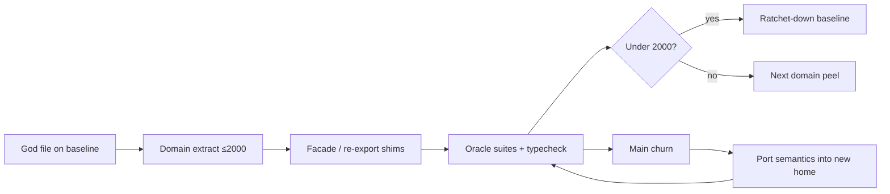
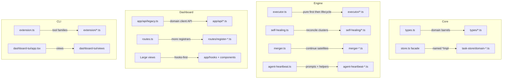

# refactor: Organize package internals and split god-files

## Summary

A multi-wave, behavior-preserving program to make `@fusion/core`, `@fusion/engine`, `@fusion/dashboard`, and `@runfusion/fusion` (CLI) easier to navigate: split oversized modules into domain-named folders, continue established extraction patterns (TaskStore facade, route registrars, merger satellites, App hooks-first), and graduate files under the 2,000-line line-count ratchet without re-ratcheting ceilings as a substitute for structure.

---

## Problem Frame

Individual packages already have clear *package* boundaries, but *inside* the large packages navigation is hard. Flat `src/` trees and multi-thousand-line god-files force every change through the same monofiles. **Measure live LOC, not only baseline ceilings** — the ratchet file is often stale high *or* under-grown. Current worst offenders:

| Area | Examples (approx live / baseline ceiling) |
|------|-------------------------------------------|
| Core | `store.ts` ~2.5k thin facade (baseline still 17,371 — already extracted) · `types.ts` ~8k · `db.ts` ~278 stub (baseline 5,924 stale) · debt in `task-store/remaining-ops-1..10` |
| Engine | `executor.ts` ~19k · `merger.ts` ~12k · `self-healing.ts` ~12k · `agent-heartbeat.ts` ~5.5k |
| Dashboard | `app/api/legacy.ts` ~11.5k · large components 3–5k · residual `routes.ts` / `register-git-github.ts` |
| CLI | `extension.ts` ~5.5k · `dashboard-tui/app.tsx` ~4.6k |

The repo already *wants* this outcome: `scripts/check-file-line-count.mjs` caps new files at 2,000 and ratchets grandfathered files downward; FNXC history on that script states wholesale god-file shrink is dedicated follow-up work. Prior work established templates (`docs/plans/2026-06-24-001-refactor-dashboard-app-tsx-module-breakup-plan.md` completed; `packages/core/src/task-store/`; `packages/dashboard/src/routes/register-*`; `merger-*.ts`; `auto-recovery-handlers/`). The remaining problem is incomplete application at scale—plus intermediate debt such as `task-store/remaining-ops-1..10` (and `*-ops-2` ordinal dumps) that recreated opacity under a new name.

**Glossary:** A **unit** (U1–U9) is a roadmap work item. A **wave** is one landable PR/slice (a unit may contain multiple waves). A **slice** is an ordered peel inside a unit (e.g. U4 Slice A then B). R6/R13 “wave’s file set” means the landable PR’s files.

This plan is **not** a product feature, public API redesign, or cross-package ownership redraw. Success is navigability + ratchet progress + green behavior contracts.

---

## Requirements

### Behavior and contracts

- R1. All waves are behavior-preserving: no intentional functional, UX, lifecycle, or API-contract change. Compile-only fixes limited to import paths and re-exports; no access-modifier, async/sync, or control-flow “cleanups” while organizing.
- R2. Public package barrels stay stable: `@fusion/core`, `@fusion/engine`, dashboard `routes.ts` entry, `app/api.ts`, merger/self-healing/executor primary module paths used by tests. Temporary re-export shims are allowed; permanent dual homes are not.
- R3. Characterization oracles for each touched god-file stay green. Each unit names an **oracle family** (paths or suite prefixes); the implementer finalizes the exact file list for the symbols moved in that wave. File-scoped verification is required; for pure moves, also run the god-file’s highest-signal existing suites, not only tests that reverse-import empty new files.
- R4. FNXC requirement comments move with the owning behavior (dated, greppable). Facades must not keep the only copy of requirement text after extraction.

### Structure and ratchet

- R5. Every **new** file is ≤ 2,000 lines. Prefer domain-named modules and folders; **forbid** new `remaining-ops-N`, `*-ops-N` / `*-2` ordinal dumps, `*-misc.ts`, or similarly opaque files. Oversize domains split by subdomain name, not ordinal.
- R6. Every **touched** grandfathered file’s baseline ceiling ratchets **down** (or the entry is removed when under cap) after a peel. Graduation uses a reviewed baseline edit that **must not increase** any path’s ceiling outside the wave’s file set — **except** U1’s one-time scoped re-ratchet of organic growth (KTD10).
- R7. Folder organization follows existing conventions per package layer (see KTDs)—extend patterns already in-tree rather than inventing a new global layout.

### Safety invariants

- R8. Route registrar **mount order** is frozen unless a wave’s goal is explicitly a documented reordering with precedence characterization. Splits must not reorder registrars as a side-effect.
- R9. Dashboard lazy-view inventory (`lazy()` non-underscore consts + AGENTS “Lazy-Loaded Heavy Views” + `lazy-loaded-views-docs.test.ts`) is untouched by organize waves. Eager FOUC CSS imports stay at the documented site.
- R10. Static `@fusion/*` imports only; no dynamic engine import tricks; no React/CSS re-exports from server plugin barrels.
- R11. Cross-package direction preserved: core ↛ engine/dashboard; engine DI via existing `setCreateFnAgent` (and similar) only.
- R12. No changeset for pure internal refactors of private packages. `@runfusion/fusion` gets a changeset only if a wave changes published CLI surface (not expected).

### Wave hygiene

- R13. Before landing a hot-file wave, rebase/sync main and apply the **extract-vs-semantics protocol**: keep the structural call site; **port main’s semantics into the new module**; never `--ours`/`--theirs`; run the union of both sides’ targeted suites.
- R14. `pnpm check:line-count` is a hard wave exit criterion (even though it is opt-in for normal pretest).
- R15. Existing `remaining-ops-*` modules are only allowed as **migration sources** to domain-named targets; each wave that touches them must shrink or delete at least one, never add another.

---

## Key Technical Decisions

- KTD1. **Program shape = multi-wave roadmap, not one mega-PR.** Waves are file-disjoint where possible, landable independently, and ordered so core symbol moves complete before dependent engine/dashboard rebases. Prefer many small extractions over one un-rebaseable split.
- KTD2. **Reuse five extraction patterns already proven in-repo** (pick by surface; do not invent a sixth style):
  1. **Facade + `*Impl`** — `TaskStore` / `task-store/` (public class stays; bodies move).
  2. **Registrar + shared context** — `routes.ts` + `routes/register-*` + `ApiRoutesContext`.
  3. **Satellite modules + re-export** — `merger.ts` → `merger-*.ts` (deep test mocks keep parent path).
  4. **Hooks-first UI** — completed App.tsx playbook: hooks, utils, presentational components, transient shims.
  5. **Handler folder + dispatcher** — policy trees (`auto-recovery-handlers/`) when methods cluster by reconcile domain (self-healing).
- KTD3. **Domain-named modules only; ban extending `remaining-ops` and ordinal dump suffixes.** Intermediate numeric dump files are technical debt. New extracts must name the domain (`merge-queue`, `archive-lifecycle`, `workflow-definitions`, `executor/prompt`, `self-healing/workspace`, etc.). When a domain exceeds 2,000 lines, split by **subdomain** (`merge-queue-lease.ts`, `merge-queue-cleanup.ts`), never by ordinal (`*-ops-2`, `*-2`, `remaining-*`). Existing `remaining-ops-*` and `*-ops-2` / `*-2` files are **migration sources only**, not templates. Migrating *out of* them is in-scope for core waves.
- KTD4. **Import stability strategy:** package barrels and established deep entrypoints are permanent. Mechanical moves keep temporary re-exports on the old path until a follow-up re-point wave. Track shims in each landable PR description as `old path → new path → delete-when` (no separate standing ledger file). Drop shims only when consumers are re-pointed; do not leave dual homes indefinitely.
- KTD5. **Graduation policy is ratchet-down-only after U1.** Prefer hand-editing `scripts/line-count-baseline.json` for touched paths over full `--update`. If full `--update` is used, the PR must show no ceiling increases outside the wave’s file set.
- KTD6. **Facade vs dump metrics.** For `store.ts`, the facade is already ~2.5k thin wrappers — primary progress is **domain migration of `remaining-ops-*` / ordinal dumps**, not re-fighting a 17k monofile. Elsewhere, facade/parent LOC decline remains first-class: satellites under cap while the parent stays huge is partial progress only. Thin shells may stay slightly over 2,000 only when explicitly marked and on a path toward graduation.
- KTD7. **Characterization-first on engine hot files** (executor, self-healing, merger, heartbeat). Pin existing focused suites green before moves; pure free functions peel first (lowest risk); class method clusters second.
- KTD8. **Production-first; test mega-files co-located only when required.** Test splits use harness + sibling suites (FN-7035 style) when a production split forces co-located test moves, or when a wave’s navigation goal includes a specific suite. Bulk “split all 55 test offenders” is deferred follow-up.
- KTD9. **Cycle budget:** impl/domain modules may import pure helpers and types; facade may import impls; domain impls must not re-enter the same facade methods that would re-import the domain (except documented DI seams). Prefer passing narrow deps over `import { TaskStore } from "../store.js"` cycles.
- KTD10. **Baseline hygiene is wave zero (two operations).** (1) **Prune / tighten stale-high** entries where live LOC is far below ceiling (`db.ts`, `store.ts`, graduated files). (2) **One-time scoped re-ratchet** of paths that already grew past their ceiling (e.g. executor, self-healing, types, legacy, extension) to current live counts — FN-7046-style repair so `pnpm check:line-count` is truthful before peels. After U1, ceilings never rise again except by mistake (forbidden); peels only ratchet down.

---

## High-Level Technical Design

### Wave lifecycle (every unit)



### Pattern selection by package layer



### Target folder sketches (directional — implementer may adjust names)

```text
packages/core/src/
  types/                  # domain type modules; types.ts becomes barrel
  task-store/             # existing; replace remaining-ops-* with domain names over waves
packages/engine/src/
  executor/               # pure helpers, dispatch, worktree, step-session, completion
  self-healing/           # startup, dependency, in-review, merge, workspace, surfacing
packages/dashboard/app/api/
  tasks.ts agents.ts settings.ts missions.ts ...  # client fetch surface
packages/cli/src/
  extension/              # tool-family registrars
  commands/dashboard-tui/views/
```

Public import paths remain the parent module or package barrel until shim cutover.

### Hot-file conflict protocol (R13)

On rebase/merge conflict for an extracted block:

1. Keep the **new structure** (call site / helper path).
2. Port **incoming semantics** into the helper’s body (not the old monofile copy).
3. Never resolve with `--ours` / `--theirs` alone.
4. Re-run the **union** of both branches’ oracle suites + package typecheck.
5. Fix FNXC/docs the move falsified.

Reference: `docs/solutions/best-practices/merge-conflict-extraction-vs-semantics-and-parallel-bootstrap.md`.

### Graduation baseline edit (R6 / KTD5)

Preferred: hand-edit only keys for files this wave touched (lower ceiling or delete entry).  
If `node scripts/check-file-line-count.mjs --update` is used: diff `scripts/line-count-baseline.json` and reject any ceiling **increase** for paths outside the wave.

---

## Scope Boundaries

**In scope**

- Behavior-preserving organization inside `packages/core`, `packages/engine`, `packages/dashboard`, `packages/cli`.
- Domain folders, god-file splits, facade/shim stability, ratchet graduation, baseline hygiene.
- Migrating `task-store/remaining-ops-*` toward named domains.
- Co-located test harness/sibling splits when forced by production moves or when a wave explicitly targets a suite.

**Out of scope (non-goals)**

- Cross-package ownership redraws (e.g. moving engine logic into core or vice versa beyond existing DI).
- Public product features, UX redesign, settings schema changes.
- Plugin packages (`plugins/*`) except incidental import-path fixes if a consumer path breaks.
- Replacing the line-count cap policy or moving `check:line-count` into the merge gate (optional future).
- Wholesale split of all 55 oversized test files as a standalone campaign.
- Semantic “cleanups” bundled into organize waves (error-path merges, backendMode guard changes, soft-delete matrix edits).

### Deferred to Follow-Up Work

- Full test mega-file campaign (all oversized `*.test.ts(x)`).
- Permanent shim removal waves after consumer re-points (PR description `old → new → delete-when` history).
- Thin-shell graduation of residual facades that remain slightly over 2,000 after domain peels.
- Compounding a `docs/solutions/architecture-patterns/` entry for the organization playbook after first waves land.
- `dev-server-*` vs `devserver-*` consolidation (`docs/dev-server-module-boundary-audit.md`) — naming hygiene, not god-file size.
- Re-point pure-function unit tests off App/merger re-export shims from prior plans.
- **Mid-tier production peels (pain-ranked, not this program’s top-N):** `mission-store.ts`, `central-core.ts`, `agent-store.ts`, `agent-tools.ts`, `project-engine.ts`, `scheduler.ts`, `triage.ts`, `github.ts`, `mission-routes.ts`, `cli/commands/dashboard.ts`, and other grandfathered files outside U2–U9. They stay on the ratchet until a follow-up plan.

---

## Phased Delivery

| Phase | Units | Intent |
|-------|-------|--------|
| A — Foundations | U1 | Conventions, baseline truth, scoreboard |
| B — Core | U2, U3 | Types navigability + TaskStore domain peels |
| C — Engine | U4, U5, U6 | Executor / self-healing / merger+heartbeat |
| D — Surfaces | U7, U8, U9 | Dashboard API/routes · UI monofiles · CLI peels |

Phases B–D can partially overlap only when file ownership is disjoint **and** no shared symbol is mid-move. Default: finish a core symbol wave before engine rebases that depend on it. U6 may land merger and heartbeat as **separate waves** with independent exits.

---

## Implementation Units

### U1. Foundations: conventions, baseline hygiene, wave checklist

- **Goal:** Make the program’s rules and scoreboard accurate before large peels; give every later unit a shared exit checklist.
- **Requirements:** R5, R6, R10, R14, R15 (policy); R12; KTD10
- **Dependencies:** None
- **Files:**
  - `scripts/line-count-baseline.json` (modify — prune stale-high + one-time re-ratchet organic growth per KTD10)
  - `docs/plans/2026-07-14-001-refactor-package-code-organization-plan.md` (this plan — already present)
- **Approach:**
  - Measure live LOC for all baseline entries.
  - **Prune/tighten stale-high** (`db.ts`, `store.ts` → actual ~2.5k, any graduated ≤2,000 removed).
  - **One-time scoped re-ratchet** of paths already over ceiling (executor, self-healing, types, legacy, extension, …) to current live counts so the check is truthful.
  - After U1, no further ceiling increases; peels only ratchet down.
  - Encode the per-wave checklist (below) into implementer practice for U2+.
- **Patterns to follow:** FNXC history in `scripts/check-file-line-count.mjs`; FN-7046/7050 scoped baseline repairs.
- **Test scenarios:**
  - Happy path: after baseline edit, `pnpm check:line-count` is green against the truthful scoreboard.
  - Edge: JSON diff shows only intentional prune/tighten and documented re-ratchets; no silent ceiling creep on untouched paths beyond the U1 growth list.
  - Error: removing an entry still >2,000 without a split fails the check — keep grandfathered until peeled.
- **Verification:** `pnpm check:line-count` green; baseline reflects live sizes.
- **Per-wave checklist (apply U2–U9):**
  1. Oracle family for the wave green (unit-specific).
  2. Package typecheck for touched package(s).
  3. Mock-path grep for moved modules (`vi.mock`, deep relative imports).
  4. For core graph moves: re-audit `packages/core/src/index.gate.ts` / engine-core gate consumers if barrel closure changes.
  5. Route mount order unchanged (dashboard).
  6. Lazy inventory untouched (dashboard UI).
  7. FNXC ownership map: comments live with behavior.
  8. New files ≤2,000; touched baseline ceilings ratchet **down** only (post-U1).
  9. Hot-file conflict protocol if rebased against main.
  10. PR description lists shims: `old path → new path → delete-when`.

---

### U2. Core: split `types.ts` into domain barrels

- **Goal:** Make domain types findable under `packages/core/src/types/` while `types.ts` remains the stable re-export surface (including the **dashboard Vite `@fusion/core` browser alias**).
- **Requirements:** R1, R2, R5, R6, R10, R11
- **Dependencies:** U1
- **Files:**
  - `packages/core/src/types.ts` (modify → thin barrel; **must remain** the browser-safe alias target)
  - `packages/core/src/types/*.ts` (new — domain clusters: e.g. task/board, agent/permission, merge/settings, workflow/work-item, messaging — names chosen by natural export clusters)
  - `packages/core/src/index.ts` (modify only if re-export paths require it; prefer stable)
  - `packages/core/src/index.gate.ts` (verify closure)
  - Oracles: core typecheck; dashboard package typecheck/build (Vite alias surface); existing type-importing suites
- **Approach:** Peel by domain clusters already partially started (`planner-overseer-state`, capacity, gitlab-config, mcp-config re-exports). Keep every symbol the dashboard imports via the Vite alias as **type-only or pure/browser-safe** re-exports on `types.ts` — never pull Node-only stores into that surface. Prefer pure type/interface/const moves into domain modules.
- **Execution note:** Low risk — still run core + dashboard typecheck so the browser alias contract is proven.
- **Patterns to follow:** Existing partial peels re-exported from `types.ts` (see FNXC on `types.ts` for Vite alias); package barrel style in `index.ts`.
- **Test scenarios:**
  - Happy path: every previously exported symbol remains importable from `@fusion/core` / `./types.js` with identical types.
  - Edge: circular type imports between domains — resolve via shared `types/common` or one-way deps only; browser alias still resolves without Node-only deps.
  - Integration: engine and dashboard packages typecheck against the barrel; dashboard client build does not pull store/engine into the browser bundle via the alias.
- **Verification:** Core + dashboard typecheck green; baseline ceiling for `types.ts` ratchets down; new type modules ≤2,000 each.

---

### U3. Core: first domain peels out of `remaining-ops-*` (TaskStore facade)

- **Goal:** Land **first domain peels** from opaque `remaining-ops-*` (and related ordinal dumps) into domain-named `task-store/` modules; eliminate ≥1 dump file and shrink the dump surface. The facade stays on `TaskStore` and already mostly delegates — further facade thinning is secondary.
- **Requirements:** R1–R4, R5–R7, R11, R13–R15
- **Dependencies:** U1; prefer U2 landed if types move affect store signatures
- **Files:**
  - `packages/core/src/store.ts` (modify only as import/wrapper thinness requires)
  - `packages/core/src/task-store/*` (create domain modules; delete emptied `remaining-ops-N.ts` / ordinal dumps when fully migrated)
  - `packages/core/src/task-store/index.ts` (update module map FNXC)
  - Oracles: `packages/core/src/__tests__/store-settings.test.ts` plus soft-delete / move / merge-queue suites under `packages/core/src/__tests__/` matching the domain peeled
  - `scripts/line-count-baseline.json` (ratchet touched paths)
- **Approach:**
  - Publish a **first-wave symbol map** before coding: functions, current dump file, target module, co-moved callees (especially cross-dump imports).
  - Prefer one cohesive domain first (e.g. merge-queue **or** workflow-definitions).
  - Move `*Impl` functions; update facade imports; delete empty dump files.
  - Do not add `remaining-ops-11` or `*-ops-3`; split by subdomain name if over 2,000.
  - Remaining dumps continue in follow-up waves of this unit or a later plan — U3 is **not** “finish all ten dumps in one land.”
- **Execution note:** Characterization-first: green the relevant store suites **before** each peel; after peel re-run same suites. Rebase protocol if `store.ts` / dump files conflict with main.
- **Patterns to follow:** Existing `moves.ts`, `file-scope.ts`, `lifecycle*.ts` style; `task-store/index.ts` FNXC decomposition notes.
- **Test scenarios:**
  - Happy path: suites for the peeled domain still pass (e.g. merge-queue lease/enqueue if that domain).
  - Edge: soft-delete write blocks, dependency cycle rejection still pass when those symbols move.
  - Error: TaskNotFound / soft-deleted write paths still throw the same error classes.
  - Integration: no new store↔impl import cycle; gate bundle still loads if core entry changes.
- **Verification:** Oracles green; ≥1 `remaining-ops-*` (or ordinal dump) fully eliminated; dump LOC net-down; baseline ratchet-down; `pnpm check:line-count`.

---

### U4. Engine: peel `executor.ts` pure helpers, then first lifecycle folders

- **Goal:** Introduce `packages/engine/src/executor/` (or satellite `executor-*.ts` if flatter is clearer for first slice) for free-function clusters already at module top; then extract 1–2 lifecycle clusters from `TaskExecutor` without changing runtime behavior.
- **Requirements:** R1–R4, R5–R7, R10, R13, R14
- **Dependencies:** U1; U3 if store symbols used by peels moved (usually independent)
- **Files:**
  - `packages/engine/src/executor.ts` (modify — re-export + thinner body)
  - `packages/engine/src/executor/*.ts` or `executor-*.ts` (new)
  - Oracles: `packages/engine/src/__tests__/executor-*.test.ts` focused set for peels (prompt/refusal/requeue signature/worktree/task-done as applicable); helpers in `executor-test-helpers.ts`
  - `scripts/line-count-baseline.json`
- **Approach:**
  - **Slice A (required first):** pure exports — prompt/refusal/requeue signatures, browser probe, workflow feedback path helpers — move with re-exports from `executor.ts`.
  - **Slice B:** one lifecycle cluster (e.g. worktree acquisition **or** step-session **or** completion handoff) only after Slice A green.
  - Keep public symbols re-exported from `executor.ts` for deep `vi.mock("../executor.js")` stability.
- **Execution note:** Characterization-first. Do not change dissent patterns, refusal classification, or requeue constants “while here.”
- **Patterns to follow:** Merger satellite re-export pattern; workflow-native primitives split (policy vs side effects) in `docs/solutions/architecture-patterns/workflow-native-runtime-primitives.md`.
- **Test scenarios:**
  - Happy path: existing executor suites for moved pure functions assert same outputs for same inputs.
  - Edge: requeue loop signature progress detection unchanged; no-commit eligibility heuristics unchanged.
  - Error: invalid assistant continuation and transient missing task.json classifiers unchanged.
  - Integration: step-session / task-done paths still pass focused executor tests after lifecycle peel.
- **Verification:** Oracles green; `executor.ts` ceiling ratchets down; new modules ≤2,000; check:line-count.

---

### U5. Engine: split `self-healing.ts` into domain handler modules

- **Goal:** Organize `SelfHealingManager` reconcile/recover/surface methods into `packages/engine/src/self-healing/` (or `self-healing-*.ts`) by domain so AGENTS run-audit inventory maps to files.
- **Requirements:** R1–R4, R5–R7, R13, R14
- **Dependencies:** U1; prefer after U4 if shared helpers overlap, else independent
- **Files:**
  - `packages/engine/src/self-healing.ts` (facade / re-exports / manager orchestration)
  - `packages/engine/src/self-healing/*.ts` (new — e.g. startup, dependency, in-review, merge-status, workspace, surfacing, temp-worktree)
  - Oracles: per domain peel, name 1–3 focused files (`self-healing-*.test.ts`, `in-review-unmet-dependency-reconcile.test.ts`, workspace reconcile tests, meta-archive guards) **or** a specific describe block inside `self-healing.test.ts` — do not treat “whole 9k suite optional” as zero coverage.
  - Optionally start a sibling suite only if extracting forces test navigability for a cluster
  - `scripts/line-count-baseline.json`
- **Approach:** Mirror `auto-recovery-handlers/` (pattern 5): group methods by reconcile family; inject manager deps rather than free-floating globals; keep `SelfHealingManager` public class on the stable path or re-exported. Preserve existing cycle-break patterns (e.g. dynamic merger import, workspace-land predicates).
- **Execution note:** Characterization-first; hot-file rebase protocol. Do not merge distinct recovery outcomes into one branch.
- **Patterns to follow:** `auto-recovery-handlers/`; AGENTS run-audit event inventory as domain map.
- **Test scenarios:**
  - Happy path: representative reconcile methods still emit expected run-audit event names/metadata shapes (ids/counts only).
  - Edge: `autoMerge:false` / user-paused / triple-proof no-action paths still no-op.
  - Error: unrecoverable parks remain parked; budgets not reset incorrectly.
  - Integration: startup recovery vs steady-state sweep distinction preserved.
- **Verification:** Focused self-healing oracles green; line-count ratchet; manager file shrinks.

---

### U6. Engine: continue merger satellites + heartbeat peel

- **Goal:** Further reduce `merger.ts` and `agent-heartbeat.ts` via additional satellites (verification/autostash/commit ceremony leftovers; heartbeat prompts + recovery helpers).
- **Requirements:** R1–R4, R5–R7, R13, R14
- **Dependencies:** U1; can parallel U4/U5 if file-disjoint
- **Files:**
  - `packages/engine/src/merger.ts` + new/extended `merger-*.ts`
  - `packages/engine/src/agent-heartbeat.ts` + `agent-heartbeat-prompts.ts` / helper satellites
  - Oracles: `merger-merge-lifecycle`, `merger-verification`, `merger-conflict-resolution`, `merger-diff-scope` (and helpers); `heartbeat-monitor`, `heartbeat-executor`, `heartbeat-error-recovery`, `agent-heartbeat-*`
  - `scripts/line-count-baseline.json`
- **Approach:** Same satellite + re-export pattern already used for merger AI/diff-volume/overlap/etc. Heartbeat: peel prompt constants and pure recovery helpers first.
- **Patterns to follow:** Existing `merger-*.ts` set; heartbeat pure helpers near file bottom already half-extracted.
- **Test scenarios:**
  - Happy path: merge lifecycle + verification suites green.
  - Edge: diff-volume gate and overlap guard behavior unchanged.
  - Error: conflict classification and transient merge error classifier paths unchanged.
  - Heartbeat: error-recovery budget metadata and park reasons unchanged.
- **Verification:** Oracles green; both baselines ratchet down; new files ≤2,000.

---

### U7. Dashboard API: split `legacy.ts` client surface + continue route peels

- **Goal:** Make client API and server route registration navigable: domain modules under `app/api/`; further split oversized registrars (`register-git-github.ts`, residual helpers in `routes.ts`) without changing mount order.
- **Requirements:** R1–R4, R5–R9, R13, R14
- **Dependencies:** U1; independent of engine units if no shared symbol moves
- **Files:**
  - `packages/dashboard/app/api/legacy.ts` → domain modules + **re-export shims on `legacy.ts`**
  - `packages/dashboard/app/api.ts` (barrel stability — continues `export *` from legacy)
  - `packages/dashboard/src/routes.ts`, `packages/dashboard/src/routes/register-*.ts`, `packages/dashboard/src/routes/README.md` (module map update)
  - Oracles: `packages/dashboard/app/api/__tests__/legacy-*.test.ts`, `packages/dashboard/src/__tests__/routes-*.test.ts`, `routes/__tests__/register-*.test.ts`
  - `scripts/line-count-baseline.json`
- **Approach:**
  - Client: group exports by domain (tasks, agents, settings/memory, missions, git/github, remote, etc.). **Freeze both** `app/api.ts` and `app/api/legacy.ts` as stable import paths until a named re-point wave — many hooks deep-import `api/legacy` today. Domain modules are implementation only.
  - Server: peel remaining residual handlers into registrars; split `register-git-github.ts` into git plumbing vs GitHub issue/PR if still oversized; **do not reorder mounts**.
- **Patterns to follow:** `packages/dashboard/src/routes/README.md`; `app/api.ts` re-export style.
- **Test scenarios:**
  - Happy path: helpers still produce same paths/methods via `api.ts` **and** `api/legacy` imports; route registration tests pass.
  - Edge: project-scoping helpers (`getScopedStore`) still applied on moved handlers.
  - Error: `ApiRequestError` / duplicate-candidate error classes still thrown as today.
  - Integration: mount-order sensitive routes still match the more-specific registrar first (spot-check overlapping patterns if any).
- **Verification:** Oracles green; ceilings ratchet; README registrar map updated; mount order unchanged; both client entrypaths still resolve.

---

### U8. Dashboard UI monofile peels (App.tsx playbook)

- **Goal:** Apply the completed App.tsx playbook to **1–2** highest-pain UI monofiles chosen at execution by live LOC + ownership (candidates: `AgentDetailView`, `TaskDetailModal`, `WorkflowNodeEditor`, `ChatView`, `MissionManager`).
- **Requirements:** R1–R5, R6, R7, R9, R14
- **Dependencies:** U1; prefer U7 first if those components tightly couple to API module paths mid-move
- **Files:**
  - Selected `packages/dashboard/app/components/*.tsx` + new hooks/subcomponents under `app/hooks/` / `app/components/`
  - Component `__tests__/*` oracles for those surfaces
  - `scripts/line-count-baseline.json`
- **Approach:** Hooks-first + presentational extract; preserve lazy inventory; transient re-export shims only if pure helpers are currently imported from the monofile. Do **not** include CLI work here (see U9).
- **Execution note:** Browser smoke after build when visual shell/modals move (worktree-safe; never port 4040).
- **Patterns to follow:** Completed App.tsx plan (`docs/plans/2026-06-24-001-refactor-dashboard-app-tsx-module-breakup-plan.md`).
- **Test scenarios:**
  - Happy path: component behavior contracts for extracted surfaces remain green.
  - Edge: mobile + desktop breakpoints covered by existing tests where present.
  - Error: modal error/empty states unchanged.
- **Verification:** Oracles green; selected UI files under or toward 2,000; check:line-count; lazy inventory test untouched/green.

---

### U9. CLI: extension tool-family peels + dashboard-tui views

- **Goal:** First-wave CLI organization: peel `extension.ts` into tool-family modules and/or continue `dashboard-tui/app.tsx` into views — land as separate waves with independent exits.
- **Requirements:** R1–R5, R6, R7, R14
- **Dependencies:** U1; independent of U8
- **Files:**
  - `packages/cli/src/extension.ts` → `packages/cli/src/extension/*.ts` with re-exports from `extension.ts`
  - `packages/cli/src/commands/dashboard-tui/app.tsx` → views/components under `dashboard-tui/`
  - Oracles: `packages/cli/src/__tests__/extension.test.ts`, `extension-task-tools.test.ts`, `dashboard-tui/__tests__/*` as matching the peel
  - `scripts/line-count-baseline.json`
- **Approach:** Registrar composition like routes — `extension.ts` stays the public entry. TUI continues the existing controller/state folder split into views. Either target may land alone; both are not required for unit close.
- **Patterns to follow:** Dashboard route registrars; existing `dashboard-tui/controller.ts` + `state.ts`.
- **Test scenarios:**
  - Happy path: tool registration still exposes the same tool names/schemas; TUI behavior contracts green for extracted views.
  - Edge: extension host mock paths / `vi.mock` of extension entry still resolve via re-exports.
  - Error: command failure messaging unchanged for peels that touch error surfaces.
- **Verification:** Oracles green for the landed wave(s); entry file(s) ratchet down; check:line-count.

---

## Risk Analysis & Mitigation

| Risk | Mitigation |
|------|------------|
| Silent semantic revert on rebase | Hot-file protocol (R13); never take a single merge side |
| `remaining-ops` opacity recreates itself | Ban new dumps (R15, KTD3); delete sources as domains land |
| Full `--update` re-grandfathers growth | Ratchet-down-only policy (KTD5) |
| Facade never shrinks | KTD6 metric; thin-wrapper collapse required |
| False green from too-narrow file-scoped tests | Oracle lists per unit; run god-file’s known suites |
| Circular imports explode | KTD9 cycle budget; prefer deps injection |
| Mount-order / lazy inventory breakage | R8, R9 explicit freezes |
| Merge gate misses non-blocking suite failures | Treat named oracles as required even if non-gate |
| Parallel agents on same monofile | File-disjoint waves; mass-migration fleet lesson |

---

## System-Wide Impact

- **Developers / agents:** Primary beneficiaries — shorter files, domain folders, clearer ownership.
- **CI / ratchet:** Baseline file changes in graduation PRs; opt-in check becomes required for these waves.
- **Runtime users:** No intentional product change; residual risk is regression from incomplete port on rebase.
- **Published CLI:** Unchanged surface expected; private package refactors only.
- **Downstream tests/mocks:** Deep relative `vi.mock` paths stay valid via re-exports until shim cutover.

---

## Success Metrics

- Navigability: top god-files either graduated (<2,000 and off baseline) or on a clear multi-domain folder map with continuous LOC decline.
- Ratchet: U1 makes the scoreboard truthful; post-U1 no wave increases any baseline ceiling outside its file set.
- Safety: zero intentional behavior changes; oracle families green per wave.
- Debt: net reduction in `remaining-ops-*` / ordinal dumps across U3 waves; PR-tracked shims shrink over time.

---

## Open Questions

### Deferred to implementation

- Exact domain file names under `types/`, `executor/`, `self-healing/`, and which 1–2 UI monofiles U8 selects first (choose by live LOC + ownership at execution).
- Whether first executor layout is a folder (`executor/`) vs flat `executor-*.ts` satellites (both valid; folder preferred if ≥4 modules).
- Which first domain U3 peels (merge-queue vs workflow-definitions vs other) after the symbol map.
- How aggressively to split `self-healing.test.ts` when peels land (only if suite blocks navigation for a cluster).

### Resolved defaults (from planning)

- Multi-wave program across core → engine → dashboard/cli.
- Both folder organization and file splits.
- Production-first; tests co-located when needed.
- Mechanical moves only; characterization-first on engine hot files.

---

## Documentation Plan

- Update `packages/dashboard/src/routes/README.md` registrar map when registrars change (U7).
- Update `packages/core/src/task-store/index.ts` FNXC module map as domains replace `remaining-ops` (U3).
- After first successful waves, run `/ce-compound` to capture the organization playbook under `docs/solutions/architecture-patterns/` (currently a documented gap).
- Do not expand AGENTS package structure section unless a permanent convention (e.g. `executor/` folder) becomes the default—prefer solutions entry first.

---

## Sources & Research

- Repo patterns: TaskStore `task-store/`, routes registrars + README, merger satellites, App.tsx completed plan, auto-recovery-handlers, line-count ratchet script FNXC history.
- Institutional: extract-vs-semantics merge conflicts; workflow-native runtime primitives; characterization / surface matrix lessons; plugin registration drift / mock graph hazards; lazy-load static import constraints.
- Prior audits: `docs/codebase-improvement-audit.md`, `docs/gap-analysis.md` (LOC numbers stale; hotspot list still directionally valid).
- External research: **skipped** — strong local patterns; no unsettled library/architecture choice.

---

## Assumptions

- Confirmed user scope: multi-wave, pain-ranked packages, folder + split, production-first.
- Implementers will land units as multiple PRs/commits as needed; the plan does not prescribe git choreography.
- Engine-core gate membership may need awareness when moving symbols that gate tests import, but gate *policy* is unchanged.
