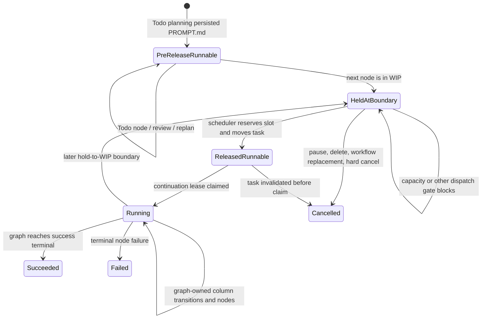
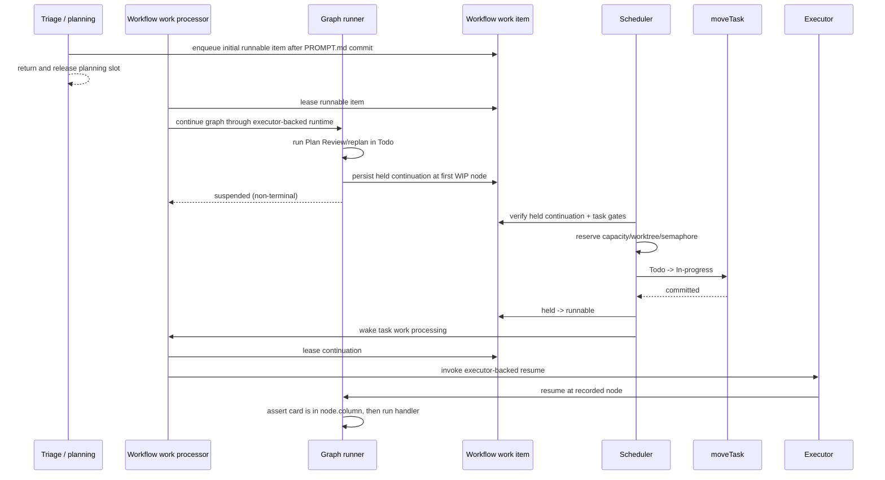

# Truthful, Resumable Workflow Lanes - Plan

## Goal Capsule

Make a workflow's authored columns an executable contract: Ideas stores work without AI, Todo creates and reviews `PROMPT.md`, In-progress implements, In-review reviews and merges, and Done is terminal. The engine must stop before crossing a scheduler-owned hold-to-WIP boundary, persist the next graph node, let the scheduler move the card when capacity is available, and resume at that node only after the move commits.

The user's confirmed five-column behavior is the product authority. Existing `builtin:coding` projects remain compatible; the repaired five-column flow is offered through the existing `builtin:coding-ideas` identity rather than silently migrating defaults. Stop implementation if the design would require node work to run outside its assigned column, use an in-memory-only continuation, or weaken `autoMerge:false`, pause/cancel, dependency, capacity, merge-proof, or workflow-drift safeguards.

Execution is branch-scoped feature work: use a dedicated worktree, keep the primary checkout on `main`, and land the complete behavior as one coherent change. The implementation owner carries the work through scoped verification, the merge gate, and the required `@runfusion/fusion` changeset; publishing a release is operator-only and out of scope.

---

## Product Contract

### Summary

Today a graph can encounter a Todo hold to In-progress WIP boundary, decline to move the card, and then execute the In-progress node anyway. The scheduler simultaneously refuses release when an enabled pre-release Plan Review has not passed. That circular ownership makes the intuitive five-column workflow either stall in Todo or run Plan Review after the card enters In-progress.

The fix adds a durable pause-and-resume protocol between graph traversal and scheduling, aligns optional-step enablement at every gate, rejects structurally undriveable workflow definitions, and restores the existing five-column coding workflow as a supported preset whose node placement matches the user's mental model.

### Actors

- A1. Operator authors or selects a workflow and manually promotes an idea into Todo.
- A2. Planning agent creates or revises `PROMPT.md` while the card is in Todo.
- A3. Plan reviewer approves or rejects `PROMPT.md` while the card is in Todo.
- A4. Scheduler admits approved work into the WIP budget and moves it to In-progress.
- A5. Executor implements only while the card is in In-progress.
- A6. Code reviewer and merger operate while the card is in In-review, subject to `autoMerge` policy.
- A7. Recovery services reconcile interrupted handoffs without skipping work or duplicating agent sessions.

### Requirements

#### Authored lane behavior

- R1. Creating a task in the five-column workflow lands it in Ideas and starts no AI or background execution until an operator promotes it.
- R2. Promotion from Ideas to Todo starts planning in Todo, persists a real `PROMPT.md`, and runs enabled Plan Review attempts in Todo.
- R3. A Plan Review REVISE outcome keeps the card in Todo, runs the existing bounded replan path, and reviews the revised artifact before release.
- R4. No node assigned to In-progress may execute until the scheduler has committed the card's move into In-progress.
- R5. Implementation nodes run in In-progress; entering an In-review Code Review node moves the card to In-review before the reviewer starts.
- R6. A Code Review REVISE outcome enters its remediation node in In-progress before fixes start, then returns to In-review for another review.
- R7. Completion summary, merge gates, merge attempts, retry/manual-hold behavior, and human review remain in In-review; confirmed merge advances to Done.
- R8. Done is terminal and starts no additional work.

#### Durable orchestration

- R9. A graph reaching any scheduler-owned hold-to-WIP boundary returns a non-terminal suspended disposition before executing the target node.
- R10. Suspension durably records the workflow run, resolved IR identity, target node, source column, target column, and held/runnable state so restart recovery can resume exactly once.
- R11. The scheduler is the sole mover across hold-to-WIP capacity boundaries; it releases only a task whose durable continuation is ready and whose normal dependency, capacity, overlap, node, pause, and planning gates pass.
- R12. After a successful release, graph execution resumes at the recorded target node instead of replaying from `start`; a racing or duplicate dispatch cannot run the continuation twice.
- R13. Workflow edits that invalidate a suspended target follow the existing drift-park-and-re-resolve contract; they never execute a deleted or rehomed node against a stale IR.
- R14. User pause, user move from In-progress to Todo, soft delete, and workflow reassignment cancel or supersede active continuations consistently with existing hard-cancel and workflow-work-item rules.

#### Authoring, compatibility, and visibility

- R15. Optional-group enablement has one shared interpretation at graph execution and release readiness: an explicit array wins, including `[]`; an absent array uses `defaultOn`.
- R16. Workflow create, update, import, AI-design, CLI/agent tools, and dashboard save paths reject a capacity hold with no unambiguous reachable WIP release target and surface an actionable validation error.
- R17. The editor describes column assignment as runtime placement and uses its existing lifecycle-warning surface to explain hold-to-WIP pause/release behavior; it must not imply that node placement is cosmetic.
- R18. `builtin:coding` keeps its current columns, optional-step defaults, and existing-task behavior. Existing selections of `builtin:coding-ideas` continue resolving by the same ID.
- R19. `builtin:coding-ideas` becomes selectable again and implements the confirmed five-column contract with only its essential Plan Review and Code Review gates: Plan Review in Todo, implementation in In-progress, and Code Review plus merge in In-review.
- R20. Run audit and task logs expose suspension, release, resume, reconciliation, and invalid-continuation outcomes using IDs/counts/outcomes-only metadata.

### Key Flows

- F1. Capture and start: operator creates in Ideas → no work starts → operator promotes to Todo → planner writes `PROMPT.md` in Todo.
- F2. Pre-release approval: Todo Plan Review APPROVE → graph suspends before the first In-progress node → scheduler reserves capacity and moves the card → executor resumes at that node.
- F3. Pre-release rework: Todo Plan Review REVISE → planner revises in Todo → reviewer rechecks in Todo → only an approved result can reach the release seam.
- F4. Delivery: implementation completes in In-progress → card enters In-review → Code Review and merge run there → confirmed merge moves to Done.
- F5. Review rework: Code Review REVISE in In-review → card enters In-progress before remediation → fixes complete → card returns to In-review for the next review.
- F6. Restart at seam: process stops after suspension or after the scheduler move → startup reconciliation reconstructs one authoritative continuation → work resumes once in the correct column.
- F7. Optional review disabled: explicit removal of Plan Review bypasses its body, reaches the same durable release seam, and never deadlocks; an absent toggle list honors the workflow's `defaultOn` value.

### Acceptance Examples

- AE1. Given a new `builtin:coding-ideas` task, when no operator action occurs, then it remains in Ideas with no planning, review, execution, or merge session.
- AE2. Given the task is promoted to Todo with Plan Review enabled, when planning finishes, then `PROMPT.md` exists and the Plan Review session starts while the persisted card column is Todo.
- AE3. Given Plan Review approves and WIP is full, when the graph reaches `parse`, then the card remains in Todo, `parse` has not run, and one held continuation identifies `parse` as the next node.
- AE4. Given the same held continuation and capacity becomes available, when the scheduler releases it, then the move to In-progress commits before `parse` or implementation starts, and the continuation is claimed once.
- AE5. Given Plan Review is explicitly disabled with `enabledWorkflowSteps: []`, when planning finishes, then the task reaches the same scheduler release seam without a review session and does not remain stuck.
- AE6. Given `enabledWorkflowSteps` is absent and Plan Review has `defaultOn: true`, when planning finishes, then Plan Review runs and release waits for its passing result.
- AE7. Given Code Review returns REVISE, when remediation starts, then the card is already back in In-progress; when remediation succeeds, it re-enters In-review before another Code Review.
- AE8. Given `autoMerge:false`, when Code Review passes, then the task remains in In-review until a human merge action; no recovery path moves it backward or promotes it automatically.
- AE9. Given the engine restarts with a held or newly released continuation, when reconciliation runs, then exactly one node execution resumes and no completed Plan Review or implementation node is replayed.
- AE10. Given an author saves a capacity-hold workflow with no reachable WIP column, then dashboard, HTTP API, and agent-tool saves all reject the same IR with the same domain validation reason.

### Success Criteria

- The five-column workflow completes F1-F4 in an automated lifecycle test without a fake boundary wrapper or manual scheduler simulation.
- Session/run evidence proves every agent-bearing node begins only after the task is persisted in that node's assigned column.
- Kill/restart tests cover both sides of the hold-release commit and show at-most-once continuation claims with eventual progress.
- Default coding characterization tests remain green, including absent versus explicit optional-step toggle cases.
- Invalid lifecycle shapes fail at every authoring surface before persistence.

### Scope Boundaries

In scope: graph traversal, workflow task-runner results, workflow-work-item persistence and leases, triage-to-graph handoff, scheduler release, startup/self-healing reconciliation, optional-group resolution, workflow validation, dashboard editor guidance, agent/API parity, the `builtin:coding-ideas` preset, audit events, regression tests, documentation, and a changeset.

Out of scope: changing the default workflow selection for existing projects; replacing the planning prompt or review prompts; redesigning the workflow editor canvas; changing merge strategies; changing global concurrency semantics; publishing a release; and migrating `builtin:coding` node placement.

### Symptom Verification

- **Original symptom:** placing Plan Review in Todo either prevents release forever or causes the review to appear at the beginning of In-progress; node work can execute while the card remains in the preceding column.
- **Exact reproduction:** create/select the five-column Ideas workflow, promote an idea to Todo, enable Plan Review, allow planning to create `PROMPT.md`, and drive the real graph plus scheduler to the Todo hold → In-progress WIP boundary.
- **Assertion it is gone:** Plan Review starts and finishes with `task.column === "todo"`; the first In-progress handler has zero calls while the continuation is held; after scheduler release it starts with `task.column === "in-progress"`; the full task then reviews/merges in In-review and reaches Done.

### Surface Enumeration

| Surface | States and variants that must be covered |
|---|---|
| Graph boundary | Same-column entry; graph-owned cross-column move; hold→WIP suspension; failure edge; backward remediation; columnless end |
| Durable continuation | Runnable, running, held, succeeded, failed, cancelled, expired lease; duplicate claim; stale IR; missing target node |
| Dispatch | Initial Todo planning completion; scheduler sweep; explicit hold promotion; restart recovery; duplicate executor callback |
| Optional steps | Explicit enabled list; explicit empty list; absent list with `defaultOn:true`; absent list with `defaultOn:false` |
| Task controls | User pause; hard-cancel move In-progress→Todo; soft delete; workflow reassignment; `autoMerge:false` |
| Workflow source | Restored built-in; custom dashboard workflow; API import/update; `fn_workflow_create`/`fn_workflow_update`; existing task selection |
| Capacity/data | Free/full WIP; dependencies met/unmet; overlap blocked; SQLite-free PostgreSQL path; restart before move/after move/before claim |
| UI | Desktop and mobile workflow editor; create/copy/select preset; server validation error; node column/phase presentation |
| Lifecycle result | APPROVE; REVISE within cap; replan/review cap exhausted; provider unavailable; merge success; manual merge wait; terminal failure |

### Dependencies

No new third-party dependency is required. This plan builds on the graph-owned lifecycle cutover in `docs/plans/2026-07-18-001-refactor-ir-driven-lifecycle-cutover-plan.md` and the existing `workflow_work_items`, workflow IR pin, move-task, scheduler capacity, and self-healing facilities.

---

## Planning Contract

### Key Technical Decisions

- KTD-1. **Column placement is an execution invariant.** `(session-settled: user-approved — chosen over treating columns as presentation metadata: the reported workflow must run each role in the lane where it was authored.)` `onNodeEntry` must return an entered-or-suspended decision, and the executor must not invoke a node handler after a suspended decision.
- KTD-2. **The scheduler remains the only hold-to-WIP mover.** `(session-settled: user-approved — chosen over letting the graph bypass capacity arbitration: Todo must finish planning/review before the existing scheduler admits implementation.)` The graph produces readiness; the scheduler reserves capacity and commits the move; the graph resumes afterward.
- KTD-3. **Use `workflow_work_items` as the durable continuation checkpoint.** A kind `task` item identifies the next node; `held` means waiting for planning or release, `runnable` means eligible to claim, and terminal states preserve idempotency. Add nullable stable-workflow-run ID, continuation sequence, wait reason, source-column, target-column, and IR-hash fields plus a database-enforced single-active-task-continuation constraint. Each visit gets a fresh item `runId`, while the stable workflow-run ID keeps graph/branch context coherent across rework visits; this avoids illegally reactivating a terminal item under the existing `(runId, taskId, nodeId, kind)` uniqueness rule. Existing merge/retry/manual-hold rows need no backfill. Do not repurpose `blockedReason`, `transitionPending` (move-hook recovery), or `workflowIrPin*` (drift evidence) as continuation storage.
- KTD-4. **Resume at an explicit node, not by replaying from `start`.** Add a graph entry/resume mode that validates the target against the pinned IR and begins at the suspended node. Existing per-node result and branch/foreach state remain the source of truth inside completed regions; replay is a recovery fallback only when reconciliation proves that no side effect can repeat.
- KTD-5. **A durable work-item loop, not triage or scheduler, runs graph nodes.** After triage persists `PROMPT.md`, it enqueues the initial kind-`task` continuation and returns, releasing its planning admission slot. The in-process runtime's workflow-work processor leases that item and invokes the executor-backed graph runtime. The same loop consumes the continuation after scheduler release. Triage never starts a nested reviewer, and the scheduler never invokes review merely to make its own release gate pass.
- KTD-6. **Release readiness is generic continuation state, not a Plan Review special case.** Replace `isPlanReviewPreReleaseGateUnpassed` as the release authority with the presence of the correct held continuation plus the ordinary unplanned/status guards. Plan Review affects readiness by graph traversal and its outcome, so any future pre-WIP node gains the same behavior.
- KTD-7. **One optional-group resolver governs every consumer.** Centralize explicit-list-versus-`defaultOn` resolution in `@fusion/core`; graph dispatch, release/readiness checks, preset seeding, dashboard display, and agent tools consume it. This follows `docs/solutions/logic-errors/optional-group-toggle-id-remapped-by-step-materializer.md`: group IDs remain identity-stable through real create and update paths.
- KTD-8. **Restore, simplify, and do not duplicate the five-column preset.** `(session-settled: user-approved — chosen over changing `builtin:coding`, adding a near-duplicate, or carrying optional Browser/Post-merge Verification stages: the user asked for the smallest Ideas→plan→code→review/merge pipeline.)` Remove `builtin:coding-ideas` from the deprecation registry, retain its ID, prune Browser Verification and Post-merge Verification from this derived graph, and place Code Review plus merge in In-review while remediation remains in In-progress.
- KTD-9. **Reject deterministic lifecycle deadlocks at the domain boundary.** `(session-settled: user-approved — chosen over saving invalid graphs with warnings: operators should not discover an impossible release topology after a task stalls.)` Shared IR validation must reject a capacity hold without exactly one downstream WIP target reachable under the runtime's release rules. The dashboard may add explanatory guidance, but API and agent saves must enforce the same error.
- KTD-10. **Reconciliation repairs state, never weakens gates.** Startup/self-healing may recreate a missing continuation only from durable proof (`PROMPT.md`, node results, task column, IR pin, and no live execution). Ambiguity parks visibly. This follows `docs/solutions/logic-errors/mission-autopilot-stalled-by-stranded-done-feature.md`: pair strict gates with a bounded recovery path.
- KTD-11. **All trigger gates receive the compatibility matrix.** `autoMerge`, dependency, pause, ephemeral-agent, overlap, capacity, soft-delete, and workflow reassignment checks apply before both pre-release and resumed dispatch. This follows `docs/solutions/logic-errors/per-task-auto-merge-override-ignored-by-trigger-gates.md`: changing the action path without every trigger path creates starvation or policy bypass.
- KTD-12. **Planning rework is a distinct durable wait, not release readiness.** A Plan Review REVISE terminalizes the current visit and creates a held continuation with wait reason `planning` at the next review visit. Triage consumes that wait to revise `PROMPT.md`, then marks the successor runnable. Only a held continuation with wait reason `capacity` and a WIP target is eligible for scheduler release.

### High-Level Technical Design

The following state machine is a design constraint, not a prescribed method signature:

If the process fails before `moveTask` commits, the item remains held. If it fails after the move but before the item becomes runnable, reconciliation observes the committed WIP column plus the matching held target and advances it. If it fails after the item is runnable or running, normal lease expiry and claim idempotency recover it. No recovery path infers approval from column alone.

### System-Wide Impact

- **Domain and persistence:** work-item transitions become part of the main coding workflow, not only extension/merge support. PostgreSQL transactions and uniqueness constraints must preserve at most one active task continuation per task.
- **Engine ownership:** triage gains a post-planning graph handoff; scheduler consumes readiness rather than Plan Review results; executor accepts an explicit continuation; self-healing audits stranded seams.
- **Cancellation:** extend the existing targeted work-item cancellation seams used by hard-cancel and task lifecycle mutations so held/runnable task continuations are cancelled when appropriate without cancelling unrelated merge work or the scheduler-owned continuation during its intended release move.
- **Observability:** add deduplicated events such as `task:workflow-suspended`, `task:workflow-release-ready`, `task:workflow-resumed`, and `task:reconcile-workflow-continuation`; metadata contains task/run/work-item/node/column IDs and outcomes only.
- **Authoring parity:** `parseWorkflowIr` remains the domain authority. Dashboard routes, dry-run validation, and `fn_workflow_*` tools must expose its exact lifecycle error rather than reimplementing a client-only rule.
- **Performance:** scheduler sweeps should batch continuation reads with task/workflow resolution and avoid a per-task query loop. Held items are expected steady state and must not produce per-poll info-log noise.

### Data Integrity and Commit Boundaries

| Invariant | Commit boundary | Recovery proof |
|---|---|---|
| At most one active kind-`task` continuation exists per task | Retire the prior active item and insert/update its successor in one store transaction, backed by a partial uniqueness constraint | Constraint violation loses the race and reloads the winner; it never launches work |
| A target node never runs before its column move | Persist `held` before returning suspended; only the scheduler changes it to `runnable` after `moveTask` commits | Held + source column waits; held + target column is the moved-before-runnable repair case |
| A runnable node runs at most once at a time | Claim with the existing state-and-lease compare-and-set before graph resume | Live lease suppresses duplicates; expired lease is reclaimable once |
| Workflow edits cannot redirect a continuation | Store the resolved IR hash with the target and compare it with the live workflow before claim | Mismatch parks through the existing drift audit/clear path; no target substitution |
| Operator invalidation wins over recovery | Pause/delete/reassignment cancellation and continuation transition share the task mutation boundary or use a post-write compare-and-set | Recovery reloads the task immediately before action and emits a no-action outcome when control state changed |
| Rework can revisit a node without reviving terminal work | Give each visit a monotonic continuation sequence and fresh item `runId`, linked by one stable workflow-run ID | Unique sequence and single-active constraints reject duplicate successors; completed visits remain immutable |

The migration is additive: new work-item columns are nullable, existing rows remain valid, and only newly suspended coding runs create kind-`task` continuations. No data backfill is required. The schema change must include the Drizzle snapshot, the next PostgreSQL migration and journal entry, async/sync row mappers, and migration tests. Rollback safety is behavioral rather than destructive: do not drop or rewrite existing rows; an older binary must ignore the additive columns, while upgrade reconciliation can cancel orphaned task continuations created by an interrupted newer run.

### Sequencing

1. Land the shared contracts and continuation persistence before changing any trigger.
2. Make graph suspension and explicit resume correct in isolation.
3. Wire post-planning enqueue, the project runtime work loop, scheduler release, and executor-backed resume as one vertical slice.
4. Add recovery/cancellation before exposing the preset.
5. Restore the preset and authoring guidance only after the runtime can honor it.
6. Replace the synthetic benchmark with real end-to-end acceptance and remove obsolete special cases.

### Implementation Constraints

- Preserve the workflow-policy / runtime-primitive / engine-substrate split described in `docs/solutions/architecture-patterns/workflow-native-runtime-primitives.md`.
- Enforce node/column invariants at the shared graph boundary, not only in individual handlers, following `docs/solutions/logic-errors/repo-root-task-worktree-requeue-loop.md`.
- User-configured commands remain async and supervised; no new synchronous shellouts or real polling waits.
- New tests use fakes/fake timers and file-scoped fixtures; do not add real-network or slow full-suite tests.
- New dashboard styles reuse existing workflow components and design tokens; no global CSS or hardcoded visual values.
- Run-audit metadata follows the repository's IDs/counts/outcomes-only rule.

### Risks & Mitigations

- **Duplicate side effects on resume:** explicit target-node continuation plus work-item leases and uniqueness prevent start-node replay; kill-window tests cover every commit boundary.
- **Task/work-item split-brain:** make move/release transitions transactional where the store permits; where cross-step commits are unavoidable, encode both intermediate states and reconcile them deterministically.
- **Default workflow regression:** characterize `builtin:coding` separately and do not rehome its nodes or change its default selection.
- **Stale workflow edits:** validate the saved IR identity at claim time and use the existing drift park/clear/re-resolve cycle instead of guessing a replacement node.
- **Hidden dispatch bypass:** enumerate scheduler, triage, executor retry, heartbeat, self-healing, and explicit promotion entry points; route all through the same continuation claim/admission helper.
- **Preset creates a new support burden:** retain the old ID and existing task compatibility, update its tests and description, and keep the workflow compositional rather than creating bespoke executor branches.

### Sources & Research

- `packages/engine/src/workflow-column-boundary.ts` — currently detects hold→WIP but returns `void`, so traversal cannot observe the park.
- `packages/engine/src/workflow-graph-executor.ts` — currently calls `onNodeEntry` and immediately executes the node.
- `packages/engine/src/hold-release.ts` — currently special-cases an explicitly enabled pre-release Plan Review result, creating the circular gate.
- `packages/engine/src/__tests__/benchmark-six-column-workflow.test.ts` — documents that the graph does not suspend and uses a test-only scheduler wrapper.
- `packages/core/src/types/merge-queue.ts` and `packages/core/src/postgres/schema/project.ts` — existing work-item states, leases, node identity, and uniqueness provide the durable continuation substrate.
- `packages/core/src/builtin-coding-ideas-workflow-ir.ts` — existing five-column preset already supplies Ideas intake and Todo planning placement but leaves Code Review in In-progress.
- `docs/plans/2026-07-18-001-refactor-ir-driven-lifecycle-cutover-plan.md` — origin design selected a scheduler-owned ready-for-release seam; this plan completes the deferred suspension/resume behavior.
- [Fusion PR #2335](https://github.com/Runfusion/Fusion/pull/2335) — landed graph-owned lifecycle work while deferring actual suspension at the ready-for-release seam.

---

## Implementation Units

### U1. Define shared lifecycle and optional-step contracts

- **Goal:** Make suspension, continuation, and optional-group enablement first-class domain concepts used by every layer.
- **Requirements:** R9, R10, R15, R16
- **Dependencies:** none
- **Files:** `packages/core/src/types/merge-queue.ts`, `packages/core/src/workflow-optional-steps.ts`, `packages/core/src/workflow-ir.ts`, `packages/core/src/workflow-lifecycle.ts` (new), `packages/core/src/postgres/schema/project.ts`, `packages/core/src/postgres/migrations/0031_workflow_task_continuations.sql` (new), `packages/core/src/postgres/migrations/meta/_journal.json`, `packages/core/src/task-store/row-types.ts`, `packages/core/src/task-store/task-row-mappers.ts`, `packages/core/src/task-store/async-workflow-workitems.ts`, `packages/core/src/task-store/workflow-workitems-ops-2.ts`, `packages/core/src/index.ts`, `packages/core/src/index.gate.ts`, `packages/core/src/__tests__/workflow-ir-validation.test.ts`, `packages/core/src/__tests__/workflow-optional-steps.test.ts`, `packages/core/src/__tests__/postgres/schema-applier.test.ts`
- **Approach:** Define the continuation metadata/state transition contract around existing kind-`task` workflow work items; add the nullable metadata and active-item uniqueness constraint; add one pure optional-group enablement helper; add a pure lifecycle topology validator for capacity holds and downstream WIP targets. Keep validation in `parseWorkflowIr` so persistence, API, tools, and UI inherit it. Extend both async and compatibility row mappings together so no backend reads a partial shape.
- **Test scenarios:** explicit `[]` overrides `defaultOn:true`; absent list enables `defaultOn:true`; capacity hold with zero or multiple ambiguous WIP release targets fails; the Ideas→Todo→In-progress topology passes; backward review-remediation edges remain legal; migration preserves existing non-task rows; two active task continuations for one task are rejected atomically.
- **Verification:** targeted core Vitest files pass and public export gates include the shared helpers/types.

### U2. Persist, suspend, and explicitly resume graph traversal

- **Goal:** Stop traversal before a scheduler-owned boundary and resume once at the recorded node.
- **Requirements:** R4, R9, R10, R12, R13
- **Dependencies:** U1
- **Files:** `packages/engine/src/workflow-column-boundary.ts`, `packages/engine/src/workflow-graph-executor.ts`, `packages/engine/src/workflow-graph-task-runner.ts`, `packages/engine/src/workflow-task-runtime.ts`, `packages/core/src/task-store/workflow-workitems-ops-2.ts`, `packages/core/src/task-store/async-workflow-workitems.ts`, `packages/engine/src/__tests__/workflow-graph-column-moves.test.ts`, `packages/engine/src/__tests__/workflow-graph-task-runner.test.ts`, `packages/engine/src/__tests__/workflow-task-runtime.test.ts`
- **Approach:** Return a typed boundary decision; propagate a suspended disposition without treating it as success/failure; upsert the held continuation before returning; add explicit graph entry at a validated target node; claim/terminalize the work item around resumed traversal. Keep `workflowIrPin*` drift checks and `transitionPending` move recovery independent.
- **Test scenarios:** target handler is not called on suspension; a same-column chain does not suspend; resume starts at target without replaying earlier prompt/review handlers; duplicate resume loses the lease; missing/rehomed target parks via drift; node failure terminalizes the claimed item without fabricating completion.
- **Verification:** targeted graph, runner, runtime, and work-item tests prove the state machine and at-most-once claim behavior.

### U3. Connect Todo planning, scheduler release, and executor resume

- **Goal:** Run pre-release graph nodes in Todo and hand approved work through the real capacity scheduler into In-progress.
- **Requirements:** R2, R3, R4, R11, R12, R15
- **Dependencies:** U2
- **Files:** `packages/engine/src/triage.ts`, `packages/engine/src/runtimes/in-process-runtime.ts`, `packages/engine/src/workflow-work-processor.ts`, `packages/engine/src/workflow-work-scheduler.ts`, `packages/engine/src/scheduler.ts`, `packages/engine/src/hold-release.ts`, `packages/engine/src/executor.ts`, `packages/engine/src/workflow-planning-service.ts`, `packages/engine/src/__tests__/plan-review-single-owner.test.ts`, `packages/engine/src/__tests__/scheduler-trait-dispatch.test.ts`, `packages/engine/src/__tests__/workflow-graph-optional-group.test.ts`, `packages/engine/src/__tests__/workflow-work-processor.test.ts`, `packages/engine/src/__tests__/workflow-work-scheduler.test.ts`
- **Approach:** After the planning artifact commits, enqueue the initial continuation and let triage release its semaphore slot. Wire a bounded project-runtime processor for kind-`task` items that delegates leased work to the executor-backed graph runtime, so it reuses the real planning/review/implementation/merge seams rather than the single-node test facade. A REVISE outcome creates a planning-wait successor that triage advances only after rewriting `PROMPT.md`; an approved path creates a capacity-wait successor at the first WIP node. Have every release surface require and advance only the matching capacity-wait item; wake the processor only after the move succeeds. Remove the Plan-Review-specific release gate after generic readiness covers it. Preserve admission checks, pre-held slot transfer, and cleanup on every early return.
- **Test scenarios:** planning completion enqueues but does not synchronously run review under the triage slot; APPROVE with free/full capacity; REVISE then APPROVE in Todo; explicit disabled review; absent toggle list; move rejection leaves item held; move success then dispatch-metadata failure remains recoverable; duplicate scheduler/processor polls produce one claim and one move.
- **Verification:** targeted triage, hold-release, scheduler, optional-group, and executor dispatch tests pass with no test-only boundary wrapper.

### U4. Reconcile interruptions and honor operator control

- **Goal:** Make every suspension/release crash window recoverable without bypassing human or lifecycle controls.
- **Requirements:** R13, R14, R20
- **Dependencies:** U3
- **Files:** `packages/engine/src/self-healing.ts`, `packages/engine/src/active-session-registry.ts`, `packages/core/src/task-store/moves.ts`, `packages/core/src/task-store/remaining-ops-2.ts`, `packages/engine/src/__tests__/workflow-graph-paused-node-resume.test.ts`, `packages/engine/src/__tests__/workflow-ir-pin-wiring.test.ts`, `packages/engine/src/__tests__/workflow-merge-cancellation.test.ts`, `packages/engine/src/__tests__/self-healing.test.ts`
- **Approach:** Add bounded reconciliation for held-in-Todo, moved-but-held, runnable-with-expired-lease, and stale-target states. Cancellation/reassignment paths cancel only matching active task continuations. Apply `userPaused`, hard-cancel, soft-delete, dependency, and `autoMerge:false` guards before any repair action; emit deduplicated audit events for action and no-action outcomes.
- **Test scenarios:** restart before move; restart after move before runnable transition; expired running lease; user pause at each state; In-progress→Todo hard cancel; soft-delete race; workflow replacement invalidates old run; `autoMerge:false` in-review task is untouched.
- **Verification:** targeted recovery/cancellation tests use fake time and assert both state and audit metadata.

### U5. Restore the simple five-column coding preset

- **Goal:** Offer the workflow the user expected without changing default coding projects.
- **Requirements:** R1-R8, R18, R19
- **Dependencies:** U3, U4
- **Files:** `packages/core/src/builtin-coding-ideas-workflow-ir.ts`, `packages/core/src/builtin-workflows.ts`, `packages/core/src/types.ts`, `packages/core/src/__tests__/builtin-coding-ideas-workflow-ir.test.ts`, `packages/core/src/__tests__/builtin-workflows.test.ts`, `packages/core/src/__tests__/store-create-intake-column.test.ts`, `packages/engine/src/__tests__/builtin-workflows-lifecycle.test.ts`
- **Approach:** Remove only `builtin:coding-ideas` from the deprecated set; retain its identity and Ideas/Todo traits; derive a minimal graph that omits Browser Verification and Post-merge Verification; place Plan Review/replan in Todo, parse/foreach execution in In-progress, Code Review/completion summary/merge in In-review, Code Review remediation in In-progress, and only the terminal node in Done. Keep `builtin:coding` unchanged and update preset copy to describe the actual lanes.
- **Test scenarios:** preset catalog visibility/default-enabled policy; existing selected task resolves unchanged; no AI in Ideas; plan/review in Todo; implementation-only In-progress; Code Review REVISE round trip; merge/manual wait in In-review; Done terminal; default coding characterization unchanged.
- **Verification:** targeted core and engine built-in lifecycle tests pass.

### U6. Make authoring feedback truthful across UI, API, and tools

- **Goal:** Prevent authors from saving undriveable graphs and explain the runtime meaning of lane placement.
- **Requirements:** R16, R17, R19
- **Dependencies:** U1, U5
- **Files:** `packages/dashboard/src/routes/register-workflow-routes.ts`, `packages/dashboard/src/routes/__tests__/workflow-validate-route.test.ts`, `packages/dashboard/app/components/WorkflowNodeEditor.tsx`, `packages/dashboard/app/components/WorkflowColumnPanel.tsx`, `packages/dashboard/app/components/workflow-lifecycle-autofix.ts`, `packages/dashboard/app/components/WorkflowNodeEditor.css`, `packages/dashboard/app/components/__tests__/WorkflowNodeEditor.test.tsx`, `packages/dashboard/app/components/__tests__/WorkflowColumnPanel.test.tsx`, `packages/dashboard/app/components/__tests__/workflow-lifecycle-autofix.test.ts`, `packages/engine/src/agent-tools.ts`, `packages/engine/src/__tests__/agent-workflow-tools-exposure.test.ts`
- **Approach:** Map shared lifecycle validation errors into the existing save/dry-run response and lifecycle-warning system; display them at the affected hold/column; add concise placement/release guidance using existing components and tokens; ensure create/copy/select surfaces offer the restored preset. Agent tools must call the same validator and return the same actionable reason. Do not add a second validation panel or a new canvas interaction mode.
- **Test scenarios:** desktop and mobile invalid-save feedback; valid five-column save; copied built-in stays editable; preset selectable; API and agent create/update reject the same invalid topology; no empty control shells or orphaned labels after UI changes.
- **Verification:** targeted dashboard route/component tests and agent-tool parity tests pass; inspect both desktop and mobile layouts.

### U7. Replace the synthetic benchmark with end-to-end lifecycle proof

- **Goal:** Prove the original symptom and all lane boundaries through production orchestration.
- **Requirements:** R1-R20; F1-F7; AE1-AE10
- **Dependencies:** U3-U6
- **Files:** `packages/engine/src/__tests__/benchmark-six-column-workflow.test.ts`, `packages/engine/src/__tests__/builtin-workflows-lifecycle.test.ts`, `packages/engine/src/__tests__/workflow-work-scheduler.test.ts`, `packages/dashboard/app/components/__tests__/board-quickcreate-workflow-lane-visibility.test.tsx`, `docs/workflow-editor.md`, `.changeset/truthful-resumable-workflows.md` (new)
- **Approach:** Delete the benchmark's fake scheduler boundary wrapper and drive real triage/graph/scheduler/executor seams with deterministic fakes. Assert task column at every handler start, persisted continuation transitions, session uniqueness, and restart recovery. Update operator docs with the five-column preset and authoring rules. Add a minor `@runfusion/fusion` changeset because a supported preset becomes newly selectable and workflow runtime behavior changes.
- **Test scenarios:** full happy path; both review rework loops; capacity wait; optional-step matrix; restart windows; manual merge; invalid topology; default workflow non-regression.
- **Verification:** all scenario assertions pass without real waits/network calls; the required changeset passes strict format validation.

---

## Verification Contract

Run the smallest affected test files after each unit. Before handoff, run the union of changed-file tests with package-scoped Vitest commands, then:

- `pnpm check:changesets --strict` — the published-package changeset has valid labeled fields.
- `pnpm lint` — workflow, dashboard, and test changes meet repository lint rules.
- `pnpm verify:fast` — changed packages typecheck/build and the CLI boot smoke passes without running the full suite.
- `pnpm test:gate` — the trusted merge gate remains green.

Behavioral verification must prove, from persisted task/work-item/session evidence rather than log text alone:

- No node handler starts before `task.column` equals the node's assigned column.
- A held continuation prevents downstream calls and survives restart.
- A committed scheduler move precedes runnable transition and resumed execution.
- Plan Review placement/toggles cannot deadlock release.
- Code Review remediation visibly crosses In-review → In-progress → In-review.
- `autoMerge:false`, pause, delete, dependency, capacity, and workflow-drift gates remain authoritative.
- Dashboard, API, import/dry-run, and agent tools accept/reject the same workflow shapes.

Do not run `pnpm test:full` or `pnpm verify:workspace` for this task unless a genuinely untargetable cross-workspace failure requires it. If a test flakes without a corresponding product bug, follow the quarantine-on-sight rule rather than adding retries or timeouts.

---

## Definition of Done

- R1-R20 and AE1-AE10 are traced to passing automated coverage.
- The original reported workflow can be selected or authored and completes Ideas → Todo → In-progress → In-review → Done with the promised work in each lane.
- The graph returns a durable suspended state at hold-to-WIP boundaries and cannot execute the target node early.
- Scheduler release and executor resume are idempotent across all tested crash windows.
- Optional-group enablement is shared and consistent for explicit, empty, and absent task settings.
- Invalid capacity-hold topologies cannot be persisted through any supported authoring surface.
- `builtin:coding` compatibility tests show no behavioral migration; existing `builtin:coding-ideas` selections remain valid and the preset is selectable again.
- Audit metadata contains no prompt, review prose, model IDs, or other forbidden free text.
- Dashboard changes reuse existing components/tokens and pass desktop/mobile surface checks.
- Scoped tests, strict changeset validation, lint, `pnpm verify:fast`, and `pnpm test:gate` pass.
- The diff contains no abandoned continuation fields, duplicate Plan Review gate, synthetic scheduler wrapper, dead helper, stale copy, or experimental code from rejected approaches.
- No release or publish command has been run.

