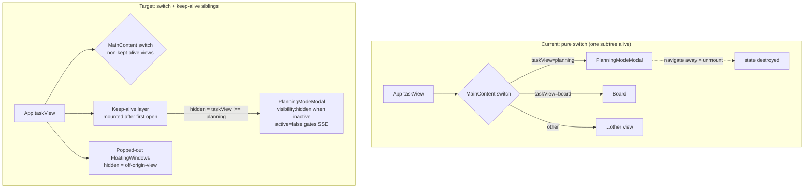
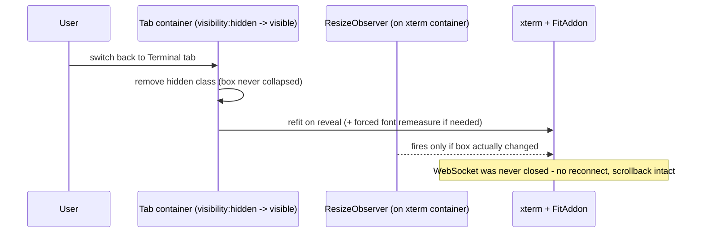

# fix: Stop over-aggressive component unmounts across the dashboard

## Summary

Fix every confirmed source of unnecessary unmount/remount churn in the dashboard: two volatile-key bugs, two mechanical anti-patterns, and — the substantive part — a keep-alive layer so conversation- and terminal-bearing surfaces (Planning Mode, task-detail terminal and planner-chat tabs, popped-out task windows) survive navigation and tab switches mounted-but-hidden, mirroring the existing Quick Chat hidden-FloatingWindow pattern. Includes a deep audit of Planning Mode's internal session/view transitions and lightweight state preservation for the cheaper views.

---

## Problem Frame

A remount audit (2026-07-22) found the dashboard unmounts components far more often than intended. The main-content area is a pure `if (taskView === ...) return` switch (`packages/dashboard/app/components/dashboard/MainContent.tsx`), so every navigation destroys the previous view entirely; TaskDetail's tab body is one mutually-exclusive ternary, so every tab switch tears down terminals (WebSocket close + xterm dispose) and the planner chat; popped-out task windows are filtered out of the render array when the user leaves their origin view. On top of the architectural cause, two keys are more volatile than the identity they represent: the streaming chat segment key embeds `entries.length` (remounts the actively streaming thinking block on every entry), and the dock task list keys `TaskCard` by `id-index` (remounts on any reorder).

User-visible symptoms: an expanded thinking block snapping shut on every streamed entry, terminals reconnecting and losing scroll/unsent input on every tab flip, Planning Mode losing in-flight interview UI (view state, streaming output, retry counters, unsaved summary edits) on any sidebar navigation, and floating task windows vanishing and remounting when switching views.

The codebase already contains the correct pattern twice: Quick Chat stays mounted via `<FloatingWindow hidden={!quickChatOpen}>` (`packages/dashboard/app/App.tsx`, Quick Chat render block), and `useBoardScrollRestore` papers over board remounts. The heavy surfaces never got either treatment.

---

## Requirements

Keying and component identity:

- R1. The actively streaming chat segment keeps its React identity while entries stream into it; an expanded thinking block stays expanded for the duration of a stream.
- R2. `TaskCard` rows in the dock task list keep their identity across list reorders, filter toggles, and status changes.
- R3. No component is defined inside another component's render body and rendered as a JSX tag (`ProviderStatusBadge`, `GitHubStatusBadge` hoisted to module scope).
- R4. MCP server rows keep their identity across server state transitions (key is `server.name` alone).

Keep-alive for heavy surfaces:

- R5. Planning Mode (`taskView === "planning"`, embedded `PlanningModeModal`) survives main-view navigation mounted-but-hidden after its first open: returning is an instant visibility restore with no reload, reflow, or loading flash, preserving ViewState, conversation history, streaming output, draft edits, and scroll.
- R6. The task-detail Terminal, Worktree-terminal, and Planner-chat tabs survive tab switches mounted-but-hidden after first open: no WebSocket teardown, no xterm dispose, no planner composer/scroll loss.
- R7. Popped-out task windows under `taskPopupsBoardListOnly` are hidden (not unmounted) when the user leaves their origin view; their embedded task detail, including any open terminal, stays live.
- R8. Hidden kept-alive surfaces suspend their background work: SSE/EventSource subscriptions gated by the existing `active`/`enabled` prop convention are closed while hidden and reopened on reveal; no hidden surface polls.
- R9. Terminals revealed from a hidden state render a correct grid: refit fires on reveal, and the hide mechanism never lets the xterm container reach zero geometry (`visibility: hidden`, never `display: none`).
- R10. Behaviors currently coupled to unmount still fire when unmount becomes hide: nav-stack entries are removed when a hidden-not-closed surface is dismissed, unconfirmed-edit reverts still run, and no stale per-card authorization state survives where a remount previously cleared it.

Planning Mode internal transitions:

- R11. A deep audit of `PlanningModeModal`'s internal transitions (session switching, session-list mode, ViewState changes, mobile detail flips) identifies and fixes any transition that discards state it should preserve, with the same invariant standard as the top-level fixes.

Cheap-view state preservation:

- R12. CommandCenter (active sub-tab, date range) and DevServerView (selected script, log pagination, command input) restore their cheap UI state after an unmount round-trip via lifted/persisted state — these views are not kept alive.

Verification:

- R13. Regression tests assert the general invariant across all enumerated surfaces (desktop and mobile breakpoints) per the Fix-the-Invariant rule, not just the reported repros.

---

## Key Technical Decisions

- **Keep-alive hides with `visibility: hidden` + `pointer-events: none`, never `display: none`.** `FitAddon.proposeDimensions()` floors a zero-box container to a degenerate 2×1 grid permanently (`docs/solutions/ui-bugs/mobile-terminal-blank-render-zero-geometry-container.md`); `display: none` collapses the box to zero. `FloatingWindow` already implements and regression-tests exactly this (`packages/dashboard/app/components/__tests__/FloatingWindow.test.tsx`, "keeps hidden children mounted" test) — new keep-alive wrappers copy that contract.
- **Lazy first-mount, then persist.** Surfaces mount only when first opened (Quick Chat's `quickChatEverOpenedProjectId` gate is the precedent) and stay mounted afterward. No view is mounted at boot that the user hasn't visited; memory cost is bounded to surfaces actually used this session.
- **Keep-alive breadth: conversation- and terminal-bearing surfaces only.** Planning Mode, task-detail terminal/worktree-terminal/planner-chat tabs, and popped-out task windows get keep-alive. CommandCenter and DevServerView get lifted-state preservation instead (R12) — their state is cheap to externalize and keeping them mounted buys little. ChatView keeps its existing SWR-cache + server stream re-attach cushioning; scroll/session-selection preservation for it is deferred follow-up.
- **Background work is gated by the existing `active`/`enabled` prop convention, not new infrastructure.** `TaskChatTab active` → `useAgentLogs(taskId, active, …)` already opens/closes its EventSource on `enabled`; `taskSseEnabled = taskView === "board" || taskView === "list"` already gates board SSE by view. Kept-alive hidden surfaces pass `active={false}` (or equivalent) while hidden. Note the existing Quick Chat precedent does NOT gate ChatView's effects while hidden — the new wrappers must do better than the precedent here, and the ChatView gap is explicitly out of scope.
- **Popup gating flips from array filter to `hidden` prop.** `App.tsx` renders all `poppedOutTaskEntries` and passes `hidden={!isTaskPopupVisibleForView(...)}` instead of filtering the render list. The exported predicate and its semantics are unchanged; only the render consequence changes. The documented `FNXC:TaskPopupViewGating` behavior changes from "state keeps hidden snapshots so returning remounts them" to render-only hiding — the FNXC comment and `docs/dashboard-guide.md` line for it are updated in the same change.
- **Unmount-coupled behaviors are audited per converted surface, not assumed safe.** Known couplings from research: `ExecutorStatusBar` reverts unconfirmed edits on unmount (`docs/dashboard-guide.md`, `FNXC:ExecutorStatusBar`); planner-oversight completed/effective values must not be reused across what used to be a TaskCard remount (`FNXC:PlannerOversight`); modals opened with `pushNav` must still `removeNav` on hide-dismiss (`docs/solutions/ui-bugs/navigation-history-stale-modal-stack.md`). Each conversion carries an explicit check for these.
- **MainContent keeps its pure-switch contract; keep-alive sits beside it, not inside every branch.** Kept-alive views render as always-mounted (after first open) hidden-gated siblings of the switch output rather than rewriting all ~25 branches. The switch continues to own everything not kept alive.
- **No new top-level `React.lazy` symbols without updating the inventory contract.** The lazy-loaded-views guard (`packages/dashboard/app/__tests__/lazy-loaded-views-docs.test.ts`) pins App-level lazy declarations against AGENTS.md. Keep-alive reuses existing lazy declarations inside their existing `<Suspense>` wrappers; if a wrapper component must be added, it is not a new lazy view.

---

## High-Level Technical Design

Current vs. target mounting topology for the main content area:

TaskDetail tab bodies follow the same shape one level down: the `activeTab` ternary keeps owning cheap tabs, while terminal/worktree-terminal/planner-chat convert to persistent hidden-gated mounts (after first open) with `active={activeTab === X}` gating their SSE/WebSocket-adjacent effects.

Reveal sequence for a hidden terminal (directional guidance, not implementation specification):

---

## Implementation Units

### U1. Stable key for streaming chat segments

- **Goal:** Stop the actively streaming thinking segment from remounting on every streamed entry.
- **Requirements:** R1
- **Dependencies:** none
- **Files:** `packages/dashboard/app/components/TaskChatTab.tsx` (segment key near line 1045), `packages/dashboard/app/components/__tests__/TaskChatTab.test.tsx` (or the existing TaskChatTab test file)
- **Approach:** Drop `segment.entries.length` from the segment key; identity is `kind + startIndex`. Verify no downstream logic relies on the length-remount to reset `TaskChatThinking`'s `open` state (its `defaultOpen` prop still controls the initial state on genuine segment changes).
- **Patterns to follow:** The semantic-key rule from `docs/solutions/ui-bugs/skill-autocomplete-highlight-reset-on-swr-revalidation.md` — derive keys/deps from stable semantic identity, never counts or references.
- **Test scenarios:**
  - Happy path: render a thinking segment, expand it, append entries to the same segment, rerender — the expanded state persists (component instance not remounted).
  - Edge: a genuinely new segment (different `startIndex`) still gets a fresh instance with `defaultOpen` applied.
  - Edge: two segments of the same kind at different offsets keep distinct identities.
- **Verification:** New test fails against the old key (remount observed), passes with the fix; existing TaskChatTab tests stay green.

### U2. Stable key for dock task list cards

- **Goal:** Stop `TaskCard` remounts on dock-list reorder.
- **Requirements:** R2, R10 (stale-state check)
- **Dependencies:** none
- **Files:** `packages/dashboard/app/components/DockTaskList.tsx` (key near line 75), sibling test file in `packages/dashboard/app/components/__tests__/`
- **Approach:** `key={task.id}`. Per the `FNXC:PlannerOversight` caution in `docs/dashboard-guide.md`, check whether any per-card state (planner-oversight effective values, menus) relied on the reorder-remount to reset; if so, reset it explicitly on the relevant prop change instead.
- **Patterns to follow:** Every other task list in the app already keys by `task.id` alone.
- **Test scenarios:**
  - Happy path: reorder `visibleTasks` (e.g. status change moves a task), rerender — card instances persist (local state such as an open menu survives, or an instance-identity probe confirms no remount).
  - Edge: toggling the `showDone` filter changes list membership without remounting surviving cards.
  - Stale-state check: a card whose task's oversight/authorization-relevant props change does not retain stale derived state.
- **Verification:** Reorder test proves identity stability; planner-oversight behavior unchanged.

### U3. Mechanical identity cleanups

- **Goal:** Remove the inline component definitions and the state-in-key row.
- **Requirements:** R3, R4
- **Dependencies:** none
- **Files:** `packages/dashboard/app/components/ModelOnboardingModal.tsx` (hoist `ProviderStatusBadge` ~1055 and `GitHubStatusBadge` ~1092 to module scope), `packages/dashboard/app/components/settings/sections/McpServersCard.tsx` (key ~612 becomes `server.name`)
- **Approach:** Hoist both badges to module scope, passing the translation function as a prop or capturing it via the existing hook at module-component level. McpServersCard: verify nothing depends on the state-transition remount (validation state is external in `validateStates`, so nothing should).
- **Test scenarios:** Test expectation: minimal — one assertion per hoisted badge that it renders identically for each status value (snapshot or role/text query); these are stateless presentation components and the change is behavior-preserving. If existing ModelOnboardingModal/McpServersCard tests cover the rendered output, extending them suffices.
- **Verification:** Typecheck + existing tests green; no badge is declared inside a component body (grep-level check).

### U4. Keep-alive layer for Planning Mode

- **Goal:** Planning Mode survives main-view navigation mounted-but-hidden after first open.
- **Requirements:** R5, R8, R10
- **Dependencies:** none (first structural unit; U5–U6 follow its pattern)
- **Files:** `packages/dashboard/app/components/dashboard/MainContent.tsx` (planning branch ~696 moves to the keep-alive layer), `packages/dashboard/app/App.tsx` (or a new small wrapper component in `packages/dashboard/app/components/dashboard/`), a component CSS file for the hidden wrapper if a new class is needed, `packages/dashboard/app/components/PlanningModeModal.tsx` (accept an `active`-style prop to gate any subscriptions), tests in `packages/dashboard/app/__tests__/` and `packages/dashboard/app/components/__tests__/`
- **Approach:** After the user first opens Planning (`everOpened` latch, mirroring Quick Chat's `quickChatEverOpenedProjectId`), render the planning subtree persistently as a hidden-gated sibling of the MainContent switch; the switch's planning branch stops returning its own instance. Hide with the `visibility: hidden; pointer-events: none` contract plus `aria-hidden`. Pass `active={taskView === "planning"}` down so `PlanningModeModal` gates anything subscription-like; the session data layer (`useBackgroundSessions`) is SSE-driven at App level and stays untouched. Reset/unmount the kept-alive instance on project switch (key by project id, as Quick Chat does). The `PlanningWorkflowSwitcherSlot` header portal must only portal while planning is the active view.
  - Nav-stack check (R10): the embedded planning view participates in `handleChangeTaskView` navigation, not `pushNav` modal history — confirm and note; `modalManager.closePlanning()` semantics (clearing entry-point payload) must still fire on explicit close even though the tree stays mounted.
- **Patterns to follow:** Quick Chat block in `App.tsx`; `FloatingWindow` hidden contract and its CSS; `taskSseEnabled` view-gating precedent.
- **Test scenarios:**
  - Happy path: open Planning, enter interview state (mock a session with view state / streaming text), navigate to Board, navigate back — same component instance, ViewState and streaming output intact, no loading flash (assert via the `recordResumeEvent` instrumentation: `route-active` rather than `remount` trigger).
  - Hidden-work gating: while hidden, the wrapper carries `visibility: hidden` + `aria-hidden="true"` and any `active`-gated subscription inside PlanningModeModal is closed (spy on the gated hook/effect).
  - First-mount laziness: before Planning is ever opened, no PlanningModeModal instance exists.
  - Project switch: switching projects tears down and replaces the kept-alive instance.
  - Explicit close: `closePlanning` still clears modalManager payload and returns to board.
  - Mobile breakpoint: the hidden wrapper does not affect mobile layout (no stray scroll containers or fixed footers while hidden).
- **Verification:** New tests green; `lazy-loaded-views-docs.test.ts` untouched and green; manual smoke — mid-interview navigation round-trip preserves the conversation.

### U5. Keep-alive for task-detail terminal and planner-chat tabs

- **Goal:** Tab switches inside TaskDetail stop destroying terminals and the planner chat.
- **Requirements:** R6, R8, R9, R10
- **Dependencies:** U4 (establishes the wrapper/CSS pattern)
- **Files:** `packages/dashboard/app/components/TaskDetailModal.tsx` (terminal ~5412, worktree-terminal ~5433, planner-chat ~5092 branches of the `activeTab` ternary), `packages/dashboard/app/components/SessionTerminal.tsx` (reveal refit hook-in if needed), tests in `packages/dashboard/app/components/__tests__/`
- **Approach:** Convert the three heavy tab bodies to persistent hidden-gated mounts (after first open of each tab, per-tab `everOpened` latch) while cheap tabs stay in the ternary. Keep the existing `active` props (`TaskPlannerChatTab active`, and thread an equivalent into the terminal components) so `useAgentLogs`-style EventSources close while hidden — the terminal WebSocket itself intentionally stays open (that is the point of keep-alive); confirm the server side tolerates a long-lived idle terminal socket per existing TerminalModal session persistence. On reveal, trigger a refit; per `docs/solutions/ui-bugs/xterm-options-noop-remeasure-after-font-settle.md`, a forced font remeasure may be needed if the no-op OptionsService guard swallows the refit. `visibility: hidden` keeps the container box non-zero so the ResizeObserver/FitAddon never sees a 0×0 box.
  - Unmount-coupled check (R10): task switch (different `task.id`) and modal close must still fully unmount and dispose terminals — keep-alive is scoped to tab switching within one open task detail.
- **Patterns to follow:** `SessionTerminal`'s existing single-effect lifecycle (do not split its teardown semantics); `FloatingWindow` hidden CSS contract; `mobile-terminal-blank-render-zero-geometry-container.md` observer rules.
- **Test scenarios:**
  - Happy path: open Terminal tab, switch to Definition, switch back — WebSocket not closed (spy), xterm not disposed, same instance.
  - Planner chat: type a draft, switch tabs, return — draft and scroll state intact; `active=false` closed its EventSource while hidden (spy on `useAgentLogs` enabled transitions).
  - Reveal geometry: on reveal, refit fires; container never reports zero size while hidden (assert the hidden style is `visibility`, not `display`).
  - Teardown still works: closing the modal or switching to a different task disposes terminals and closes sockets exactly as today.
  - Mobile breakpoint: hidden tab bodies don't stack scrollable regions on mobile.
- **Verification:** New tests green plus existing `SessionTerminal.test.tsx` / `TerminalModal.test.tsx` green; manual smoke — run a command, flip tabs, confirm no reconnect banner and scrollback/scroll position intact.

### U6. Popped-out task windows hide instead of unmount

- **Goal:** Off-origin-view popped-out windows stay alive.
- **Requirements:** R7, R8, R10
- **Dependencies:** U4 (pattern), U5 (embedded terminals inside popups benefit)
- **Files:** `packages/dashboard/app/App.tsx` (replace the `visiblePoppedOutTaskEntries` filter ~826-828 at the render site ~2039 with `hidden={...}`), `packages/dashboard/app/__tests__/App.taskPopupViewGating.test.tsx` (update assertions), `docs/dashboard-guide.md` (`FNXC:TaskPopupViewGating` line)
- **Approach:** Render all `poppedOutTaskEntries`; pass `hidden={!isTaskPopupVisibleForView({ taskPopupsBoardListOnly, taskView, originTaskView })}` to each `FloatingWindow`. The predicate, setting semantics, and per-origin-view addressability are unchanged. Update the FNXC comment and dashboard-guide text from "returning remounts them" to render-only hiding. Nav-stack check (R10): explicitly closing a popup (visible or hidden) must still remove its nav entry with the same stable callback.
- **Patterns to follow:** Quick Chat `hidden={!quickChatOpen}`; existing `FloatingWindow` hidden test assertions.
- **Test scenarios:**
  - Happy path: with `taskPopupsBoardListOnly` on, pop out a task from Board, switch to Chat — the FloatingWindow is present with `aria-hidden="true"` and `visibility: hidden` (updated `expectNoTaskPopupShell` becomes "hidden, not absent"); switch back — same instance, visible.
  - Setting off: popups visible on all views, unchanged.
  - Close while hidden: programmatic/close paths remove the entry and its nav registration.
  - Geometry: FloatingWindow suspends geometry persistence and outside-dismiss listeners while hidden (already covered by FloatingWindow tests; assert no regression at the App level).
- **Verification:** Updated gating tests green; `App.taskDetailFloatingGeometry.test.tsx` green.

### U7. Deep audit: Planning Mode internal transitions

- **Goal:** Find and fix state-discarding transitions inside `PlanningModeModal` itself (session switching, session-list mode, ViewState transitions, mobile detail flips) so internal navigation meets the same bar as U4.
- **Requirements:** R11
- **Dependencies:** U4 (so audit findings are measured against the kept-alive baseline)
- **Files:** `packages/dashboard/app/components/PlanningModeModal.tsx`, existing `PlanningModeModal.*.test.tsx` suites and `PlanningModeModal.test-helpers.ts` in `packages/dashboard/app/components/__tests__/`
- **Approach:** Audit pass over the internal transitions with the same lenses as the top-level audit: (a) conditional rendering that unmounts stateful panes when `showSessionList` / `isSessionListMode` / `mobileShowDetail` flip; (b) keys on session panes or history entries that embed volatile parts; (c) state resets keyed on cache-array identity (the SWR-churn class); (d) switching `selectedSessionId` — what in-flight state of the previous session is lost vs. reconstructable from the session row, and whether switching back re-attaches to a live stream. Fix what the audit confirms; record intentional resets (e.g. model change resetting the session scope) as documented behavior. Findings that require product decisions get listed in the PR rather than silently decided.
- **Execution note:** Audit-first — enumerate and classify transitions before changing any; land fixes as separate commits per finding.
- **Test scenarios:** (per confirmed finding, at minimum:)
  - Toggling session-list mode and back preserves the active session's interview pane state.
  - Switching between two sessions and back re-attaches/restores the first session's view without a full reload flash, to the extent the session row supports it.
  - Mobile `mobileShowDetail` flip round-trip preserves detail pane state.
- **Verification:** Audit findings documented in the PR description; each fix carries a failing-then-passing test; existing PlanningModeModal suites green.

### U8. Lifted-state preservation for CommandCenter and DevServerView

- **Goal:** Cheap UI state survives the unmount round-trip for the two remaining frequently-used heavy views without keeping them mounted.
- **Requirements:** R12
- **Dependencies:** none (parallel to U4–U7)
- **Files:** `packages/dashboard/app/components/command-center/CommandCenter.tsx` (or its state hooks), `packages/dashboard/app/components/DevServerView.tsx`, a small persistence helper if none fits (check for an existing localStorage-backed hook first per the reuse rule), sibling tests
- **Approach:** Lift `activeTab` + date range (CommandCenter) and selected script/task + command input (DevServerView) into persisted state (module-level ref or localStorage-backed hook, following the `useBoardScrollRestore` externalize-don't-keep-mounted approach and the planning-description `getPlanningDescription` localStorage precedent). Log pagination/scroll may use the boardScrollSnapshot-style ref pattern if cheap; otherwise defer.
- **Test scenarios:**
  - CommandCenter: set sub-tab + range, unmount, remount — both restored; a fresh project/session gets defaults.
  - DevServerView: typed-but-unsent command survives an unmount round-trip; selected script restored.
- **Verification:** New tests green; no new polling while unmounted (nothing mounted — trivially true; assert no module-level timers introduced).

### U9. Invariant regression suite, symptom verification, and release notes

- **Goal:** Encode the "no unnecessary remounts" invariant across all enumerated surfaces and finish the bug-class paperwork.
- **Requirements:** R13 (and closes the loop on R1–R12)
- **Dependencies:** U1–U8
- **Files:** test files added in U1–U8 (this unit fills coverage gaps found against the Surface Enumeration below), `.changeset/fix-dashboard-remount-churn.md`
- **Approach:** Sweep the Surface Enumeration checklist (below) against the tests landed in U1–U8; add missing breakpoint/data-state cases. Use `recordResumeEvent`'s `remount` vs `route-active` triggers as the instrumentation seam for "did this surface remount" assertions where component-identity probes are awkward. Add the changeset: `"@runfusion/fusion": patch`, `category: fix`, summary phrased for operators (terminals, planning sessions, and popped-out tasks no longer reset when switching views/tabs). No slow tests: all remount assertions run on jsdom with fake streams/spies — no real sockets, no polling waits.
- **Test scenarios:** Gap-fill only; the invariant cases live in their units. Explicitly confirm: desktop + mobile breakpoints for U4–U6 surfaces; empty/populated data states for the keyed lists (U1, U2).
- **Verification:** `pnpm verify:fast` green; file-scoped vitest runs for every touched test file green; changeset passes `pnpm check:changesets`.

---

## Symptom Verification

- **Original symptom:** Components across the dashboard unmount too often — streaming thinking blocks collapse mid-stream, terminals reconnect on tab switches, Planning Mode loses in-flight interview state on navigation, popped-out task windows vanish when leaving their origin view, task cards remount on reorder.
- **Exact reproduction:** (1) Expand a thinking block while an agent streams into it — it collapses on the next entry. (2) Open a task's Terminal tab, run a command, switch to Definition and back — WebSocket reconnects, scroll/unsent input lost. (3) Start a planning interview, navigate to Board and back — interview UI resets to a reloaded state. (4) With `taskPopupsBoardListOnly` on, pop out a task from Board and switch to Chat — the window unmounts. (5) Change a dock-listed task's status — its card remounts.
- **Assertion it is gone:** Automated tests in U1, U4, U5, U6, U2 respectively assert component-identity/instrumentation-level persistence for each reproduction (remount not observed, state preserved), plus the broader invariant coverage in U9.

## Surface Enumeration

- Keyed-list identity: `TaskChatTab` segments (task detail Activity chat), `DockTaskList` cards; checked that `TaskPlannerChatTab`'s internal keys (`toolName-index`) and other audited keys are stable — no change needed there.
- Keep-alive surfaces: Planning Mode (embedded main view), task-detail Terminal / Worktree-terminal / Planner-chat tabs (desktop and mobile tab bars both route through the same ternary), popped-out task FloatingWindows (board-list-only setting on and off).
- Shared components that must not regress: `FloatingWindow` (Quick Chat and task popups share it), `SessionTerminal` (task detail + anywhere else it mounts), `TaskChatSegmentView`/`TaskChatThinking`, `TaskCard` (board, list, dock, popup contexts — only the dock keying changes).
- Breakpoints: mobile (`max-width: 768px` or `max-height: 480px` — landscape phones included) and desktop for every keep-alive surface; hidden wrappers must not create stray scrollable/fixed elements on mobile.
- Data states: empty (no sessions/tasks/entries), populated, actively streaming, and duplicate-id defense where lists dedupe (`dedupeSessionsById`).
- Unmount-coupled behaviors re-checked per converted surface: nav-stack removal, `ExecutorStatusBar`-style revert-on-unmount, planner-oversight stale-value hazard, `modalManager` payload clearing.

---

## Scope Boundaries

- Re-render churn (context `value={{...}}` identity, memoization) is out of scope — different problem class from unmounting.
- CSS/styling work beyond the hidden-wrapper class is out of scope.
- Intentional remount-to-reset keys stay as-is: `MissionInterviewModal` counter key, `PreviewIframe` retry key, `TerminalModal` per-session container key (documented zero-geometry fix), task pop-out identity key, `BranchGroupCard` collapse-on-switch key.

### Deferred to Follow-Up Work

- ChatView keep-alive or scroll/session-selection preservation for the main Chat view (currently cushioned by SWR cache + server stream re-attach; also the known gap that hidden Quick Chat does not gate ChatView's effects).
- Gating ChatView SSE/read-marking effects while Quick Chat is hidden (pre-existing gap, documented in research).
- Keep-alive for remaining cheap views (Agents, Documents, Insights, etc.) — they lose only filter/scroll state and remount cheaply.
- DevServerView log scroll-position restore if it turns out to need more than the snapshot-ref pattern.

---

## Risks & Dependencies

- **Memory growth from persistent subtrees.** Bounded by lazy-first-mount (only visited surfaces stay alive) and project-switch teardown. Watch: PlanningModeModal is large; if a session accumulates huge streaming buffers, hidden retention keeps them — acceptable for a single session, revisit if telemetry disagrees.
- **Hidden-surface background work.** The Quick Chat precedent shows hidden ≠ idle by default; every kept-alive surface must be explicitly `active`-gated (R8) and tests must spy on the gates, or we trade remount churn for permanent background load.
- **xterm reveal geometry.** `visibility: hidden` preserves the box, but ancestors introduced by the wrapper must not apply `display: none` or width caps (`mobile-terminal-collapsed-screen-zero-width-cell.md`); jsdom cannot prove rendered-grid correctness — manual verification on a real browser is required, and unavailable-device gaps are recorded per `docs/ios-acceptance.md` rather than claimed verified.
- **Behavior changes hiding behind "it stopped remounting".** Any state that a remount previously reset (planner oversight, unconfirmed edits, nav entries) now persists; U2/U4–U6 carry explicit checks, and the FNXC comments at each converted site are updated so the new lifecycle is encoded in-code.
- **SSE wholesale-replace staleness.** Mounted-but-hidden conversation surfaces keep receiving `chat:session:updated`-style events that degrade enrichment fields (`isGenerating`); per `docs/solutions/logic-errors/queued-chat-message-flush-trusts-stale-isgenerating.md`, no hidden surface may gate destructive actions on cached enrichment state on reveal.
- **Test updates that invert assertions.** `App.taskPopupViewGating.test.tsx` currently asserts absence; flipping to hidden-presence must preserve the setting's intent (popups don't clutter other views) — the assertion moves from "not in DOM" to "not visible/interactive".

---

## Sources & Research

- Audit findings (this session): confirmed sites `TaskChatTab.tsx:1045`, `DockTaskList.tsx:75`, `TaskDetailModal.tsx:5412/5433/5092`, `MainContent.tsx:696/811/674/791`, `App.tsx:826-828/2039`, `ModelOnboardingModal.tsx:1055/1092`, `McpServersCard.tsx:612`.
- Keep-alive primitive: `packages/dashboard/app/components/FloatingWindow.tsx` (`hidden` prop, visibility-not-display contract, effect suspension while hidden) and its regression test `packages/dashboard/app/components/__tests__/FloatingWindow.test.tsx` ("keeps hidden children mounted…").
- Acceptance bar for keep-alive UX: `docs/dashboard-guide.md` Quick Chat section ("instant visibility restore with no conversation reload, layout reflow, or loading flash") and `FNXC:TaskPopupViewGating` (FN-8016).
- Polling gates: `packages/dashboard/app/hooks/useAgentLogs.ts` (EventSource on `enabled`), `taskSseEnabled` in `App.tsx`, `useBackgroundSessions` (SSE-driven, mount-independent).
- Terminal lifecycle constraints: `docs/solutions/ui-bugs/mobile-terminal-blank-render-zero-geometry-container.md`, `docs/solutions/ui-bugs/xterm-options-noop-remeasure-after-font-settle.md`, `docs/solutions/ui-bugs/mobile-terminal-collapsed-screen-zero-width-cell.md`.
- State-reset identity class: `docs/solutions/ui-bugs/skill-autocomplete-highlight-reset-on-swr-revalidation.md`.
- Nav/modal lifecycle: `docs/solutions/ui-bugs/navigation-history-stale-modal-stack.md`.
- Remount instrumentation: `packages/dashboard/app/utils/resumeInstrumentation.ts` (`remount` / `route-active` / `route-inactive` triggers) and its tests.
- Structural guard: `packages/dashboard/app/__tests__/lazy-loaded-views-docs.test.ts` (lazy-view inventory contract with AGENTS.md).
